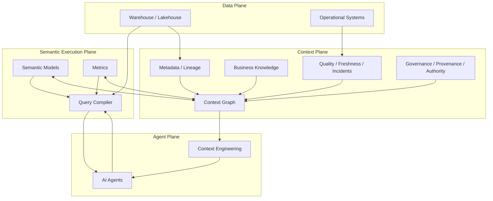

# DataHub Research

研究 DataHub 的**架构思想、设计哲学，以及它如何从 Metadata Platform 演化为 AI 时代的 Context Layer / Context Platform**。

官方文档翻译是学习手段，不是研究终点。

> DataHub: https://datahub.com/  
> Documentation: https://docs.datahub.com/

## Start Here

1. **[01 — Why Context Layer?](docs/research/01-why-context-layer.md)**
2. **[02 — Context Graph vs Knowledge Graph](docs/research/02-context-graph-vs-knowledge-graph.md)**
3. **[03 — Context Layer vs Semantic Layer](docs/research/03-context-layer-vs-semantic-layer.md)**
4. 下一篇：**Context Freshness & Provenance**

Supporting notes:

- [Context Layer](docs/context-layer.md)
- [Design Philosophy](docs/design-philosophy.md)
- [High-Level Architecture](docs/architecture.md)
- [Official Docs Learning Notes](docs/official-docs/README.md)

## 核心研究问题

1. 为什么企业需要独立于数据存储和 Agent runtime 的 **Context Layer**？
2. Metadata Platform 为什么有机会演化成 Context Platform？
3. Context Graph 与 Knowledge Graph 的真实差异在哪里？
4. Context Layer 与 Semantic Layer 应该如何分工？
5. 为什么 freshness、provenance、authority 会成为 AI 基础设施的一等属性？
6. Human 与 Agent 是否应该共享同一个 governed truth plane？
7. Agent write-back context 后如何维持可信度？

## 当前架构模型

当前研究的核心判断：

> **Semantic Layer makes meaning executable. Context Layer makes meaning situationally trustworthy.**

## 研究方法

官方文档采用：

**原文链接 → 中文释义 → 厂商主张 → 架构拆解 → 外部对照 → 我们的工作定义 → 开放问题**

我们不以源码实现为目标，而关注：

- architectural responsibility
- system boundaries
- information model
- trust model
- lifecycle
- AI / Agent implications
