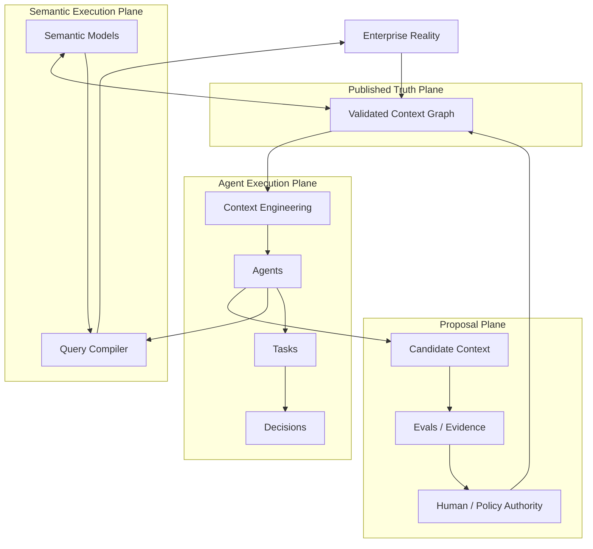
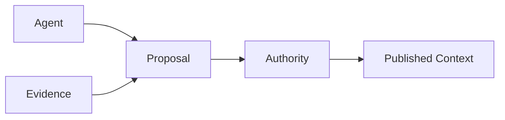

# DataHub Research

研究 DataHub 的**架构思想、设计哲学，以及它如何从 Metadata Platform 演化为 AI 时代的 Context Layer / Context Platform**。

官方文档翻译是学习手段，不是研究终点。

> DataHub: https://datahub.com/  
> Documentation: https://docs.datahub.com/

## Start Here

1. **[01 — Why Context Layer?](docs/research/01-why-context-layer.md)**
2. **[02 — Context Graph vs Knowledge Graph](docs/research/02-context-graph-vs-knowledge-graph.md)**
3. **[03 — Context Layer vs Semantic Layer](docs/research/03-context-layer-vs-semantic-layer.md)**
4. **[04 — Context Freshness & Provenance](docs/research/04-context-freshness-and-provenance.md)**
5. **[05 — Agent Read / Write Context](docs/research/05-agent-read-write-context.md)**
6. 下一篇：**Human + Agent Shared Truth Plane**

Supporting notes:

- [Context Layer](docs/context-layer.md)
- [Design Philosophy](docs/design-philosophy.md)
- [High-Level Architecture](docs/architecture.md)
- [Official Docs Learning Notes](docs/official-docs/README.md)

## 当前最重要的架构模型

当前研究逐渐形成几个原则：

> **Semantic Layer makes meaning executable. Context Layer makes meaning situationally trustworthy.**

> **Context Graph 的难点不是 storage，而是 dependency-aware maintenance。**

> **Freshness 不是 updated_at；Provenance 不是 audit log。**

> **Agents propose. Evidence verifies. Authorities publish.**

## Agent Write-back 的核心边界

Agent 可以：

- observe；
- infer；
- annotate；
- propose；
- execute bounded writes。

但 machine-generated context 不应该因为被写入 graph 就自动升级为企业 truth。

## 研究方法

官方文档采用：

**原文链接 → 中文释义 → 厂商主张 → 架构拆解 → 外部对照 → 我们的工作定义 → 开放问题**

我们不以源码实现为目标，而关注：

- architectural responsibility
- system boundaries
- information model
- trust / authority model
- temporal model
- provenance
- lifecycle
- AI / Agent security
- human-machine governance
