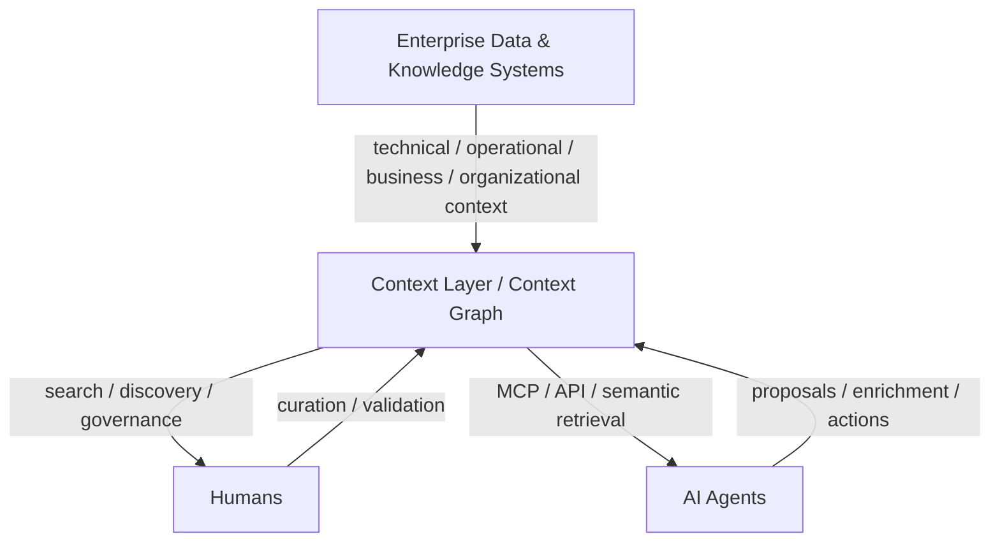
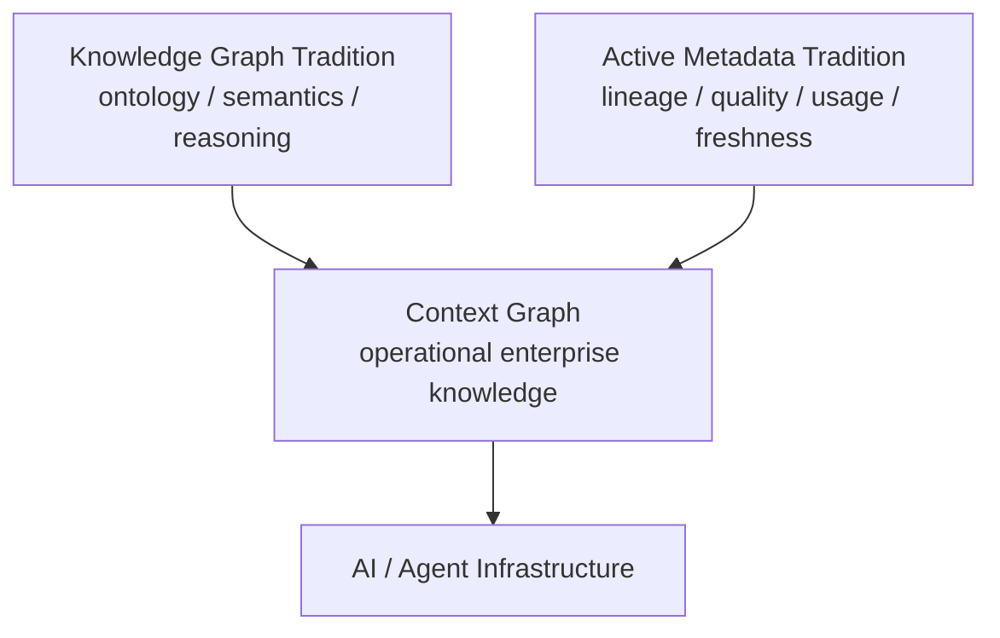

# DataHub Research

研究 DataHub 的**架构思想、设计哲学，以及它如何从 Metadata Platform 演化为 AI 时代的 Context Layer / Context Platform**。

官方文档翻译是学习手段，不是研究终点。

> DataHub: https://datahub.com/  
> Documentation: https://docs.datahub.com/

## 核心研究问题

这个仓库重点回答：

1. 为什么企业需要一个独立于数据存储和 AI Agent 的 **Context Layer**？
2. DataHub 为什么从 Data Catalog / Metadata Platform 走向 Context Platform？
3. 为什么选择 **Graph** 来组织 metadata、business knowledge、lineage、ownership、quality 与 provenance？
4. 为什么 context 必须是 continuously synchronized，而不是静态文档或一次性 RAG index？
5. DataHub 如何处理 **meaning、trust、freshness、provenance、governance**？
6. Context Layer 与 Semantic Layer、Knowledge Graph、Data Catalog、RAG、Agent Memory 分别是什么关系？
7. MCP 在这套架构里是什么：Context Layer 本身，还是 Context Activation / access protocol？
8. 人与 Agent 是否应该消费同一个 governed context source of truth？
9. AI Agent 能否反向写入、丰富 Context Layer？这会带来什么治理问题？

## Start Here

1. **[01 — Why Context Layer?](docs/research/01-why-context-layer.md)**
2. **[02 — Context Graph vs Knowledge Graph](docs/research/02-context-graph-vs-knowledge-graph.md)**
3. 下一篇：**Context Layer vs Semantic Layer**

Supporting notes:

- [Context Layer](docs/context-layer.md)
- [Design Philosophy](docs/design-philosophy.md)
- [High-Level Architecture](docs/architecture.md)
- [Official Docs Learning Notes](docs/official-docs/README.md)
- [Context Platform 官方材料中文学习笔记](docs/official-docs/context-platform.md)
- [Context Graph / Knowledge Graph 官方材料中文学习笔记](docs/official-docs/context-graph.md)

## 研究视角

我们研究的重点是中间这一层为什么存在、应该包含什么，以及它如何成为 AI 系统的长期基础设施。

## 当前一个重要判断

当前研究认为，Context Graph 的价值不在于发明新的 graph model，而在于让 semantic graph 与实时 enterprise operations 汇合。

## 三条学习主线

### 1. Design Philosophy

- metadata as infrastructure
- graph-first relationships
- active / continuously synchronized metadata
- governance and provenance as first-class context
- one context plane for humans and machines

→ [Design Philosophy](docs/design-philosophy.md)

### 2. Architecture

不以源码实现为目标，而研究逻辑架构、信息流与边界：

- source systems
- metadata/context ingestion
- unified context graph
- semantic enrichment
- governance & trust
- context activation
- human / agent consumers

→ [Architecture](docs/architecture.md)

### 3. AI Context Layer

重点研究：

- Context Management vs Context Engineering
- Context Graph vs Knowledge Graph
- Context Layer vs Semantic Layer
- Technical / Operational / Business / Organizational Context
- freshness
- provenance
- authority
- trust
- MCP & Agent Context
- read/write context

→ [Context Layer](docs/context-layer.md)

## 官方文档学习

官方文档采用：

**原文链接 → 中文释义 → 作者主张 → 我的理解 → 架构含义 → 开放问题**

而不是逐字镜像翻译。

→ [Official Docs Notes](docs/official-docs/README.md)
