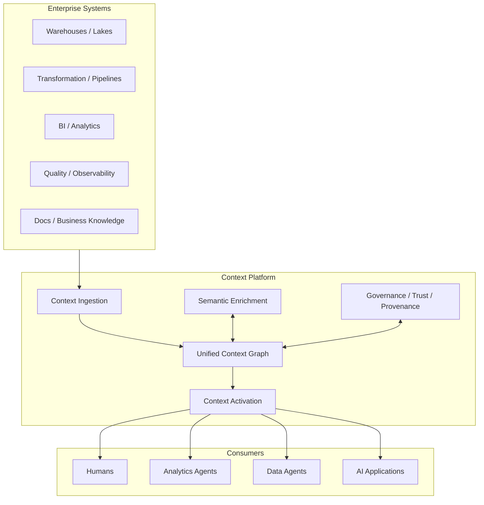

# DataHub Architecture — High-Level View

## Scope

这里只研究 logical architecture 与 architectural responsibilities，不进入源码实现。

## Reference Model

## Architecture Questions

### Context Ingestion

不是只问“怎么连接 Snowflake”，而是：

- 如何把异构系统里的 context 统一？
- structured metadata 与 unstructured knowledge 如何进入同一个模型？
- freshness 的 SLA 应该是什么？
- push/event 与 scheduled ingestion 各自解决什么问题？

### Unified Context Graph

重点研究：

- 为什么 graph 比 flat catalog 更适合 context？
- graph 中什么应该成为 node / relationship？
- technical、business、operational、organizational context 如何关联？
- context graph 与 knowledge graph 的边界是什么？

### Semantic Enrichment

AI 时代仅有 schema 不够。

需要研究：

- business meaning 从哪里产生？
- query history / documentation / SME knowledge 如何变成可消费 context？
- AI 生成的 context 如何经过 validation 后成为 trusted context？

### Governance / Trust / Provenance

Context Layer 不能只负责 retrieval。

它还需要回答 context 的来源、可信度、权限、责任人和时效性。

### Context Activation

Context 的价值发生在消费侧。

研究：

- Search/UI 是 human activation。
- API/SDK 是 application activation。
- MCP 是 agent activation 的标准接口之一。
- 是否应该允许 Agent 写回 context？

## 核心边界

本仓库会持续区分：

- Data Plane：真实业务数据
- Metadata / Context Plane：关于数据及组织知识的 context
- Semantic Layer：面向指标/业务语义的一类抽象
- Agent Runtime：推理、规划、工具调用
- Context Layer：为人和 Agent 提供统一、治理、可追溯 context 的共享基础设施
