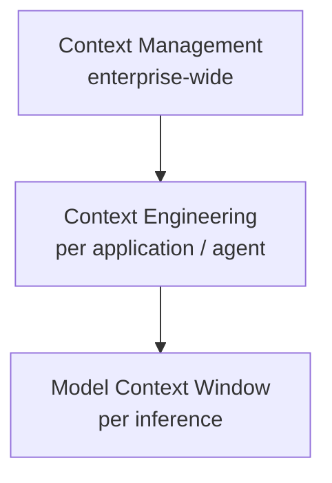
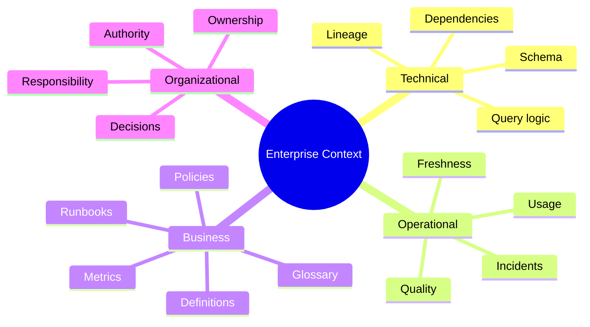
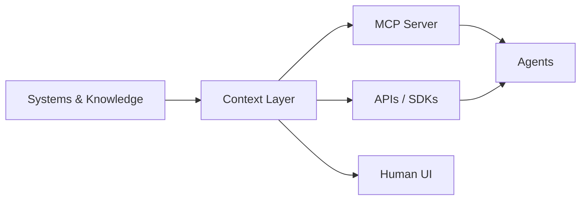

# Context Layer in the AI Era

## 为什么这是本仓库的重点

LLM 的问题通常不是“不会生成 SQL”，而是缺少企业内部的真实语境：

- 哪张表是 authoritative？
- 指标到底怎么定义？
- 哪个 join 是合法的？
- 数据是否新鲜？
- 当前质量是否异常？
- 谁拥有这个资产？
- 这个定义为什么存在？
- 上游变化会影响什么？

这些信息分散在 warehouse、dbt、BI、catalog、quality system、wiki、runbook 和人的经验里。

Context Layer 的问题，本质上是：

> 如何把企业已经拥有的知识组织成一个可持续维护、可信、可查询，并能被人和 Agent 共同消费的系统。

## Context ≠ Prompt

研究时要严格区分：

- **Context Management**：组织级 context 的获取、治理、更新和共享。
- **Context Engineering**：为某个 Agent/任务选择和组织 context。
- **Context Window**：模型单次推理实际看到的信息。

DataHub 主要值得研究的是第一层，以及它如何支撑第二层。

## Context 的组成

当前研究模型：

后续会用 DataHub 官方材料与其他架构观点持续修正这个分类。

## Context Layer 的系统属性

一个可用于生产 Agent 的 Context Layer 至少要讨论：

1. **Unification** — 避免每个 Agent 建自己的 context island。
2. **Freshness** — context 要跟随现实变化。
3. **Semantics** — 不只知道结构，还要知道 meaning。
4. **Provenance** — 能解释信息从哪里来。
5. **Governance** — 权限、责任与可信度必须进入 retrieval。
6. **Retrievability** — 人和机器都能有效查询。
7. **Interoperability** — MCP/API 等接口降低 Agent 与 context 的耦合。
8. **Feedback / Write-back** — Agent 是否能反向丰富 context，以及如何验证。

## 一个重要判断

MCP 不是 Context Layer。

更准确的模型是：

MCP 解决的是 **标准化访问/激活 context** 的问题；context 的质量仍取决于 MCP 背后的统一、治理、freshness、semantics 与 provenance。
