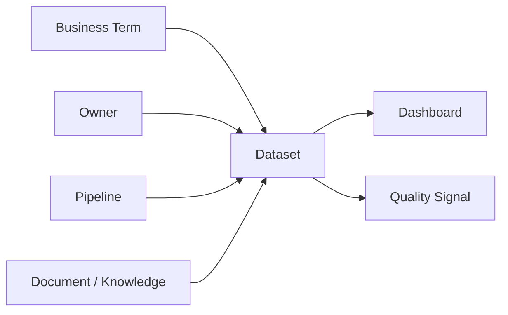
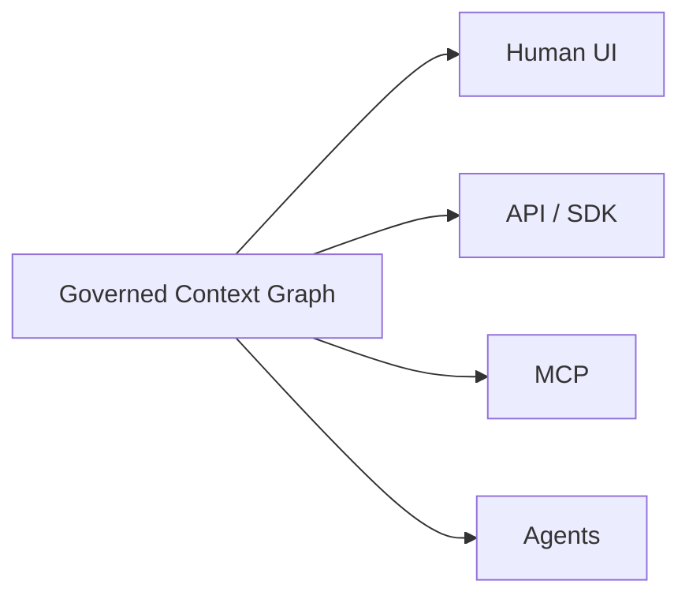

# DataHub Design Philosophy

## 研究目标

这里不分析源码，而是分析 DataHub 做出的架构选择及其背后的理由。

## 1. Metadata 不只是 Catalog 内容

传统 catalog 容易被理解为“给人搜索数据的 UI”。

DataHub 更值得研究的地方，是把 metadata 看成可以被持续采集、关联、治理和程序化消费的基础设施。

研究问题：

- metadata 什么时候从 documentation 变成 infrastructure？
- 如果 metadata 是 infrastructure，它需要哪些系统属性？
- freshness、identity、relationships、provenance 为什么会变成基础能力？

## 2. Relationships are first-class

DataHub 的重要抽象不是“资产列表”，而是资产之间的关系：

AI 场景下，单个对象的 description 往往不足以支持可靠推理；关系提供了 lineage、影响范围、业务语义和 provenance。

## 3. Context 必须反映运行中的现实

静态 wiki / data dictionary 的问题不是“信息少”，而是会 drift。

因此要研究 DataHub 的一个重要设计命题：

> Context Layer 应该是 living system，而不是 documentation snapshot。

重点观察：

- continuous synchronization
- event-driven metadata
- operational signals
- ownership / quality / lineage 的变化传播

## 4. Governance 不是 AI 之后再补的一层

Agent 获取 context 时同时需要知道：

- 这个信息来自哪里？
- 是否可信？
- 是否过期？
- 谁负责？
- 是否允许当前主体使用？
- 哪个定义是 authoritative？

因此 governance、provenance、quality 与 context retrieval 是同一个架构问题的不同侧面。

## 5. Human-readable → Machine-consumable

Catalog 时代主要消费者是人。

Agent 时代要求同一套 context 能被机器以 API / MCP / semantic retrieval 的方式消费。

研究假设：

真正值得研究的不是 MCP 本身，而是 **MCP 背后暴露的 context 是否统一、可信、及时、可追溯**。

## 待验证

- DataHub 的 Context Platform 叙事中，哪些是原有 metadata architecture 的自然延伸？
- 哪些能力是 AI 时代新增的？
- Context Graph 相比 Metadata Graph，边界到底扩大在哪里？
- read-write agent context 如何避免污染 shared context？
