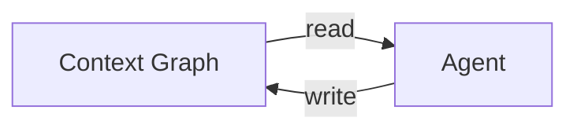
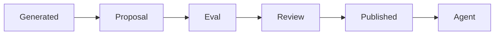
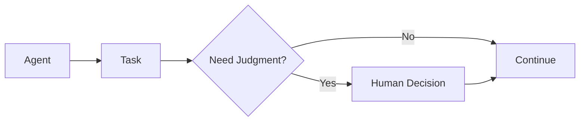
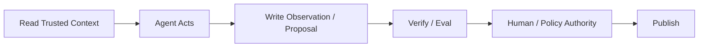

# Agent Read / Write Context — 官方材料中文学习笔记

**Status:** 第一轮  
**Focus:** Agents / Decisions / Context Proposals / Write-back  
**Updated:** 2026-09-28

> 这是中文释义与架构拆解，不是逐字翻译。

---

# 1. DataHub 已经明确支持 Agent Write-back

DataHub 当前产品页面明确写到：

Agent 不只可以从 Context Graph pull context，还可以通过 governed workflows：

- 添加 tags；
- 更新 descriptions；
- 分配 ownership；
- 写回 metadata。

DataHub 的 Context Graph 文章也明确描述 MCP Agent 可以进行 mutation。

因此：



已经是实际产品方向。

---

# 2. 但 Context Hub 建立了 Published / Unpublished 边界

官方 Docs 明确：

> Only published context documents are visible to agents.

也就是说 AI-generated context 并不自动成为 Agent-visible context。

生命周期更接近：



这是一个非常重要的 trust boundary。

---

# 3. Human-edited Context 优先

官方 Context Proposal 文档明确说明：

> Human-edited business metadata takes precedence over agent-generated metadata.

这说明 DataHub 当前并没有采用：

```text
latest write wins
```

而是隐含了：

```text
authority hierarchy
```

这对于 shared Context Graph 非常重要。

---

# 4. Evals 是 Publish Gate 的组成部分

DataHub Context Hub 的 eval 支持：

- SQL generation golden question；
- semantic equivalence；
- generic catalog Q&A；
- must-reference assets；
- must-not-reference assets；
- additional grading guidelines。

因此 Context 的质量不是只评价：

> 文档写得像不像。

而是直接评价：

> 发布它之后，Agent 行为是否正确。

这是很重要的设计：

```text
Context Quality
=
Effect on Agent Behavior
```

---

# 5. DataHub v2.2 的 Agents 模型

DataHub v2.2 把 automation 抽象成：

### Agents

有自己的：

- instructions；
- tools；
- plugins；
- data scope。

### Tasks

可以：

- manual；
- schedule；
- event-triggered。

### Decisions

Agent 在需要 human judgment 时暂停，等待输入，然后继续。



相比“执行完再审批”，Decision 更像 runtime reasoning checkpoint。

---

# 6. Context Curator Agent 是最典型的例子

DataHub v2.2 内置 Context Curator Agent：

- 从 query logs / BI dashboards 生成 semantic context；
- 随数据变化保持更新；
- 将 proposals 路由给 domain expert review。

这其实就是：

```text
Machine Generation
-> Human Authority
-> Shared Context
```

的完整实现。

---

# 7. Ask DataHub 的 Write Guardrail

DataHub v2.1 宣布 Ask DataHub GA 时明确：

> metadata edits require human approval before write.

同时提供：

- reasoning / tool traces；
- AI Tool Audit Dashboard；
- agent proposes changes at scale；
- human retains control。

这是一种 conservative write model。

---

# 8. Agent Registry

DataHub v2.1 开始把 Agent 当成一等 governed entity：

- instructions；
- skills；
- tools；
- model；
- owner；
- datasets；
- versions；
- evals。

Agent 还可以进入 lineage graph。

这对于 write-back 最重要的意义是：

> Agent-generated context 可以有稳定 producer identity。

未来能追：

```text
Context Assertion
-> generated by Agent X
-> Agent X version Y
-> model Z
-> consumed datasets A/B
```

---

# 9. Agent Hackathon 暴露了成熟 write-back pattern

2026 DataHub Agent Hackathon 的获奖项目出现了几个值得记录的 pattern。

## Blackbox

```text
read lineage
-> investigate incident
-> verify evidence
-> repair code
-> open PR
-> write incident resolution back
```

## Hindsight

写：

- tags；
- incident banners；
- postmortem document。

并且：

> 每一次 write 都通过另一个 API read-back 验证。

## Schema Drift Auto-Repair

在修复后写回：

- lineage；
- column documentation；
- tags；
- incident status。

## ContextSeal

写入前：

- evidence bound to commit；
- hashed；
- human approval；
- adversarial evaluation。

这些 community projects 展示的 write-back discipline，甚至比简单产品 mutation API 更值得学习。

---

# 10. 官方方向里的核心设计哲学

可以压缩成：



所以 Agent 不是只读 consumer。

但也不是无边界 editor。

更合理的角色是：

> **governed participant in the context lifecycle**

---

# 11. 安全侧的外部验证

MITRE ATLAS 已经明确把：

> AI Agent Context Poisoning

定义成 persistence technique。

OWASP 2026 Agentic Security 也把：

> Memory & Context Poisoning

作为 Agent 系统的重要风险。

这和 DataHub write-back 架构直接相关。

一旦 Agent 可以把当前输入影响写入 persistent shared context：

```text
prompt injection
-> write-back
-> persistent poisoning
-> future agents
```

所以 proposal/publish boundary 不只是 data governance feature。

它同时是：

> **AI security boundary**

---

# 12. 当前学习结论

DataHub 当前已经形成一个比较清楚的方向：

```text
Agent = Reader + Actor + Proposer
Human/Policy = Authority
Context Hub = Promotion Boundary
Context Graph = Shared State
```

我们暂时不建议把 Agent 定义为默认 Context Author。

更准确是：

> **Agent is a Context Contributor.**

只有当：

- evidence；
- eval；
- policy；
- authority；

满足要求时，它生成的内容才应该被 promotion 成 shared truth。

---

# Related Research

- [05 — Agent Read / Write Context](../research/05-agent-read-write-context.md)
- [04 — Context Freshness & Provenance](../research/04-context-freshness-and-provenance.md)
- [01 — Why Context Layer?](../research/01-why-context-layer.md)
