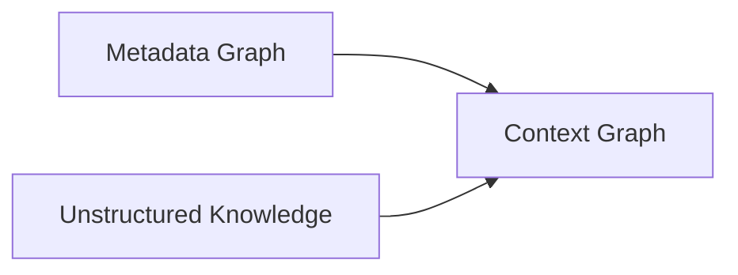
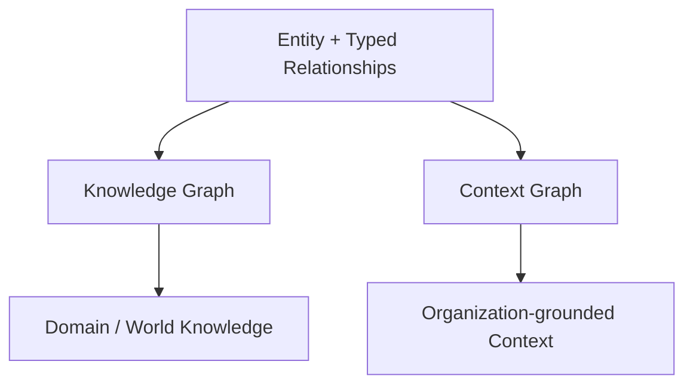
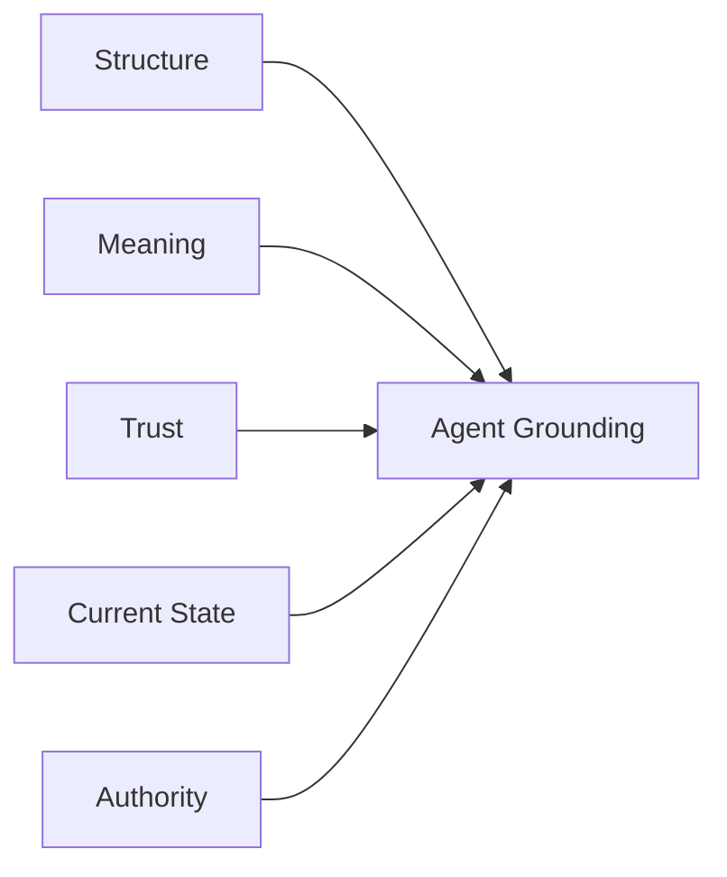
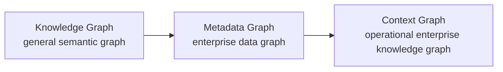

# Context Graph / Knowledge Graph — 官方材料中文学习笔记

**Status:** 第一轮  
**Primary Sources:**  
- https://datahub.com/blog/context-graph/  
- https://datahub.com/blog/context-graph-vs-knowledge-graph/  
- https://datahub.com/blog/metadata-knowledge-graph/

> 本文是中文释义与观点拆解，不是逐字翻译。

---

# 1. DataHub 的核心定义

DataHub 当前把 Context Graph 描述为一个统一 semantic network：

- 一边是 structured metadata；
- 一边是 unstructured organizational knowledge；
- 中间通过 meaningful relationships 连接。

Structured metadata 包括：

- schemas；
- lineage；
- ownership；
- quality；
- usage。

Organizational knowledge 包括：

- business definitions；
- runbooks；
- policies；
- decision logs；
- documentation；
- institutional knowledge。

---

# 2. DataHub 对 Knowledge Graph 的态度

DataHub 2026-04-29 的文章非常明确：

> Context Graph 与 Knowledge Graph 的图结构没有本质区别。

官方自己的区分主要是：

| Knowledge Graph | Context Graph |
|---|---|
| 更一般的 graph category | organization-specific specialization |
| entities + typed relationships | entities + typed relationships |
| 通常用 ontology 表达 domain semantics | 聚焦企业实际 data ecosystem |
| 可以描述一般领域知识 | 强调资产、owner、decision、documentation |
| knowledge representation | AI grounding / enterprise context |

官方甚至表示：

如果一个 Knowledge Graph 已经围绕某个公司的资产、owner、文档和 institutional knowledge 建模，那么它基本已经是一个 Context Graph。

---

# 3. Metadata Graph → Context Graph

DataHub 给出的演化逻辑：



Metadata Graph 负责：

- 数据资产；
- schema；
- lineage；
- ownership；
- classification；
- quality。

Context Graph 再加入：

- docs；
- decisions；
- business definitions；
- institutional knowledge。

官方表达可以压缩成：

> Metadata Graph 告诉你数据是什么、怎么连接。  
> Context Graph 还要告诉你它意味着什么、为什么存在、应该如何使用。

---

# 4. “Same Shape, Different Scope”

这是当前最值得记住的一句话。



但这里需要加一条自己的批注：

> “Knowledge Graph = world model” 是 DataHub 为了教学做的简化，不是严格技术定义。

Knowledge Graph 完全可以描述一个企业内部世界。

所以更准确的差异不是：

```text
world vs organization
```

而是：

```text
general knowledge representation
vs
operational enterprise context serving
```

---

# 5. DataHub 为什么强调 Context Graph

从官方材料看，Agent 是主要驱动力。

Agent 不是只需要知道：

- 有什么 table；
- column 是什么类型。

还需要：

- 哪个资产 trusted；
- 哪个 deprecated；
- 什么 definition approved；
- 谁拥有它；
- 是否 fresh；
- 哪个 document 解释它；
- 出问题该找谁。

所以 Context Graph 目标是提供：



---

# 6. 我们的批判性理解

## 6.1 Context Graph 不是新的 graph technology

官方也基本承认这一点。

DataHub 表示 context graph 可以建立在：

- RDF stack；
- property graph；
- custom storage；

之上。

因此 graph database 不是定义条件。

## 6.2 Generic Knowledge Graph 技术上可以做到相同事情

W3C RDF 可以表达任意 resources 与 relationships。

W3C PROV 已经可以表达：

- Entity；
- Activity；
- Agent；
- provenance；
- responsibility；
- derivation；
- timestamps。

因此 DataHub 的真正差异不应被理解成：

> Knowledge Graph 做不到 provenance / authority / time。

而应该理解成：

> DataHub 把这些企业数据场景里的能力产品化，并让它们持续与真实数据系统同步。

## 6.3 重点从 representation 转到 operation

Knowledge Graph 常问：

> How do we model knowledge?

Context Graph 额外要求：

> How do we keep context true enough to operate on?

这引出：

- freshness；
- continuous synchronization；
- certification；
- source authority；
- policy；
- lifecycle；
- agent access；
- write-back governance。

---

# 7. 当前学习结论

暂时把三者理解为：



但要注意：

这不是严格的继承关系。

更准确地说它们是三个 overlapping concepts。

DataHub 选择 “Context Graph” 这个名称，主要是在强调：

> graph 里承载的不是抽象知识，而是可以让 Human / Agent 正确理解并操作企业数据的当前语境。

---

# Related Research

- [02 — Context Graph vs Knowledge Graph](../research/02-context-graph-vs-knowledge-graph.md)
- [01 — Why Context Layer?](../research/01-why-context-layer.md)
- [Context Layer](../context-layer.md)
