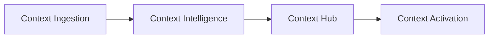
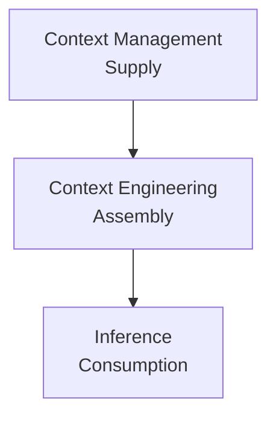

# Context Platform — 官方材料中文学习笔记

**Type:** 官方产品/架构材料释义  
**Status:** 第一轮  
**Primary Source:** https://datahub.com/products/context-platform/

> 本文不是逐字翻译。目标是保存中文释义、架构主张和研究问题。

---

## 一句话理解

DataHub 当前把 Context Platform 定义成位于企业数据系统与 AI Agent 之间的共享上下文基础设施。

它希望解决的不是“Agent 能否连接到数据”，而是：

> Agent 获取到的数据与知识是否统一、及时、经过治理，而且有足够的业务语义让它知道应该相信什么。

---

## 官方材料的核心结构

当前产品材料可以抽象成：

### Context Ingestion

中文理解：

从 warehouse、lake、BI、transformation、文档系统等来源持续收集 context，并将不同系统中的信息连接起来。

架构含义：

**Context Layer 首先是 integration problem。**

如果企业知识仍然分散在 Snowflake、dbt、Looker、Confluence 和人的经验里，Agent 并没有真正拥有 enterprise context。

### Context Intelligence

中文理解：

利用 query history、BI definitions、dbt 等已有信号自动推导或生成更多 semantic / business context。

架构含义：

**Context production 不能完全依赖人工填写 catalog。**

企业规模下，让专家从空白输入框开始写所有定义几乎不可持续，因此 AI/automation 更适合先生成 candidate context。

### Context Hub

中文理解：

把自动生成的 context 交给 domain expert 审查、修改、批准和发布。

架构含义：

这里体现的是 **authority**。

AI 可以生成候选知识，但“什么应该成为企业认可的 context”仍然需要 governance / ownership model。

### Context Activation

中文理解：

将已经治理、发布的 context 通过 Search、API、SDK、MCP 等方式供应给人和 Agent。

架构含义：

**Context 的价值不在存储，而在 activation。**

Context Layer 最终需要进入实际 decision path。

---

# Context 的组成

DataHub 近期材料使用四层模型：

| Layer | 中文理解 | 主要回答 |
|---|---|---|
| Technical | 技术上下文 | 有什么资产、结构如何、如何连接 |
| Operational | 运行上下文 | 是否新鲜、健康、正在使用 |
| Business | 业务上下文 | 它是什么意思、应该如何解释 |
| Organizational | 组织上下文 | 谁负责、谁有 authority、谁能访问 |

这四层不是四个孤立数据库。

DataHub 的主要主张是：它们应该连接进同一个 context graph。

---

# Context Management vs Context Engineering

## Context Engineering

关注某个 Agent 在当前任务里：

- 应该检索什么；
- tool 如何选择；
- context window 如何组织；
- memory 如何管理；
- 如何减少无关 token。

## Context Management

关注组织级问题：

- authoritative information 在哪里；
- 谁维护；
- 如何同步；
- 如何治理；
- 如何复用；
- 如何给多个 Agent 一致供应。

因此可以理解为：

---

# 对 DataHub 设计哲学的启示

## 1. Catalog UI 不是中心

如果 Agent 是一等消费者，那么 metadata/context 的核心价值不能绑定在 UI 上。

真正的产品中心转向：

- graph；
- APIs；
- policies；
- freshness；
- provenance；
- machine-readable context。

## 2. Metadata 的意义发生了变化

以前 metadata 主要帮助人类：

> discover and understand data.

现在它还需要帮助机器：

> select, reason, trust and act.

## 3. Business knowledge 成为基础设施

过去 business documentation 常常是 catalog enrichment。

Context Platform 的视角下，它变成 Agent 做正确决策所需的基础输入。

## 4. Human validation 仍然重要

AI 可以提高 context creation 的速度。

但 enterprise semantics 包含 policy、authority 与业务约定，不能只通过历史行为统计推导。

---

# 需要继续质疑的问题

1. “Single context graph” 是 logical unification 还是 physical centralization？
2. unstructured knowledge 的 freshness 如何管理？
3. AI 自动生成的 context 如何版本化和 provenance tracking？
4. 多个 domain 对同一术语存在不同定义时如何表达？
5. published context 的 authority model 是什么？
6. Agent write-back 后如何防止 context pollution？
7. DataHub Core 与 Cloud Context Platform 的能力边界如何长期演进？

---

# Related Research

- [Why Context Layer?](../research/01-why-context-layer.md)
- [Context Layer](../context-layer.md)
- [Design Philosophy](../design-philosophy.md)
