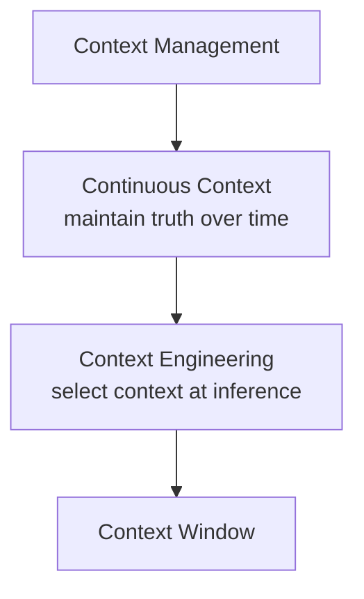
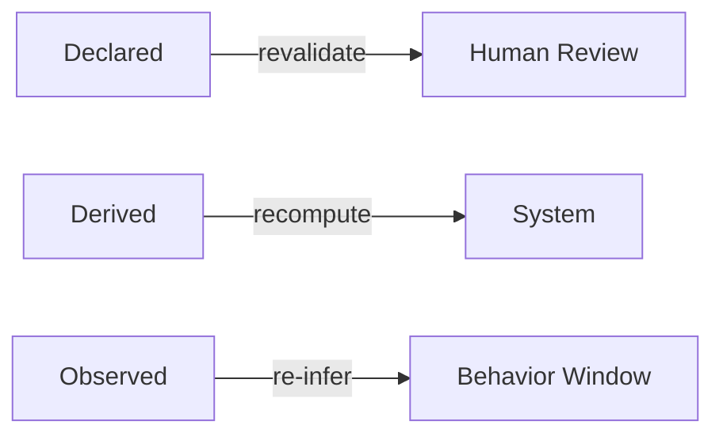
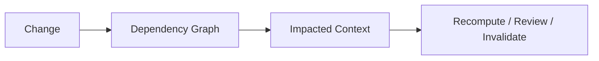
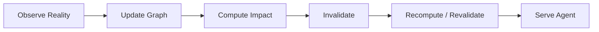

# Continuous Context / Freshness / Provenance — 官方材料中文学习笔记

**Status:** 第一轮  
**Primary Source:** https://datahub.com/blog/continuous-context/  
**Date:** 2026-05-05

> 这是中文释义与批判性阅读，不是逐字翻译。

---

# 1. 官方的核心问题

DataHub 提出的核心问题是：

> 文档本来就会 stale，但过去人类可以靠经验补偿；Agent 会把 stale context 当成事实直接执行。

因此它把 **continuous context** 定义为：

> 持续维护 Agent 消费的 context，让它随着真实世界变化而保持准确。

这里值得注意：

Continuous Context 不是 Context Engineering。



Continuous Context 是 temporal maintenance problem。

---

# 2. 三类 Context

DataHub 把 context 分成：

## Declared Context

人明确声明的知识：

- business rules；
- domain definitions；
- conventions；
- strategic intent。

官方的核心比喻：

> declared context 更像需要定期续约的 contract，而不是 materialized view。

## Derived Context

从 live technical signals 自动总结：

- schema；
- lineage；
- freshness；
- quality；
- ownership；
- usage。

官方认为它应该：

> source changes -> automatically re-derive

## Observed Context

从真实行为中推断：

- frequently joined tables；
- hidden dependencies；
- usage patterns；
- emerging deprecation。

这是：

> what people actually do

而不是：

> what people said they do。

---

# 3. 三类 Context 需要不同的维护策略



这是官方材料里非常有价值的一点。

如果所有 context 都只有同一个：

```text
updated_at
```

实际上无法正确管理 freshness。

---

# 4. Context Graph 为什么和 Freshness 有关

DataHub 的论点是：

> maintenance fundamentally is a graph problem。

因为 source change 后，真正的问题不是更新当前 node。

而是找：

- downstream derived context；
- human declarations that may now conflict；
- observed relationships that may have changed；
- agent-facing context that should be refreshed。

所以：



这让 Context Graph 从“知识展示结构”变成“maintenance dependency graph”。

---

# 5. 官方提出的六个 Continuous Context 能力

DataHub 的文章提出大致六项：

1. Context Graph，而不是 flat document store；
2. 全栈 change detection；
3. intelligent summarization；
4. human-authored context staleness detection；
5. per-context-type freshness SLA；
6. agent-native interfaces。

其中最值得关注的是第 4 和第 5。

因为它们承认：

> human-written context 不能通过普通 CDC 自动更新。

系统只能发现：

> “这个声明可能已经不可信了。”

然后请求 human review。

---

# 6. Freshness SLA per Context Type

DataHub 给出的思路：

- incident status：分钟级；
- schema：小时级；
- business definition：可能一年 revalidate 一次。

因此：

> Freshness 不是全平台统一数值。

这是正确方向。

我们的进一步拆解是：

```text
context freshness
≠ age of record
```

还要区分：

- source event time；
- observed time；
- processed time；
- derived time；
- validated time。

---

# 7. Provenance 在官方材料中的位置

DataHub 当前把 provenance 与 freshness 并列为 Context Layer 的基础能力。

对 Agent 返回 context 时，理想状态不是只返回内容。

还应告诉它：

- 是 live metadata 推导的？
- human 声明的？
- 多久没 validation？
- source 是什么？
- lineage / evidence 是什么？

官方甚至提出：

> agent-native context 应该携带 freshness 和 provenance。

这意味着 Agent response 的基本单位正在从：

```text
text
```

变成：

```text
assertion + trust metadata
```

---

# 8. 需要修正的地方：Event-driven 不等于 Real-time Truth

DataHub 官方频繁使用：

- real-time；
- event-driven；
- continuous synchronization。

架构方向是合理的。

但 DataHub 自己的 support material 也明确说明：

> metadata 经过 asynchronous processing，系统具有 eventual consistency 特征；大规模 ingestion 时 search/UI 的可见时间可能显著落后 ingestion acknowledgement。

因此更准确的表达应该是：

> event-driven architecture 降低 context staleness window，但不能消除 consistency lag。

真正要衡量：

```text
Source Change
-> Detection
-> Ingestion
-> Processing
-> Derivation
-> Indexing
-> Agent Visibility
```

每一段都需要 SLO。

---

# 9. W3C PROV 给出的补充视角

DataHub 现在开始讲 context invalidation，但 provenance / invalidation 并不是全新概念。

W3C PROV-O 已经定义：

- Entity；
- Activity；
- Agent；
- wasGeneratedBy；
- wasDerivedFrom；
- wasAttributedTo；
- generatedAtTime；
- invalidatedAtTime；
- wasInvalidatedBy。

对 Context Layer 最有启发的是：

> **Invalidation 应该是一等事件。**

Context 系统不能只保存：

> 什么时候生成。

还应该能保存：

> 什么时候停止成立，以及为什么停止成立。

---

# 10. OpenLineage 的补充视角

OpenLineage 把 runtime metadata 表达成 events：

- RunEvent；
- DatasetEvent；
- JobEvent；

并携带：

- eventTime；
- producer；
- identity；
- state transitions。

它说明：

> provenance 更可靠的来源往往是系统真实运行时 event，而不是事后人工 documentation。

Context Layer 可以把类似模式扩展到更广的 enterprise context。

---

# 11. 当前学习结论

DataHub 的 Continuous Context 方向可以压缩成：



真正值得学习的不是“自动更新文档”。

而是：

> **把 Context Maintenance 变成 dependency-aware continuous computation。**

这是 Context Platform 相比传统 Catalog/Wiki 更深的系统差异。

---

# Related Research

- [04 — Context Freshness & Provenance](../research/04-context-freshness-and-provenance.md)
- [03 — Context Layer vs Semantic Layer](../research/03-context-layer-vs-semantic-layer.md)
- [02 — Context Graph vs Knowledge Graph](../research/02-context-graph-vs-knowledge-graph.md)
