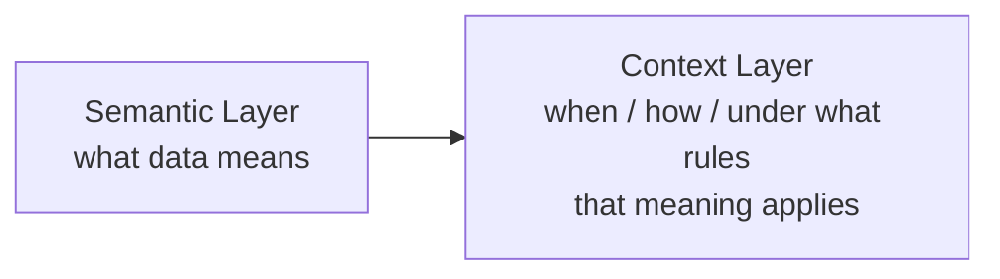
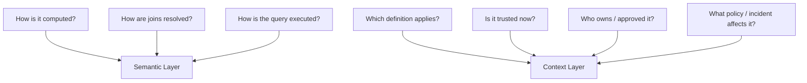
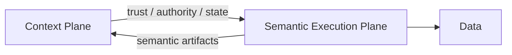
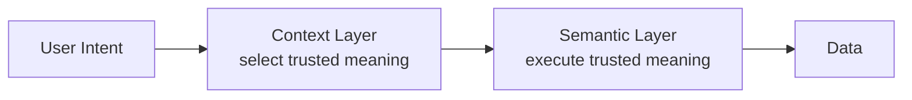

# Context Layer vs Semantic Layer — 官方材料中文学习笔记

**Status:** 第一轮  
**Primary Source:** https://datahub.com/blog/context-layer-vs-semantic-layer/  
**Date:** 2026-04-27

> 这是中文释义与批判性阅读，不是逐字翻译。

---

# 1. DataHub 官方的核心主张

DataHub 给出的基础区分是：

### Semantic Layer

解决：

> “Revenue / Active Users 这样的业务指标应该如何计算？”

典型能力：

- metrics；
- dimensions；
- business logic；
- consistent calculation。

### Context Layer

在 semantic definitions 之外再加入：

- lineage；
- freshness；
- governance；
- access；
- policy；
- operational state。

因此官方给出的简化是：



---

# 2. 官方最有价值的一点

DataHub 没有把 Semantic Layer 描述成无用或被淘汰。

相反，它认为二者 complementary。

这一点是合理的。

AI Agent 同时需要：

- 一个确定性方式计算 metric；
- 一个更宽的 context 来决定当前是否应该使用这个 metric。

例如：

```text
Semantic:
Revenue = SUM(completed_orders.net_amount)

Context:
- Finance certified
- Board-reporting approved
- Data fresh
- No open incident
- Owner = Finance Analytics
```

这两个层次是不同问题。

---

# 3. 需要修正的地方：Semantic Layer 并不只是 metrics

DataHub 的文章为了形成清晰对比，把 Semantic Layer 描述得比较窄。

但当前产品现实更复杂。

## dbt Semantic Layer

官方文档明确包括：

- metrics；
- semantic models；
- joins；
- permissions；
- APIs。

dbt MCP Server 甚至提供：

- Semantic Layer；
- metadata discovery；
- lineage；
- freshness；
- SQL；
- project metadata。

## Looker

LookML 定义：

- dimensions；
- aggregates；
- calculations；
- relationships。

Looker-managed MCP server 允许 Agent 在继承用户角色与权限的前提下访问 semantic model 和 governed data。

## Cube

Cube 把：

- metrics；
- dimensions；
- joins；
- access control；
- APIs；
- caching；
- AI/MCP；

都纳入 semantic layer product boundary。

因此不能说：

> “只要有 governance / MCP / permission，就已经是 Context Layer。”

产品边界已经高度重叠。

---

# 4. 我们采用的更稳定边界

与其按 feature list 分类，我们按 architectural responsibility 分类。



因此：

> Semantic Layer = computational semantics  
> Context Layer = situational semantics

---

# 5. “Context Layer extends Semantic Layer”也需要谨慎

从 information scope 看，这句话成立。

Semantic models / metrics 本身属于 enterprise context，因此 Context Graph 应该 ingest 它们。

但从 runtime architecture 看，并不应该让 Context Layer 接管 semantic query execution。

更合理的是：



也就是说：

> Context Layer 理解并关联 Semantic Layer；  
> Semantic Layer 保持自己的 executable semantics 职责。

---

# 6. DataHub 自己的路线也支持这个判断

DataHub 2026 年的 roadmap 已经公开讨论：

- first-class semantic models；
- metrics；
- metric-level lineage；
- dbt / Snowflake / Databricks semantic model ingestion；
- semantic model import / export；
- OSI-compatible interchange。

这表明 DataHub 的实际方向是：

> Context Platform 将 semantic artifacts 纳入 Context Graph。

而不是：

> 重新实现所有 Semantic Layer runtime。

---

# 7. AI 时代两者共同解决的更大问题

Semantic Layer 和 Context Layer 都可以被理解为：

> **减少 LLM 的推断自由度。**

Semantic Layer：

```text
不要让 LLM 猜 metric / join / aggregation。
```

Context Layer：

```text
不要让 LLM 猜 authority / freshness / relevance / policy。
```

组合后：



---

# 8. 当前学习结论

我们暂时采用：

> **Semantic Layer makes meaning executable.**  
> **Context Layer makes meaning situationally trustworthy.**

更中文一点：

> Semantic Layer 解决“这个业务概念怎么算”；  
> Context Layer 解决“在当前场景下，该用哪个定义、为什么可以相信它”。

这比“Context Layer 是 Semantic Layer 的下一代”更准确。

---

# Related Research

- [03 — Context Layer vs Semantic Layer](../research/03-context-layer-vs-semantic-layer.md)
- [02 — Context Graph vs Knowledge Graph](../research/02-context-graph-vs-knowledge-graph.md)
- [01 — Why Context Layer?](../research/01-why-context-layer.md)
