# 01 — Why Context Layer?

## 从 Data Catalog 到 AI Context Infrastructure

**Status:** 第一版  
**Focus:** DataHub 的架构演化与 AI 时代的 Context Layer  
**Updated:** 2026-09-28

---

## 0. 先给出当前结论

DataHub 最值得研究的地方，不是“它是一个更好的 Data Catalog”，而是它代表了一条更大的架构演化路径：

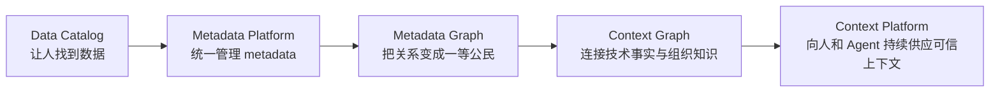

这条路径不是严格的产品版本历史，而是一个**架构解释框架**。

DataHub Core 今天仍然可以被理解为开放的 metadata platform；DataHub Cloud 在 2026 年则明确把自己定位成建立在 DataHub Core 之上的 enterprise context platform。

这说明 Context Platform 并不是从零出现的新系统，而更像是 metadata architecture 在 Agent 时代被重新解释和扩展后的结果。

---

# 1. 为什么 Agent 把“metadata 问题”放大成了“context 问题”？

传统数据系统里，很多知识其实一直没有真正进入软件系统。

一个资深分析师知道：

- 哪张表才是 production source；
- “revenue” 在财务和销售语境下不是同一个定义；
- 哪些 join 虽然技术上能跑，但业务上不应该使用；
- 某张表昨天开始延迟，今天不应该用于董事会数字；
- 某个 dashboard 已经被弃用，但仍然有人访问；
- 两个冲突定义中谁拥有最终解释权。

这些知识大量存在于：

- 人脑；
- Slack / Teams；
- Wiki / Notion / Confluence；
- dbt code；
- BI definitions；
- tickets / runbooks；
- query history；
- ownership relationships；
- quality / incident systems。

人在使用数据时，会自然把这些碎片拼起来。

LLM / Agent 不会自动拥有这层隐性知识。

它最危险的失败方式也不是 SQL syntax error，而是：

> **查询完全成功，但使用了错误的资产、错误的业务定义、过期的数据，最后返回一个非常可信的错误答案。**

因此 Agent 把一个长期存在的数据管理问题暴露得更明显：

**企业缺的不是更多数据，而是机器可消费的组织语境。**

---

# 2. Context Layer 要解决的不是“更多 token”

讨论 AI context 时，至少要分清三个层级：

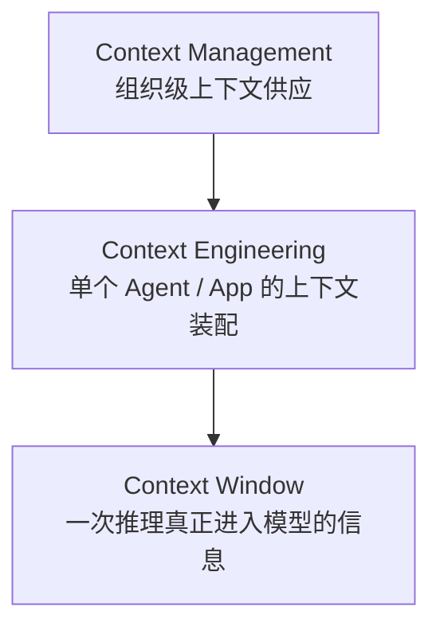

## Context Window

这是模型执行一次推理时能看到的 token。

问题是容量、attention、排序、压缩。

## Context Engineering

这是某个应用为了完成任务，决定：

- 放什么 system instruction；
- 调什么 tool；
- 检索什么文档；
- 使用什么 memory；
- 如何压缩历史；
- 什么信息 just-in-time retrieval。

这是 **application-local** 的问题。

## Context Management

这是另一个层级的问题：

- authoritative source 是什么？
- 两个定义冲突时哪个可信？
- 信息是否仍然新鲜？
- 谁拥有它？
- 数据质量是否正常？
- lineage 是什么？
- Agent 是否有权访问？
- 所有 Agent 是否在使用同一套企业定义？

这是 **organization-wide infrastructure** 的问题。

因此：

> Context Engineering 决定“这一轮给模型看什么”；  
> Context Management 决定“企业究竟有什么可信的信息可以给它看”。

DataHub 2026 年的 Context Platform 叙事，主要切入的是第二个问题。

---

# 3. 为什么 RAG 本身不等于 Context Layer？

RAG 解决的是：

> 如何找到与问题相关的信息。

Context Layer 还要解决：

> 找到的信息是否正确、当前、权威、允许使用，而且与其他事实如何关联。

例如，一个向量检索系统可以找到三个“Revenue Definition”文档。

但它本身未必知道：

- 哪一个已经 deprecated；
- 哪一个属于 Finance authoritative definition；
- 哪一个 metric 实际映射到哪个 dataset / column；
- 上游 pipeline 今天是否失败；
- 当前用户是否有权看到对应数据；
- 谁批准了这个定义；
- 哪个 dashboard 使用了它。

因此可以把二者关系画成：

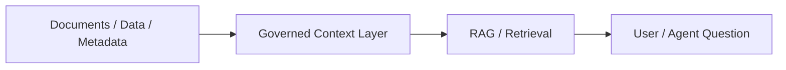

RAG 是 retrieval pattern。

Context Layer 是 **retrieval 背后的 truth supply chain**。

---

# 4. 为什么 DataHub 有机会从 Metadata Platform 演化到 Context Platform？

这是最值得学习的地方。

DataHub 早期/基础架构已经把下面这些东西当作 metadata system 的核心：

- entity identity；
- schema；
- lineage；
- ownership；
- glossary；
- usage；
- quality；
- relationships；
- metadata changes；
- programmatic APIs；
- 跨系统 ingestion。

这些能力原本主要服务于：

- discovery；
- governance；
- observability；
- impact analysis。

但从 Agent 的视角看，它们恰好也是判断“我应该相信什么”的基础信号。

例如：

| Metadata 能力 | 对人类的价值 | 对 Agent 的价值 |
|---|---|---|
| Lineage | 看上下游影响 | 判断来源、依赖与 blast radius |
| Ownership | 找负责人 | 判断 authority / escalation |
| Quality | 判断数据健康 | 决定当前数据是否值得使用 |
| Usage | 看热门资产 | 提供 behavioral relevance |
| Glossary | 统一业务术语 | 把自然语言映射到数据语义 |
| Schema | 理解结构 | 生成查询与工具调用 |
| Change events | 看到变化 | 避免使用 stale context |

所以 DataHub 的演化不是：

> “Catalog 做不下去了，所以加 AI”。

更合理的架构解释是：

> **一个足够成熟的 metadata graph，本来就在积累构建 enterprise context layer 所需的结构化基础。**

AI 让这层基础设施从“帮助人理解数据”变成了“帮助机器正确理解企业”。

---

# 5. Metadata Graph → Context Graph：到底增加了什么？

DataHub 当前对 Context Graph 的描述，核心扩张是：

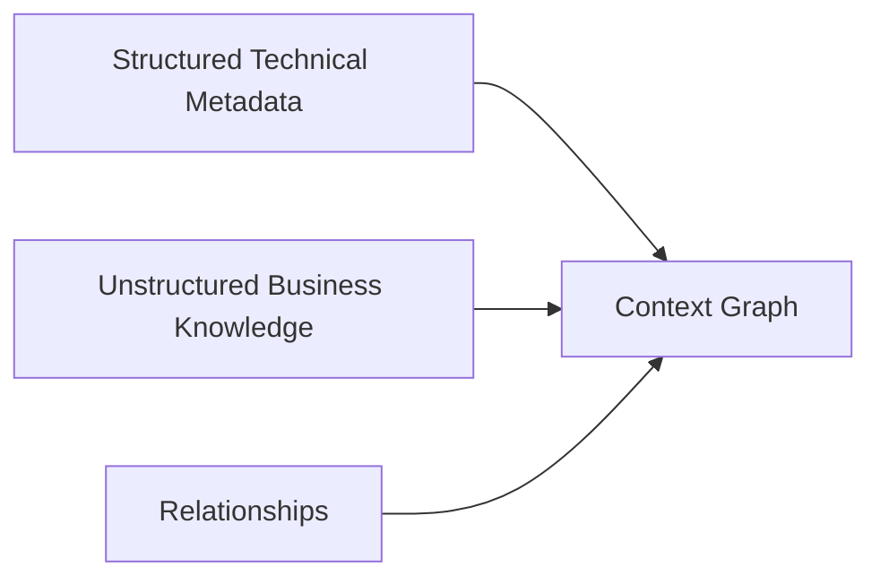

传统 metadata graph 很擅长：

- datasets；
- schemas；
- pipelines；
- dashboards；
- lineage；
- owners；
- tags；
- quality signals。

但 Agent 还需要大量不能单纯从技术系统推导出来的知识：

- why；
- business intent；
- decision history；
- approved definitions；
- runbooks；
- exceptions；
- organizational conventions；
- validated query patterns。

这意味着 Context Graph 的真正扩张不是“多几个 entity type”。

而是从：

> **描述数据系统**

扩展成：

> **描述企业如何理解、信任、使用和治理这些数据系统。**

---

# 6. 最新的四层 Context 模型

DataHub 在 2026-09-22 的材料中把 enterprise agent context 归纳为四层。

我们先把它作为一个分析模型，而不是行业标准。

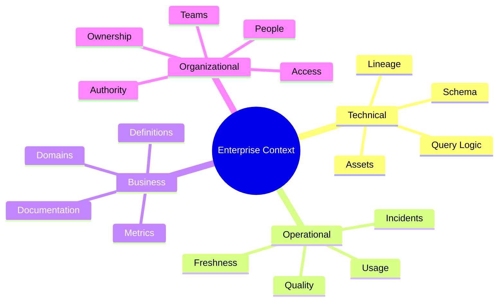

## 6.1 Technical Context

回答：

- 有什么？
- 它们如何连接？
- 数据从哪里来？
- 哪些资产依赖它？

这是传统 metadata platform 最成熟的一层。

## 6.2 Operational Context

回答：

- 它现在健康吗？
- 是否 stale？
- 是否有人真正使用？
- 是否发生 incident？
- quality signal 是什么？

这一层非常重要，因为 **truth 具有时间属性**。

一个昨天正确的上下文，今天可能已经错误。

## 6.3 Business Context

回答：

- 它是什么意思？
- “Customer”“Revenue”“Active User”如何定义？
- 哪个 metric 是 approved？
- 哪套逻辑符合业务规则？

这是从 metadata graph 向 context graph 扩张最大的部分之一。

## 6.4 Organizational Context

回答：

- 谁负责？
- 谁拥有解释权？
- 哪个 team 是 authority？
- 谁有权限？
- 出现歧义时 Agent 应该找谁？

这是很多简单 RAG / semantic layer 模型最容易忽略的一层。

---

# 7. 为什么 Graph 是 DataHub 设计哲学里的关键？

这里需要非常谨慎：

**“Context Graph” 不应该被简单理解成“底层一定使用某一种 graph database”。**

真正重要的是 logical model：

> relationships are first-class.

Context 的价值往往不在某一个属性，而在路径。

例如：

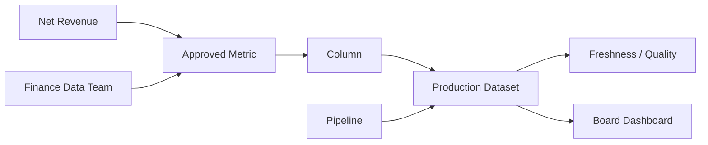

Agent 真正需要回答的往往不是：

> “Net Revenue 的定义是什么？”

而是：

> “Finance 批准的 Net Revenue 定义是什么？它落在哪个 production dataset？这张表现在是否新鲜？谁负责？这个数字最终影响哪些董事会报表？”

这是一个 **relationship traversal** 问题。

所以 Graph 的设计价值是：

1. 把关系当作信息，而不是附属字段；
2. 支持 provenance；
3. 支持 impact analysis；
4. 支持 authority resolution；
5. 支持跨 technical / business / organizational context 的组合查询。

---

# 8. Freshness 为什么在 AI 时代变成一等属性？

传统 catalog 的一个典型问题是 documentation drift。

人类遇到过期文档时，还可能凭经验识别：

> “这页看起来两年没更新了，我去问一下 owner。”

Agent 很可能不会。

因此 context 一旦被 Agent 自动消费，staleness 的风险被放大：

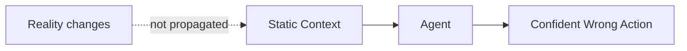

这解释了为什么 DataHub 长期强调的 event-driven / active metadata 架构，在 Agent 时代突然具有更高的战略意义。

**Context Layer 不能只是知识库。它必须是一个与现实持续同步的系统。**

---

# 9. Governance 为什么不能放在 Agent 外面？

很多 AI architecture 把 governance 理解成：

> “Agent 最后执行 action 时检查一下 permission。”

这太晚了。

Governance 实际上应该参与 context selection 本身。

Agent 在检索阶段就需要知道：

- 哪个 source authoritative；
- 哪个 asset certified；
- 哪个 context document published；
- 当前 principal 能看到什么；
- 哪个定义已经废弃；
- provenance 是什么。

因此更合理的结构是：

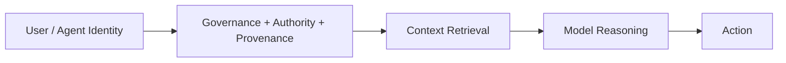

这意味着：

> Governance 不是 Context Layer 后面的 guardrail。  
> Governance 是 Context Layer 本身的一部分。

---

# 10. MCP 在这里到底是什么？

MCP 很重要，但不能把层级搞混。

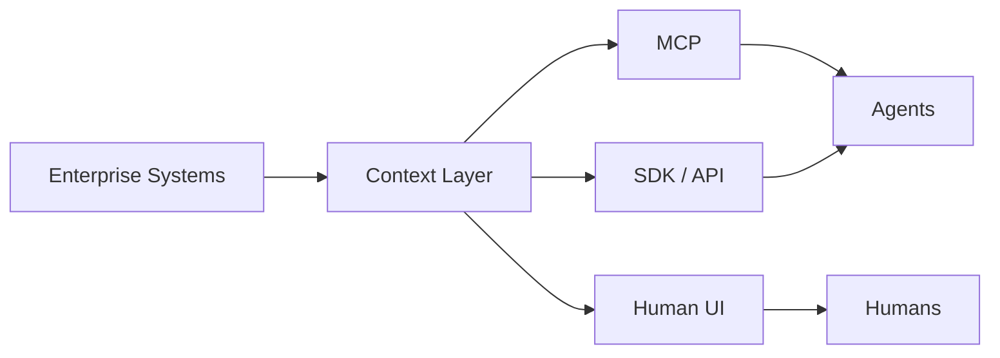

MCP 主要解决的是：

- 标准化 discovery；
- tool invocation；
- runtime context access；
- 降低 Agent 与具体平台的集成耦合。

但 MCP 并不自动解决：

- 数据是否可信；
- 定义是否 authoritative；
- context 是否 stale；
- lineage 是否完整；
- business semantics 是否存在；
- access policy 是否合理。

所以：

> **MCP 是 Context Activation / delivery protocol，而不是 Context Layer 本身。**

一个非常好的 MCP server 背后，如果连接的是混乱、过期、互相冲突的信息，Agent 只会更高效地获得错误 context。

---

# 11. DataHub 的 Context Platform 可以抽象成四段式架构

DataHub 当前产品材料把能力描述为 Context Ingestion、Context Intelligence、Context Hub、Context Activation。

把产品名去掉后，可以抽象成一个更通用的架构：

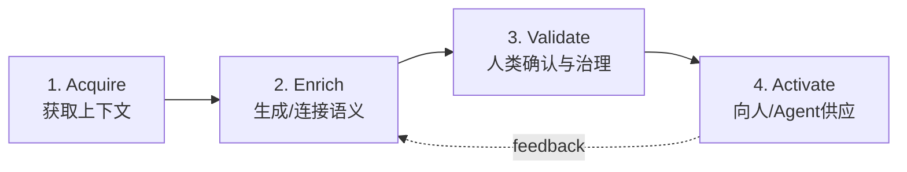

### Acquire

从大量 technical / business systems 获取信息。

### Enrich

从 query logs、BI、dbt、文档等推导更多语义。

### Validate

AI 可以生成候选 context，但最终 authority 往往仍来自 domain expert。

### Activate

通过 UI、Search、API、SDK、MCP 等方式提供给 consumer。

这个循环比“把文档 embedding 到 vector DB”完整得多，因为它处理的是 context lifecycle。

---

# 12. 一个更重要的设计哲学：Human 和 Agent 是否应该共享同一个 Truth Plane？

DataHub 当前叙事里有一个值得深入研究的思想：

> 人与 Agent 应该从同一个 governed source of truth 消费 context。

这是一个很重要的架构选择。

如果人为用户使用 Data Catalog A，Analytics Agent 使用 Vector DB B，Coding Agent 使用 Wiki index C，那么组织会得到多个 truth plane：

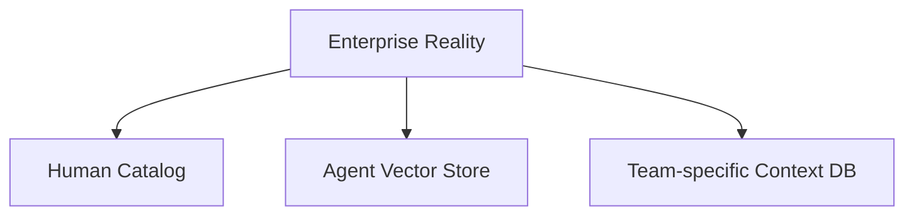

长期结果通常是：

- 定义漂移；
- 权限漂移；
- freshness 不一致；
- 同一个问题不同 Agent 给不同答案；
- provenance 无法统一审计。

DataHub 给出的答案是：

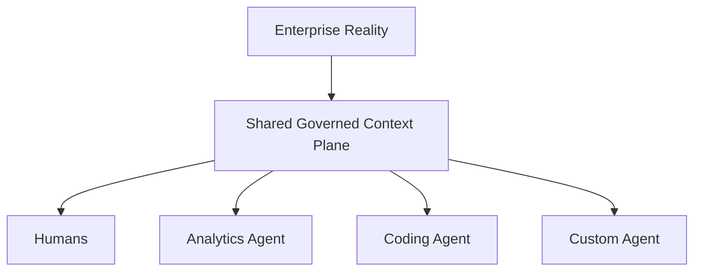

这是 Context Platform 最值得研究、也最有普适性的架构命题之一。

---

# 13. 我们暂时不接受的三个营销简化

DataHub 的方向值得研究，但不能直接接受所有产品叙事。

## 13.1 “Single source of truth” 不等于没有冲突

企业里真实存在：

- 多个 metric definition；
- domain-specific truth；
- 时间版本；
- policy exceptions；
- local semantics。

成熟 Context Layer 更可能需要：

> **managed plurality + explicit authority**

而不是假设所有问题最终都有一个全局唯一答案。

## 13.2 Context Graph 不等于把所有知识都塞进一个系统

真正的问题应该是：

- 哪些 context 应该 materialize？
- 哪些应该 federated / retrieve-on-demand？
- 哪些只是 reference？
- 哪些需要复制？
- freshness / ownership boundary 怎么保持？

“统一”不一定意味着“物理集中”。

## 13.3 AI-generated context 不天然可信

AI 可以从 query history、BI、代码和文档推导 context。

但它学到的是：

> “过去大家怎么做”。

这不一定等于：

> “组织规定应该怎么做”。

因此 Human-in-the-loop 不只是 UX feature，而是 authority model 的组成部分。

---

# 14. 当前的 Context Layer 定义

经过第一轮研究，我们暂时使用下面这个工作定义：

> **Context Layer 是位于企业真实系统与人类/AI consumer 之间的共享知识基础设施。它持续获取并连接 technical、operational、business、organizational context，并携带 freshness、provenance、authority 和 governance，使上层系统能够检索到“相关且可相信”的企业语境。**

其中几个词不能省：

- **shared**：避免每个 Agent 创建自己的 truth island；
- **continuous**：context 必须跟现实同步；
- **connected**：关系本身就是知识；
- **governed**：不是检索到就等于可以相信；
- **machine-consumable**：Agent 是一等 consumer；
- **human-validatable**：authority 不能完全交给机器生成。

---

# 15. 下一步研究

接下来不继续堆功能，而是分别拆五个问题：

1. **Context Graph vs Knowledge Graph**  
   DataHub 的 Context Graph 到底是新架构，还是 metadata knowledge graph 的重新命名？

2. **Context Layer vs Semantic Layer**  
   metric semantics 是 Context Layer 的子集，还是另一层独立基础设施？

3. **Context Management vs Context Engineering**  
   两者责任边界在哪里？谁应该负责？

4. **Context Freshness & Provenance**  
   如何把“当前真实”变成机器可验证属性？

5. **Agent Read / Write Context**  
   当 Agent 不只是读取 context，而开始产生 context 时，trust model 应该如何设计？

---

# Sources

以下均为 DataHub 官方材料。由于它们同时承担产品教育与市场传播作用，本篇将其视为 **primary vendor sources**，并把产品主张与架构推论分开处理。

- DataHub, **Context Platform for AI Agents**  
  https://datahub.com/products/context-platform/

- DataHub, **The Context Layer for AI: What Enterprises Get Wrong**, 2026-04-27  
  https://datahub.com/blog/context-layer-for-ai/

- DataHub, **What Is a Context Graph?**, 2026-04-10  
  https://datahub.com/blog/context-graph/

- DataHub, **What Is Context Management?**, 2026  
  https://datahub.com/blog/context-management/

- DataHub, **Introducing the DataHub Context Platform**, 2026-05-28  
  https://datahub.com/blog/announcing-datahub-context-platform/

- DataHub, **Introducing DataHub Cloud v2.1**, 2026-08-03  
  https://datahub.com/blog/datahub-cloud-2-1/

- DataHub, **What Is a Business Context Layer?**, 2026-09-15  
  https://datahub.com/blog/business-context-layer/

- DataHub, **Context Engineering for AI Agents**, 2026-09-16  
  https://datahub.com/blog/context-engineering-for-ai-agents/

- DataHub, **AI Agent Context: Four Layers and How Each Fails**, 2026-09-22  
  https://datahub.com/blog/ai-agent-context/

- DataHub Docs, **Activate Context**  
  https://docs.datahub.com/docs/managed-datahub/context/activate-context
