# 02 — Context Graph vs Knowledge Graph

## “新范式”还是 Knowledge Graph 在 Agent 时代的一次重新聚焦？

**Status:** 第一版  
**Focus:** Context Graph / Knowledge Graph / Metadata Graph 的边界  
**Updated:** 2026-09-28

---

# 0. 当前结论

先给出最重要的判断：

> **Context Graph 不是一种新的 graph data model。**

DataHub 自己对这个问题的回答相当直接：Context Graph 与 Knowledge Graph 在结构上基本相同，都是 **entities + typed relationships**。DataHub 主张真正的区别在 **scope 与 grounding**：Knowledge Graph 是更一般的类别，而 Context Graph 特指围绕一个组织真实资产、定义、人员、决策和运行状态构建的图。

我们的进一步判断是：

> **Context Graph 更适合被理解成一种 domain-specific operational Knowledge Graph，而不是与 Knowledge Graph 并列的新基础范式。**

它真正增加的不是新的“图结构”，而是一组更严格的系统约束：

- organization-grounded；
- continuously synchronized；
- provenance-aware；
- authority-aware；
- operational-state-aware；
- governed；
- agent-consumable。

因此“Context Graph”这个词的价值主要是重新定义 **graph 要承担什么职责**，而不是重新定义 graph 是什么。

---

# 1. 先把三个概念拆开

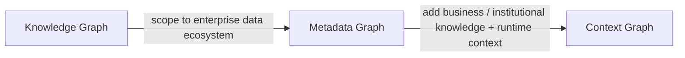

这个图只是一个分析模型，不表示所有厂商都接受同样的术语。

## 1.1 Knowledge Graph

最一般的定义：

- entity / resource；
- typed relationship；
- schema / ontology；
- graph traversal / reasoning。

W3C RDF 的抽象模型本身就是：

```text
subject --predicate--> object
```

一组 triple 构成 directed labeled graph。

它并不限制图必须描述“世界知识”还是“企业内部知识”。

因此从计算模型上说：

> Knowledge Graph 可以表达任何 domain。

包括：

- products；
- biomedical knowledge；
- organizations；
- enterprise data assets；
- people；
- policies；
- lineage；
- provenance；
- agents。

## 1.2 Metadata Graph

Metadata Graph 把 Knowledge Graph 的思想收窄到数据生态系统：

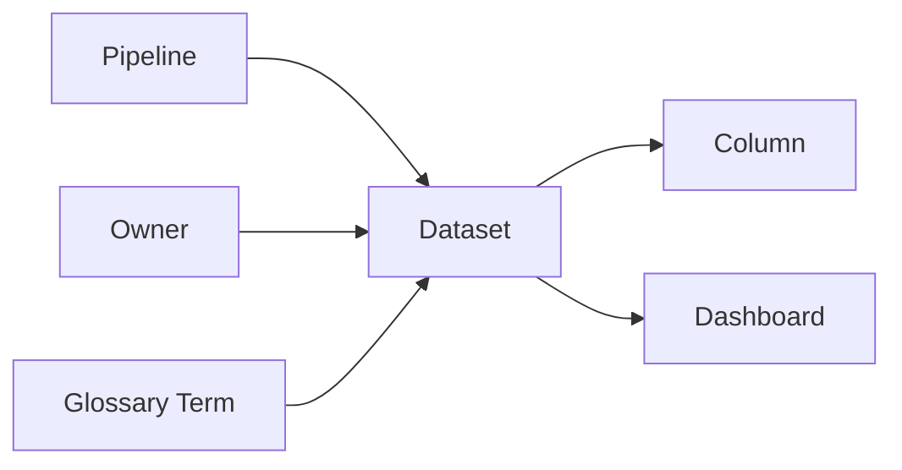

这里最重要的设计变化是：

> relationship 不再只是 asset 的 attribute，而成为一等结构。

于是 lineage、impact analysis、ownership traversal 等问题自然变成 graph query。

## 1.3 Context Graph

DataHub 当前给出的定义，是在 Metadata Graph 上继续扩展：

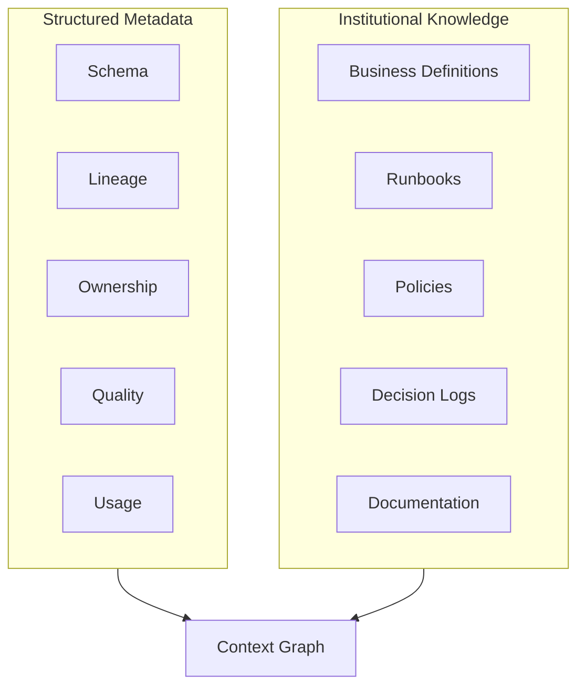

重点不只是“多放几类节点”，而是把过去分离的：

**system facts + organizational meaning**

连接起来。

---

# 2. DataHub 的官方说法其实很克制

DataHub 在 2026-04-29 的文章中直接写道：

- Context Graph 和 Knowledge Graph 的 underlying structure 相同；
- 很多强行制造的结构差异并不存在；
- 真正区别是 scope 与 grounding；
- 如果把 Knowledge Graph 收窄到某个公司的资产、owner 和文档，它实际上就已经是 Context Graph。

这是一个很重要的信号。

它意味着我们不应该把：

```text
Knowledge Graph -> Context Graph
```

理解为类似：

```text
Relational DB -> Graph DB
```

这种基础数据模型迁移。

更准确的是：

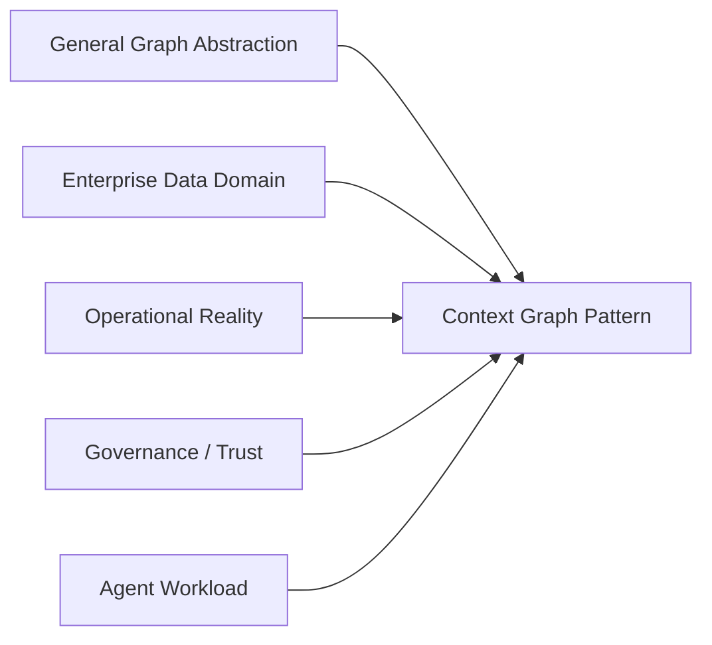

**Context Graph 是 Knowledge Graph 被一个特定问题空间约束后的架构模式。**

---

# 3. 对“Knowledge Graph = world model”要保持谨慎

DataHub 为了说明区别，会把传统 Knowledge Graph 描述成：

> world-model

而把 Context Graph 描述成：

> organization-model

这个表达很直观，但不是严格的技术边界。

因为 enterprise knowledge graph 很早就可以建模：

- 本企业客户；
- 内部组织结构；
- 业务流程；
- proprietary products；
- ownership；
- policies；
- internal documents；
- provenance。

RDF 本身允许 resource 是任意可识别的事物。

W3C PROV 更进一步，已经提供：

- Entity；
- Activity；
- Agent；
- attribution；
- derivation；
- responsibility；
- generation；
- timestamps；
- provenance chains。

因此：

> **一个设计得足够完整的 enterprise Knowledge Graph 完全可以拥有 DataHub 所谓 Context Graph 的大部分语义能力。**

所以真正的问题不是：

> Knowledge Graph 能不能表示这些东西？

答案是能。

真正的问题是：

> 企业有没有把这些能力做成持续运行、不断同步、可以被 Agent 直接消费的生产基础设施？

这才是 Context Graph 叙事真正有价值的部分。

---

# 4. Context Graph 真正增加的是 Operational Contract

我们可以把传统 Knowledge Graph 的最低定义写成：

```text
entities + typed relationships + semantics
```

而一个面向 AI Agent 的 Context Graph，需要更强的 contract：

```text
entities
+ relationships
+ semantics
+ current state
+ provenance
+ authority
+ trust signals
+ governance
+ continuous synchronization
+ machine activation
```

注意：

这些能力并非 Knowledge Graph 技术做不到。

区别是：

> **Context Graph 把它们从“可选建模能力”提升成“生产系统必须提供的服务等级”。**

---

# 5. 一个更准确的二维模型

与其争论名词，不如看两个维度：

1. **Semantic Breadth**：知道多少 meaning / relationships？
2. **Operational Grounding**：与当前企业真实运行状态同步到什么程度？

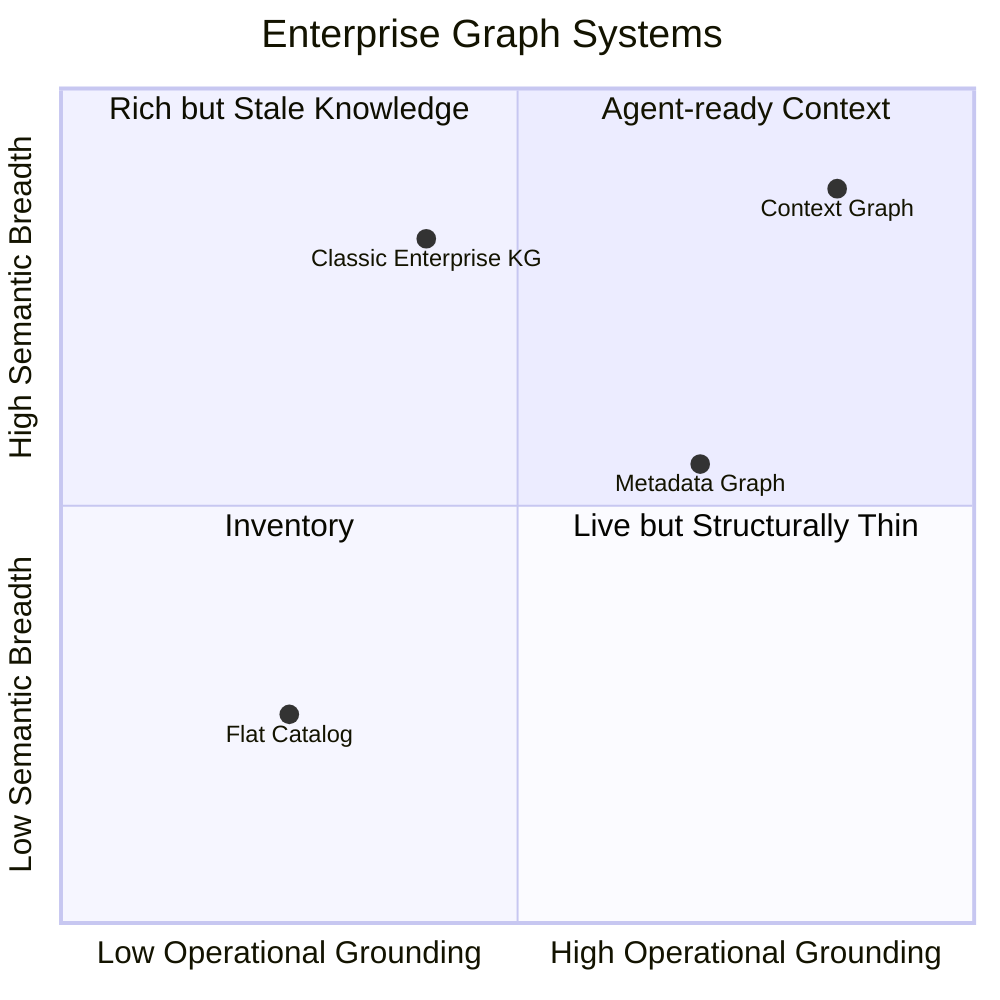

这不是定量评价，而是帮助我们区分关注点。

### Classic Enterprise KG

往往强在：

- ontology；
- semantics；
- entity resolution；
- inference；
- domain modeling。

但不一定天然负责：

- pipeline freshness；
- quality incidents；
- dataset usage；
- asset certification；
- real-time change propagation。

### Metadata Graph

往往强在：

- live data infrastructure；
- lineage；
- ownership；
- schema；
- operational metadata。

但过去可能缺少：

- business decision；
- institutional knowledge；
- unstructured knowledge；
- richer domain semantics。

### Context Graph

DataHub 的目标其实是把两边合起来：

> semantic richness × operational grounding

这比“它是不是 Knowledge Graph”更重要。

---

# 6. Freshness 是最大的区别之一，但不是 graph-theory 的区别

假设图里有：

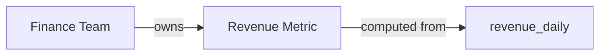

从 Knowledge Graph 的角度，这已经是有效知识。

但 Agent 真正问：

> “今天我是否应该使用 revenue_daily？”

它还需要：

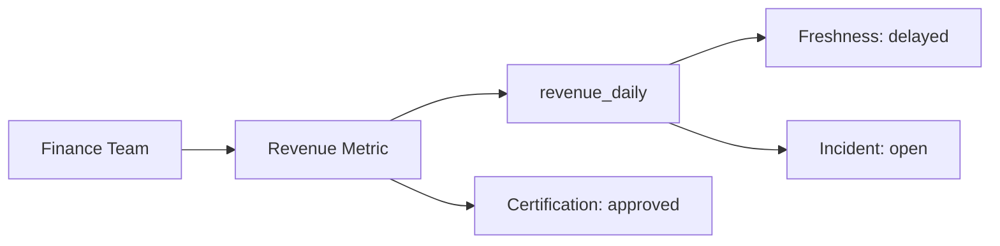

这里的信息不是“永恒知识”。

它是 **runtime state**。

因此 Context Graph 更像：

> **knowledge graph + operational digital twin**

这是一个比“world model vs organization model”更有解释力的视角。

---

# 7. Context Graph 是企业语境的 Digital Twin 吗？

这是一个值得继续验证的研究假设。

Digital Twin 的关键思想不是图，而是：

> 系统中的模型持续反映真实对象的当前状态。

Context Graph 也有类似要求：

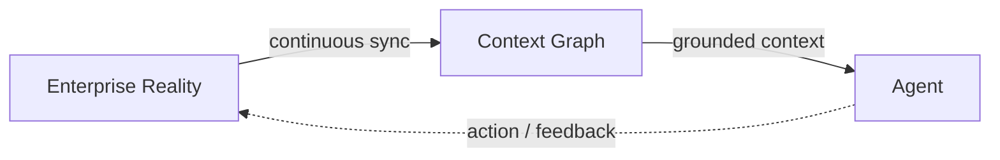

如果实际 warehouse schema 已改变，而 Context Graph 没更新，那么它不再是 context infrastructure，而只是 documentation。

因此：

> **Freshness 不是 Context Graph 的附加 metadata，而是它作为 AI infrastructure 是否成立的基础属性。**

---

# 8. Provenance 也不是 Context Graph 独有能力

DataHub 很强调 provenance，这个方向是正确的。

但要避免误解成：

> Knowledge Graph 没有 provenance，Context Graph 才有。

W3C PROV 已经明确支持：

- Entity；
- Activity；
- Agent；
- wasGeneratedBy；
- wasDerivedFrom；
- wasAttributedTo；
- responsibility；
- time。

所以更准确的理解是：

> DataHub 把 provenance 从 semantic modeling concern 变成 enterprise data operations concern。

例如 Agent 不只是知道：

```text
Net Revenue = Revenue - Refund
```

还应该知道：

- 谁定义的；
- 什么时候发布；
- 从哪个文档提取；
- 谁批准；
- 这个定义对应哪些 datasets；
- 哪些 downstream assets 使用它；
- 当前版本是什么。

这使 provenance 从“解释知识来源”升级成：

> **Agent decision evidence chain**

---

# 9. Authority 是 Context Graph 比一般 RAG 更重要的地方

如果图里出现两个定义：

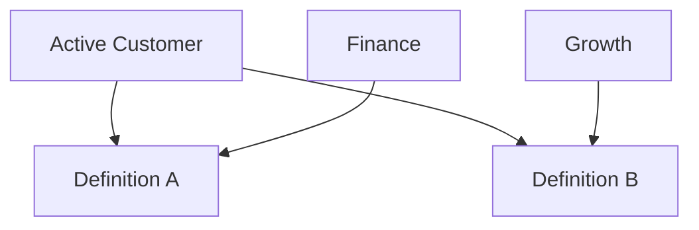

图本身只告诉我们：

> 有两个定义。

但 Agent 需要知道：

> 当前任务应该使用哪个定义？

于是 Context Graph 还需要表达：

- domain；
- authority；
- certification；
- policy；
- scope；
- version；
- temporal validity。

所以 Agent-era graph 的核心并不只是 **semantic relationship**。

更接近：

> **semantic relationship + epistemic status**

也就是：

- 这是什么？
- 它和什么有关？
- 我为什么相信它？
- 在什么范围内相信它？
- 谁拥有最终解释权？
- 它现在还有效吗？

---

# 10. Context Graph 不是 Ontology 的替代品

两者职责不同。

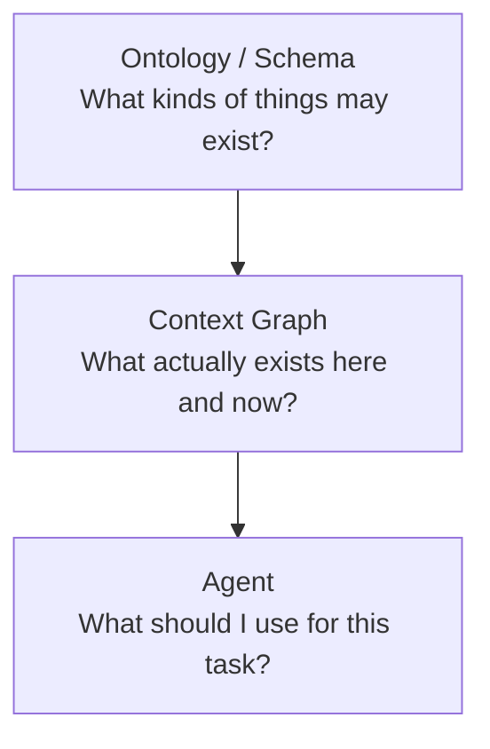

Ontology 更偏：

- class；
- property；
- constraints；
- shared vocabulary；
- conceptual semantics。

Context Graph 更偏：

- instance；
- current state；
- organization-specific relations；
- trust；
- evidence；
- operational context。

一个成熟 Context Graph 应该可以利用 ontology，但不能只靠 ontology。

---

# 11. Context Graph 也不等于 GraphRAG

这里三个东西很容易混在一起：

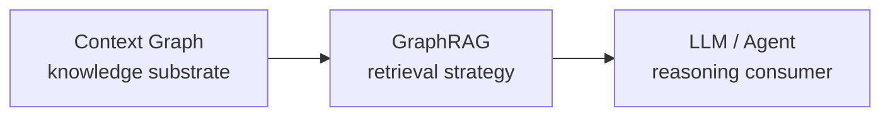

### Context Graph

解决：

> 企业有哪些被连接和治理的 context？

### GraphRAG

解决：

> 如何利用 graph structure 找到与当前问题相关的 context？

### Agent

解决：

> 如何利用取回的 context 做判断与行动？

因此 GraphRAG 可以跑在 Context Graph 上，但不能替代 Context Graph。

---

# 12. 真正的差异：Knowledge Representation vs Context Operations

这是这一篇最重要的抽象。

传统 Knowledge Graph 更容易从 **Knowledge Representation** 视角讨论：

```text
How should knowledge be modeled?
```

Context Graph 则迫使我们增加另一组问题：

```text
How should context be operated?
```

也就是：

| Knowledge Representation | Context Operations |
|---|---|
| Entity 是什么？ | Entity 是否仍然存在？ |
| Relationship 是什么？ | Relationship 是否仍然有效？ |
| Definition 是什么？ | Definition 是否 authoritative？ |
| Fact 是什么？ | Fact 是什么时候获取的？ |
| Source 是什么？ | Source 现在是否健康？ |
| Ontology 如何组织？ | Context 如何持续同步？ |
| 如何推理？ | Agent 是否可以安全使用？ |

这个差异非常重要。

> **Context Graph 的创新重点可能不在 graph，而在 operation。**

---

# 13. DataHub 的位置

按照这个模型，DataHub 的历史优势不是“它终于有 Knowledge Graph”。

它更像是从另一个方向走到同一个交叉点：

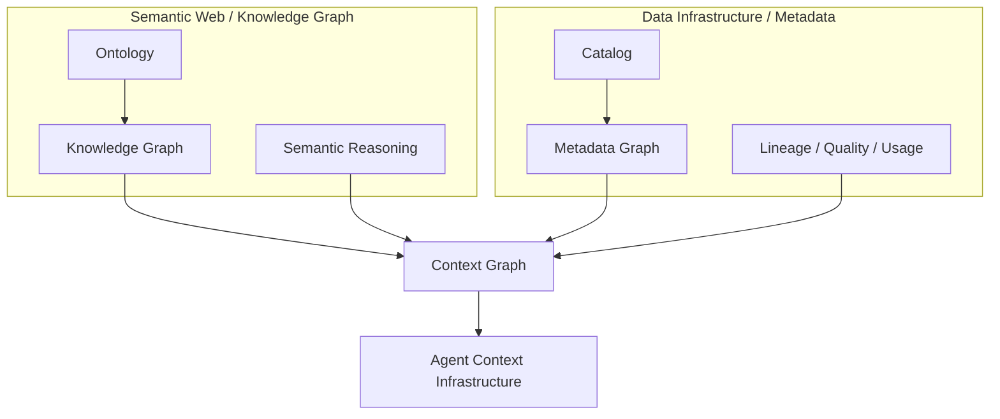

Semantic Web / KG 世界带来了：

- semantic modeling；
- ontology；
- graph reasoning；
- interoperability。

Metadata Platform 世界带来了：

- continuous ingestion；
- lineage；
- live operational metadata；
- data quality；
- ownership；
- enterprise integration。

AI Agent 需要两边。

所以 Context Graph 可以被看成：

> **Knowledge Graph tradition 与 Active Metadata tradition 的汇合点。**

这个解释比“Context Graph 是一种新的图”更有意义。

---

# 14. 对 DataHub 官方叙事的三个修正

## 14.1 “Knowledge Graph 通常是 world-model”只能作为教学简化

企业 Knowledge Graph 本来就可以是 organization-specific。

所以 scope 不构成严格分类边界。

更好的区分是：

> Context Graph 明确把 **current enterprise reality** 当成产品 contract。

## 14.2 “Context Graph 能做而 Knowledge Graph 做不了”表达过强

技术上，一个 Knowledge Graph 完全可以：

- 建模 lineage；
- 加 provenance；
- 加 timestamp；
- 加 owner；
- 加 quality；
- 加 access policy。

真正差异应该写成：

> Context Graph 产品把这些能力做成 first-class operational primitives，而不是要求用户自己设计完整 ontology 和同步系统。

## 14.3 “Single Graph” 不一定意味着单一物理数据库

Context Graph 更合理的目标是：

> logical unified context plane

而不是：

> 所有企业知识必须复制进一个 graph database。

未来我们需要进一步研究：

- materialized graph；
- federated graph；
- virtual relationship；
- just-in-time retrieval；
- source-of-truth ownership。

---

# 15. 一个更严格的工作定义

经过这一轮研究，我们把 Context Graph 暂时定义成：

> **Context Graph 是一种 organization-grounded、operationally maintained 的 enterprise knowledge graph。它把数据资产、技术关系、业务语义、组织责任、运行状态和 institutional knowledge 连接在同一个可查询语义网络中，并把 freshness、provenance、authority 与 governance 作为 Agent 可以直接使用的上下文属性。**

这个定义故意避免说：

> Context Graph 是一种新的 graph technology。

因为目前没有证据支持这个说法。

---

# 16. Architecture Checklist

以后看到一个产品声称自己有 Context Graph，可以用下面的问题判断它究竟是什么：

### Graph

- relationships 是否真的是 first-class？
- 是否支持 multi-hop traversal？
- graph 是真实 logical model，还是 UI visualization？

### Context

- 是否包含 technical metadata？
- 是否包含 business knowledge？
- 是否包含 organizational knowledge？
- 是否包含 operational state？

### Operations

- context 如何更新？
- freshness 怎么度量？
- stale information 如何失效？
- change history 是否保留？

### Trust

- provenance 是否可追踪？
- authority 如何表达？
- certification / validation 如何表达？
- conflicting truth 如何处理？

### Agent

- 是否支持 machine-readable access？
- retrieval 是否有权限边界？
- Agent 是否看到与 human 相同的 truth plane？
- write-back 如何治理？

如果一个系统只有：

```text
documents -> entity extraction -> graph
```

它可能是 Knowledge Graph。

但还不一定是我们这里定义的 production Context Graph。

---

# 17. 下一步

下一篇应该研究：

## Context Layer vs Semantic Layer

核心问题：

> Semantic Layer 已经解决了 metrics 和 business semantics，为什么 AI 时代还需要 Context Layer？

我们需要判断：

- Semantic Layer 是不是 Context Layer 的子集？
- metrics 是否应该成为 Context Graph 的 first-class nodes？
- semantic model 与 lineage / quality / ownership 如何连接？
- Agent 做 analytics 时，两层如何协作？
- DataHub 与 dbt Semantic Layer / LookML / Cube 等系统是什么关系？

---

# Sources

## DataHub — primary vendor sources

- DataHub, **Context Graph vs Knowledge Graph: Same Shape, Different Scope**, 2026-04-29  
  https://datahub.com/blog/context-graph-vs-knowledge-graph/

- DataHub, **What Is a Metadata Knowledge Graph? A DataHub Definition**, 2026-04-29  
  https://datahub.com/blog/metadata-knowledge-graph/

- DataHub, **What Is a Context Graph and Why Does It Matter for AI Agents?**, 2026-04-10  
  https://datahub.com/blog/context-graph/

## External standards / references

- W3C, **RDF 1.2 Concepts and Abstract Data Model**  
  https://www.w3.org/TR/rdf12-concepts/

- W3C, **RDF 1.2 Primer**  
  https://www.w3.org/TR/rdf12-primer/

- W3C, **PROV-O: The PROV Ontology**  
  https://www.w3.org/TR/prov-o/

These external sources are important because they show that graph semantics, provenance, agents, responsibility and time-aware provenance are not inventions of the current “Context Graph” category.
