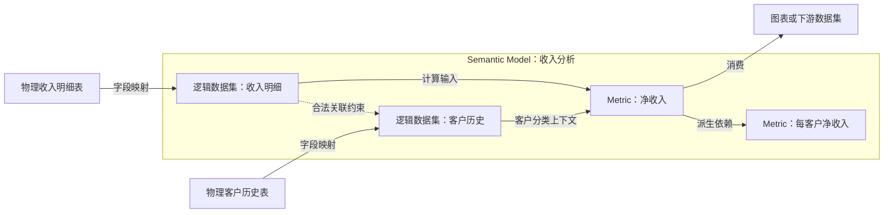
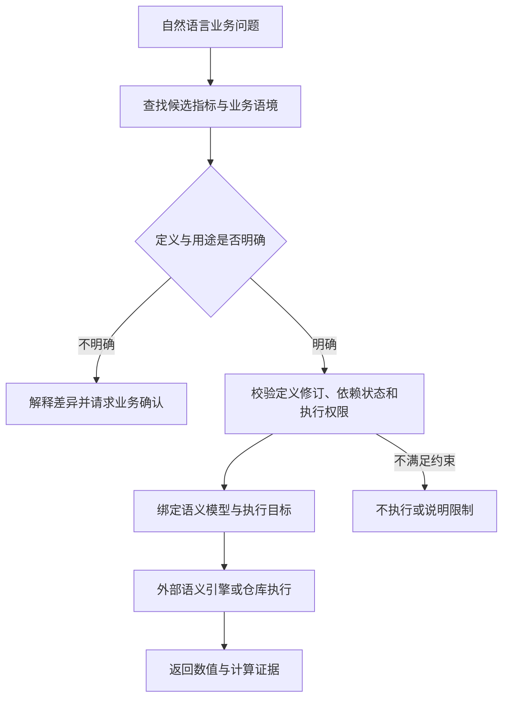

# 02 — Metrics & Semantic Models

## DataHub 如何管理业务语义，而不成为指标计算引擎

**核查日期：2026-09-28**  
**研究范围：概念模型、架构职责、设计取舍、AI Context Layer；不分析实现源码。**  
**证据状态：公开资料研究；未运行 DataHub 实例、连接器或指标查询。**

> 本文沿用本次对话的专题编号 02，与仓库已有的主线 02《Context Graph vs Knowledge Graph》并行，不替换原文。配套的[官方材料释义与证据表](../official-docs/metrics-and-semantic-models.md)记录发布状态、资料冲突和待验证事项。

## 0. 研究结论

DataHub 目前为 Metric 和 Semantic Model 提供的是**定义的目录化、治理与关联能力**。官方指南明确把指标值的计算与可视化留给 BI 工具或语义层。因此，“DataHub 加入 Metric”不能直接解释成“DataHub 成为 MetricFlow、指标服务或通用 SQL 执行引擎”。[^guide]

更准确的架构解释是：DataHub 在已有资产图谱里引入可被独立定位、描述和治理的业务计算定义，让消费者能够从“净收入是什么意思”继续追到“采用哪个定义、落在哪些逻辑数据集、依赖哪些物理数据”。这一步扩大了它管理的语义范围，但没有消除外部执行系统。[^guide][^r21]

本研究把这类职责称为 **semantic metadata / governance plane（语义元数据与治理平面）**。这是分析用语，不是 DataHub 的官方产品名，也不意味着所有治理决策已经能自动执行。


图中 DataHub 到 Agent 的连线表示架构责任，不保证所有新 Metric 字段已经通过现成 MCP 工具暴露；当前能力边界见第 1 节。

## 1. 先修正上一轮讨论中的四个过度判断

### 1.1 已发布实体，不等于各平台原生连接器已经全面支持

2026-08-03 的 Cloud 2.1 发布说明确认了实体、SDK 和界面支持，同时明确把平台原生采集的后续扩展列为下一步。当前功能指南具体提供的开箱即用路径是 **Snowflake Semantic Views**，任意其他来源可通过 SDK 组织和写入定义；dbt Semantic Layer、Databricks Metric Views 等新实体采集仍列在后续工作中。[^r21][^guide]

2.1 发布说明也列出了 Cube 连接器。这里不能把“有 Cube 连接器”或者“已有 dbt 元数据采集”推导成“所有来源均已完整映射到新的 Metric / Semantic Model 实体”。需要逐连接器核查版本、开关、输出实体和字段覆盖。

### 1.2 可以存 AI Context，不等于指标的 Agent 消费链路已经全部打通

July Town Hall 回顾把读取 certified definition 描述为面向 Agent 的价值；当前指南则仍把 Metrics / Semantic Models 专用 MCP 接入、直接使用 AI Context 的发现能力列在后续工作里。[^july][^guide]

两种资料粒度并不一致。本研究采用较窄的结论：**数据模型已经能够携带 AI Context；不能据此保证某个部署中的 Agent 已能通过标准工具完整读取和使用它。** 已有通用 DataHub MCP 可用，也不是新实体工具覆盖完成的证据。

### 1.3 有实体级血缘，不等于完整的列到指标影响分析已经落地

Cloud 2.2 描述的新路径是 `Metric → Semantic Model Dataset → Physical Dataset`，Semantic Model 作为分组容器。当前指南确认实体级影响分析，但把完整的物理列到指标影响分析列为 roadmap。[^r22][^guide]

所以不能仅凭表到指标的路径，就断言“修改任何一列都能准确找出全部受影响 KPI”。

### 1.4 “最近出现”是能力升级，不是 Metric 这个业务概念刚被发明

DataHub 在 2025-03-24 的 roadmap 已经提到 Metrics Catalog。2026 年值得研究的是这一方向的实体化、产品化，以及与语义标准和 Agent 上下文的结合。[^roadmap]

此外，OSI 已于 2026 年 7 月以 **Apache Ossie（incubating）** 的名称进入 Apache 孵化体系。讨论近期资料时应同时识别两个名称。[^ossie]

## 2. Metric、Measure、Dimension、Glossary Term 到底差在哪里？

以下是本文用于分析的概念分工；不同语义产品的字段名称不保证一一对应。

| 概念 | 回答的问题 | 合成示例 |
| --- | --- | --- |
| Glossary Term | 业务概念如何解释？ | 净收入的业务含义 |
| Measure | 哪个量参与聚合、如何聚合？ | 交易行上的 signed_amount |
| Dimension | 按什么分类、过滤或时间尺度观察？ | 地区、客户类型、交易日期 |
| Metric definition | 在指定语义范围内如何得到业务量？ | 符合规则的交易行金额之和 |
| Semantic Model | 哪些逻辑数据、关联路径和维度构成计算环境？ | 收入明细、客户历史、日期及其合法关联 |
| Metric value | 对一次具体请求执行后得到什么结果？ | 指定月份、地区、权限范围下的数值 |

DataHub 的 Metric 记录表达式，并关联其 Semantic Model；模型中的逻辑数据集复用 Dataset 实体，字段可以附加 DIMENSION、MEASURE、FILTER 语义注解。治理属性和 AI Context 再挂到相应对象上。[^guide]

这里有两个容易误解的地方。

**第一，Glossary Term 不是无用的弱版本 Metric。** 它负责组织概念，不要求每个概念都可计算。“客户”“收入确认原则”“渠道”可以关联多个指标，也可以在不同业务域里有不同用法。给术语添加一大段 SQL 能存信息，却没有自动建立可供程序查询的指标关系。

**第二，Metric 也不是一个数字。** 例如一个月的转化率，至少还依赖时间范围、分组维度、过滤条件、输入数据状态与执行身份。目录中的定义即使完全不变，下一次计算的值也可能不同。

为了讨论这种区别，可以采用下面的分析模型：

```text
指标结果 = 执行(
  指标定义及修订,
  语义模型及修订,
  时间范围与时间解释,
  维度与过滤条件,
  数据版本或读取时点,
  执行主体与权限范围
)
```

这不是 DataHub API 签名。它说明：**定义的存在，是可重复计算的必要输入之一，不是全部条件。**

## 3. 新模型真正有意思的地方：语义容器与计算依赖分开

当前指南描述了两个新实体类型——Semantic Model 和 Metric——以及复用 Dataset 类型的 Semantic Model Dataset。不要把后者误读成第三种全新的顶层实体类型。[^guide]



这张图的实线按上游到下游阅读；从 Metric 反向追溯，就是发布说明里的 Metric → 逻辑 Dataset → 物理 Dataset。虚线关联约束与实线血缘不是同一种边。

### 3.1 为什么 Semantic Model 不宜被当成每条血缘路径中的计算节点？

设模型里有收入、客户、库存三个逻辑数据集。“净收入属于这个模型”并不意味着库存是净收入的输入。

如果只画成 `所有物理表 → 模型 → 所有指标`，模型成员关系就会被误当成数据依赖，影响分析容易产生误报。把模型画成容器、把实际依赖连接到成员对象，能在概念上避免这种混淆。

Cloud 2.2 的容器化血缘变化与这个区分相符；上述误报分析是本研究对该设计的解释，不是官方给出的性能结论。旧元数据还需要重新采集或迁移以填充新的血缘形状。[^r22]

### 3.2 为什么逻辑 Dataset 值得保留？

同一张物理表可以为不同业务模型提供不同的业务投影。逻辑字段可能重命名、计算、筛选，或者以业务角色解释同一个原始列。

保留逻辑 Dataset，有助于把“上层承诺的业务接口”和“下层当前的物理实现”分开。物理重构不必天然改变业务名字；业务定义改变，也不应伪装成普通表结构变更。

这是一种可借鉴的架构原则，但不表示 DataHub 会自动完成兼容迁移或自动证明两次映射等价。

## 4. 不要混淆两种图：Dependency Graph 与 Allowed-Join Graph

**血缘回答：这个东西从什么推导而来？**

**语义关联回答：为了计算这个指标，哪些对象能以什么基数、粒度和条件组合？**

知道表 A 的某些字段流向表 B，不等于查询时可以将 A 和 B 任意连接。反过来，两张表有合法的维度关联，也不意味着一张表是另一张表的 ETL 下游。

这个区分并非 DataHub 独有。dbt 的 MetricFlow 文档也将语义图中的信息关联与任务依赖 DAG 区分，并说明查询构造需要依据实体键与关联约束选择路径。[^metricflow]

### 反例一：SQL 可以执行，但重复计数

假设一张订单表只有一笔 100 元订单，订单明细表有三行。直接 join 后对订单总额求和会得到 300，而不是 100。

`SUM(order_amount)` 这段字符串没有告诉执行者应该在什么粒度计算，也没有防止 join 扩张。语义模型需要表达并保留约束；计算引擎需要实际遵守约束。目录能够展示这些信息，不等于目录负责在运行时防止 fanout。

### 反例二：指标能展示，但不能按直觉再聚合

假设 A 地区 900 人中有 90 人转化，B 地区 100 人中有 50 人转化。两地转化率分别是 10% 和 50%，直接平均得到 30%；总体转化率应为 `(90 + 50) / (900 + 100) = 14%`。

再如，周一活跃用户集合是 Alice、Bob，周二是 Bob、Carol。两个日活数相加是 4，两天去重活跃人数是 3。

这些合成反例说明：**指标的语义包括聚合行为，而不只是展示名称和表达式文本。** DataHub 支持用 Structured Properties 补充 additivity 等信息，但存入一个属性不意味着执行引擎必然读取或强制执行它。[^guide]

## 5. “一等实体”改变了什么？

产品层面，Metric 和 Semantic Model 可以独立搜索、浏览、关联治理信息，并参与血缘。[^guide] 架构层面，本研究认为有四个变化。

**有了稳定引用的对象。** 下游可以引用某个指标身份，而不只引用一段“可能叫净收入”的文档。注意身份稳定与语义修订稳定是两回事；同一身份下的表达式仍可能改变。

**治理范围可以与技术资产解耦。** 负责原始交易表的团队，不一定是有权批准财务指标口径的团队。模型将“资产维护者”和“业务定义责任人”分开表达，才有机会支持这种组织现实。

**影响分析可以到达业务问题。** 从“某表被改了”继续追到“哪些已登记指标依赖它”，比只列出下游表更接近业务消费者的语言。血缘覆盖不完整时，结论仍只能覆盖已知依赖。

**机器消费有了结构化锚点。** 文档、同义词和示例可以围绕一个身份组织，而不是让 Agent 在多个文本片段之间自行推断它们是否指向同一个计算。

代价也随之出现：指标需要命名、消歧、修订策略、归属约定和同步机制。一等实体不会消灭治理工作，它使此前藏在文档里的治理问题变得可见。

## 6. DataHub 是不是在进入 Semantic Layer？

这个问题必须先拆开“Semantic Layer”包含的责任。

| 责任 | 具体问题 | 本次核查得到的边界 |
| --- | --- | --- |
| 定义与描述 | 指标、维度和合法关联是什么？ | DataHub 新模型覆盖此类元数据 |
| 发现与治理 | 去哪里找、谁负责、关联哪些资产？ | DataHub 的直接职责 |
| 查询构造 | 给定指标与维度，怎样构造正确 SQL？ | MetricFlow 等语义查询系统承担 |
| 数据执行 | 读哪些数据、怎样执行计算？ | 仓库及外部查询链路承担 |
| 结果交付 | 返回数值、可视化、缓存等 | 不是 DataHub Metrics Catalog 的承诺 |

上表的产品边界来自 DataHub FAQ、MetricFlow 文档和 Snowflake 的语义视图查询文档；它是职责比较，不是各产品全部功能的排名。Snowflake 明确提供以指标和维度为输入的 Semantic View 查询接口，MetricFlow 明确负责 SQL 构造，而 DataHub FAQ 明确不提供指标值计算。[^guide][^metricflow][^snowflake]

因此可以给出两句同时成立的话：

> **DataHub 正在扩大对业务语义的管理范围。**
>
> **DataHub Metrics Catalog 当前不是一个通用指标计算引擎。**

如果把 Semantic Layer 广义地理解为定义、目录和执行的组合，DataHub 的确进入了其中一部分。若把它限定为能够接收 metric request 并返回指标值的服务，那么当前不能这样定位 DataHub。

还应避免一个反向误区：外部语义平台也可能具备所有权、权限、目录和 AI 能力，不能把它们一律描述成“只有计算、没有治理”。学习重点应是每条具体链路由谁负责，而不是画出互不重叠的厂商地盘。

## 7. 对 AI Context Layer 的意义：从猜公式转向选择定义

下面是本研究建议的目标工作流，不是声称 DataHub 当前已开箱实现全部步骤。



这种流程把 Agent 的一部分工作从自由生成改成了**解析意图、选择已有定义、补足参数、调用受约束执行路径**。

但同义词命中并不是正确选择。“收入”可能同时命中 gross revenue、net revenue、bookings 或管理口径收入。向量相似度只能提供候选，不能替代业务用途与权限判断。

一个有治理标记的指标也不必然适合所有用途。Sales 批准的销售预测指标，不应因为名称接近就取代另一业务域的报表口径。发布者的权威范围需要明确，而不是把一个 Certified 标签当成全组织通行证。

## 8. 用一个完整场景推导 Context Layer 还缺什么

以下使用合成规则，仅用于架构分析，不是实际公司的财务定义，也不是已执行查询。

问题设为：

> “2026 年 8 月，按地区看付费客户净收入。”

### 8.1 明确选择对象

假定研究场景登记了 `finance.net_revenue`，业务规则是：将符合口径的收入明细金额求和，退款以负数入账，排除测试交易与税额，使用已转换为统一币种的金额。

这条规则不能只靠名字推断。它还需要与 `sales.booked_revenue` 等候选明确区分。本文不假设 DataHub 会自动识别或消除这种冲突。

### 8.2 明确模型语境

逻辑收入明细以单笔记账事件为粒度。地区必须取交易发生时的客户归属，而不是今天的客户归属。若客户历史表存在多个版本，执行路径需要保证一个事件只匹配一个有效版本。

这已经超出了 `SUM(amount)`：相同的金额列，搭配不同客户历史 join，就可能产生不同的地域结果。

### 8.3 明确三个时钟

**业务时间**：本例将统计区间设为 `[2026-08-01 00:00, 2026-09-01 00:00)`，时区 Asia/Singapore。

**定义生效时间**：8 月适用哪一版指标口径？今天修改过退款归属规则，是否需要回溯重算？

**数据可见时间**：本次计算读到的是月末冻结数据，还是包含 9 月补录的当前数据？

这三个时间维度属于本研究提出的计算契约。当前 Metric 指南没有证明 DataHub 已将它们作为完整的、强制执行的原生时间模型。

### 8.4 明确执行边界

DataHub 提供定义和相关资产信息；外部语义系统或查询层执行计算。实际执行目标必须从连接器或应用配置中获得，不能仅凭一个 DataHub URN 猜测。

存在可用语义执行入口时，应优先验证这种受约束路径。没有入口而改用生成 SQL 时，需要显式说明已经切换执行方式，并验证字段、join、过滤、权限和方言。不能把“读过已批准定义”当成“生成出来的 SQL 自动获得同样批准”。

Snowflake 的 Semantic View 查询有其原生授权规则，例如查询视图需要相应 SELECT 权限；读取 DataHub 元数据不构成这一授权。[^snowflake]

### 8.5 明确结果证据

一个可审查的回答应保留：选中的指标和模型、定义修订或快照标识、时间与过滤条件、执行目标、执行身份、查询标识，以及数据读取时点。

这是建议的证据记录，不是已验证的 DataHub 原生响应结构。本研究没有执行这个场景，因此不提供任何模拟成真实结果的净收入数值。

## 9. 指标身份的两个不直观设计

当前指南指出：Metric URN 不包含单独的环境限定项；不同平台因为 platform 参与身份而保留为不同实体。[^guide]

### 9.1 同名跨平台指标，不会自然合并成一个全局指标

dbt 中的 revenue 与 Snowflake 中的 revenue 可以是不同实体。即使表达式看起来一致，也需要确认时间口径、过滤、币种、数据范围和聚合行为，才能谈等价。

本研究建议把“某个业务指标概念”和“某个系统里的实现”视为两个分析层级：一个业务概念可以有多个实现；它们的关系需要证据，而不是靠名字合并。

这是对跨平台治理的设计建议，不是宣称 DataHub 已提供自动 canonicalization 或跨引擎等价证明。

### 9.2 不带环境限定项，有复用价值，也有写入风险

当 platform、path、id 等身份输入相同，不能指望仅靠 PROD / STAGING 区分 Metric。其他身份部分不同仍可形成不同对象。

潜在价值是同一业务定义能跨部署被引用。风险是不同环境的采集任务若共同写入同一身份，可能将不一致的定义混在一起。实际是否发生覆盖还取决于字段、写入规则和采集配置；本文没有做运行验证。

因此需要明确哪个生产者有写入权、定义修订如何审查、不同部署的物理映射如何隔离。**统一身份并不等于已经解决多写者一致性。**

## 10. OSI / Apache Ossie 解决的是交换，不能替代计算契约

Apache Ossie 是原 OSI 项目的新名称。其核心规范组织语义模型、逻辑数据集、关系与指标，并支持多方言表达式、AI Context 和厂商扩展。所读规范的版本历史把 `0.2.0.dev0` 标为未发布开发版本；不能把主分支当作固定、已部署的兼容基线。[^ossie][^spec]

### 10.1 对 DataHub 的架构价值

DataHub 的模型采用共同的语义描述结构，可以降低对某一家 BI 或仓库对象模型的绑定。与此同时，平台专有定义仍可能需要保留，避免在抽象过程中丢失信息。DataHub 指南也说明模型页面可以保留来源 DDL / YAML。[^guide]

“共同格式”是跨工具交换的接口，不是跨组织业务协商的替代品。

### 10.2 三种兼容不要混为一谈

**格式兼容**：文件能够解析，对象和字段能够映射。

**语义覆盖**：接收系统能表达原模型的时间窗口、关联约束、过滤、权限、派生指标等特性。

**执行等价**：在相同数据与请求条件下，两个执行系统得到相同结果。

这三个层级是本研究的分析框架。前一层成立，不能自动推出后一层。

一个具体的官方实现例子是 Count 的 OSI 转换文档：它明确列出跨视图指标表达式不支持、AI Context 不转换等限制。共同格式存在，并不保证每个消费者完整理解全部信息。[^count]

### 10.3 必须测试 round-trip，而不是只测试 import 成功

建议的验证路径是：`源平台定义 → 交换表示 → DataHub → 导出或目标平台`。

比对内容应包含表达式、粒度、关联基数、时间语义、过滤和方言；如果某种特性只能存入厂商扩展，记录“已保留但当前消费者不理解”，比宣称“无损通用语义”更准确。

测试还要固定规范修订与连接器版本。目录可以保留一个源定义，不代表已经实现所有平台的双向发布、冲突解决和自动部署。

## 11. Context Intelligence 与 Metric Registry 不能画等号

DataHub 将 Context Intelligence、专家审阅和 Context Activation 组织为上下文生命周期。它的产品材料描述了从查询记录等信号生成语义信息，再由专家确认的路线。[^context]

这与新 Metric 实体可以互相补充，但至少有三种不同产物：

```text
被发现的历史查询模式
    ↓ 解释和验证
经专家审阅的上下文说明
    ↓ 结构化映射与发布
可引用的指标定义及执行实现
```

箭头是需要承担的工作，不能把它们当成已自动发生的转换。

历史查询告诉我们“有人曾经这样算”，不直接证明“组织规定应该这样算”。某条模式可能专用于一次实验、包含临时排除条件，或已经不适用。

同样，一个 Context Document 被批准，不自动证明其中公式已经创建了正确的 Metric 实体，更不证明外部语义引擎已经部署了同版本定义。生产设计应明确每一种产物的批准者和发布目标。

## 12. 把 Context Layer 理解成约束供给，而不只是检索材料

这一节是本研究的架构推论。

当上下文只有自由文本，Agent 需要自己推断哪些句子是规则、哪些是例子、哪些已经失效。Metric、Semantic Model、逻辑 Dataset 和治理属性提供了把部分判断变成结构化约束的机会。

但结构化对象不应被过度拟人化成“会保证正确的知识”。它更接近一份声明：这个定义叫什么、谁维护、表达式是什么、哪些关系已经登记。上层仍需要判断声明是否适合当前任务，下层仍需要正确执行。

可以将待验证的消费条件写为：

```text
可用的指标请求 =
  定义解析无歧义
  AND 用途与发布者权威范围匹配
  AND 定义及模型修订可追溯
  AND 必要依赖状态满足约束
  AND 执行目标确定
  AND 运行时授权通过
```

这些条件不是当前 DataHub 的统一策略语言。它们给出了评估 Context Layer 的方法：**不是只问检索到了多少文档，而是问还剩哪些判断必须由 Agent 猜。**

## 13. 设计取舍：统一目录并不意味着统一计算与统一真相

### 统一发现，保留分散的定义责任

业务团队可以继续维护各自的语义实现，DataHub 负责让这些定义可发现、可关联。这样避免把所有计算迁移到一个中心引擎，但代价是必须处理多来源身份、差异与同步。

### 通用治理，保留领域特有的计算规则

复用 owners、domains、tags 等机制降低了对象管理的碎片化。可加性、汇率口径或特殊时间聚合却不一定能由通用标签完整表达。即便可用自定义属性保存，也需要明确消费协议。

### 语义声明与运行时事实分离

目录里的“定义正确”不等于此刻数据健康。数据健康也不等于用户获得了执行权限。因此，定义目录、质量信号和执行授权需要组合，不能互相代替。

### 同一份可审计知识，不要求只有一个有效定义

Finance 与 Sales 可以在不同用途下拥有不同的 revenue 定义。统一目录应让适用范围与差异显式可见，而不是通过最后一次写入或搜索排名“选出真相”。

上述是设计分析，不是 DataHub 已实现全部冲突解决机制的产品声明。

## 14. 不读源码，也能做的架构验收

以下是后续验证方案；本次没有运行，不能将预期行为写成产品实测结果。

| 验证场景 | 注入的变化或歧义 | 应检查什么 |
| --- | --- | --- |
| 同名指标 | Finance / Sales 各有 revenue | 是否呈现用途差异，而非直接选择相似度最高者 |
| 非加性指标 | 将日活或地区转化率再汇总 | 是否保留正确聚合语义 |
| Join fanout | 一个订单关联三行明细 | 指标是否仍保持正确粒度 |
| 定义漂移 | 外部公式已变，目录尚未同步 | 能否发现版本差异，避免静默消费旧定义 |
| 数据不完整 | 依赖表只到月中 | 是否拒绝把半月结果解释成整月结果 |
| 权限差异 | 两个主体能看到不同地区 | 是否分别执行授权，并解释结果范围 |
| 互操作损失 | 导入带专有扩展的复杂指标 | 是否报告不支持的语义，而非静默丢弃 |
| 环境冲突 | 两个环境写同一指标身份 | 谁能写、冲突如何暴露、定义如何恢复 |

对于 Agent，可分别记录“定义选择正确”“参数绑定正确”“计算正确”“证据充分”“应澄清时是否澄清”。不要只用 SQL 执行成功率衡量业务答案正确性。

## 15. 仍未由公开证据解决的问题

1. 各连接器在哪个正式版本完整输出新实体？Cube、dbt、Databricks 的文档、实现覆盖与发布口径需要逐项对齐。
2. 哪个 MCP / Agent Context Kit 版本能完整返回新实体、表达式、AI Context、修订及关系？当前指南仍列有后续工作。
3. 跨平台 canonical metric 是否会成为显式能力，还是继续依赖业务域、术语和人工治理？
4. 指标表达式、语义模型和外部部署怎样做一致版本绑定？“保存历史”与“按历史版本执行”是不同问题。
5. Metric 缺少环境限定项时，官方推荐的多环境、多生产者发布策略是什么？
6. 列级影响分析怎样处理表达式、过滤与派生指标？覆盖率和误报需要什么证据？
7. 从上下文生成到注册 Metric，再到外部语义部署，是否有可验证的批准链路？

这些问题不会否定模型本身；它们界定了从“可以建模”走到“生产消费者可以依赖”之间还需要什么。

## 16. 本篇对 DataHub 设计哲学的提炼

**从技术对象出发，向业务定义扩展。** 新实体把业务计算变成可以被引用和治理的对象，而不仅是表上的说明。

**复用元数据底座，但保留不同关系的含义。** 成员关系、合法关联、计算依赖与术语关联不能被一条泛化的图边替代。

**管理语义，不必包办计算。** 多个执行系统可以共存，前提是定义映射、权威边界和版本差异被明确管理。

**为机器提供可解释约束，而不是承诺消除所有判断。** Metric 对 Context Layer 的价值，是减少需要猜测的业务逻辑；它不能单独解决授权、数据时效、组织共识和执行正确性。

最终工作结论：

> **DataHub Metrics 的架构意义，是把业务计算定义纳入共享的元数据与治理体系；它与外部语义执行层互补，而不是通过增加实体类型就自动取代执行层。**

## 关联阅读

- [01 — Why Context Layer?](01-why-context-layer.md)
- [主线 03 — Context Layer vs Semantic Layer](03-context-layer-vs-semantic-layer.md)
- [04 — Context Freshness & Provenance](04-context-freshness-and-provenance.md)
- [05 — Agent Read / Write Context](05-agent-read-write-context.md)
- [配套官方材料释义与证据表](../official-docs/metrics-and-semantic-models.md)

## 来源

官方产品文档用于说明其公开承诺，不等于本研究已做运行验证。博客用于确认发布叙事与时间，不能覆盖更具体的功能限制。以下链接均于 2026-09-28 核查。

[^guide]: DataHub, *Metrics & Semantic Models*，官方功能指南。固定到本次读取的文档提交 `15b128f568cec343d4eb15592aedf25c98995f7d`：[GitHub 文档快照](https://github.com/datahub-project/datahub/blob/15b128f568cec343d4eb15592aedf25c98995f7d/docs/features/feature-guides/metrics-and-semantic-models.md)。重点章节：What's Included、Prerequisites、Ingesting Metrics、Lineage、AI Context、What's Coming Next、FAQ。官网页面本次读取失败，因此使用官方仓库中的文档文件，而非实现源码。
[^r21]: DataHub, *Introducing DataHub Cloud v2.1*, 2026-08-03：[发布说明](https://datahub.com/blog/datahub-cloud-2-1/)。重点：Metrics and semantic view SDK and UI、New ingestion connectors。
[^r22]: DataHub, *Introducing DataHub Cloud v2.2*, 2026-09-09：[发布说明](https://datahub.com/blog/datahub-cloud-v2-2/)。重点：Semantic Model container lineage。
[^roadmap]: DataHub, *What's Next for DataHub?*, 2025-03-24：[Roadmap](https://datahub.com/blog/whats-next-for-datahub/)。用于确认 Metrics Catalog 在 2025 年已被列入规划，不用于证明当时已经发布。
[^july]: DataHub, *Real Stories in Production: July 2026 Town Hall Highlights*，网页发布日期 2026-09-01，回顾的是 July Town Hall：[回顾](https://datahub.com/blog/real-stories-in-production-july-2026-town-hall-highlights/)。预览叙述不等于完整工具覆盖已经实现。
[^ossie]: Apache Ossie 官方站点及 2026-07-10 更名公告入口：[官方站点](https://ossie.apache.org/)。原名 Open Semantic Interchange（OSI）。
[^spec]: Apache Ossie, *Core Specification*：[规范](https://github.com/apache/ossie/blob/main/core-spec/spec.md)。本次所见版本历史标记 `0.2.0.dev0 (Unreleased)`；该 main 链接会变化，部署时应固定正式版本或提交。
[^metricflow]: dbt, *About MetricFlow*：[文档](https://docs.getdbt.com/docs/build/about-metricflow)。用于核实 SQL 构造、语义图与依赖 DAG 的区别、join 责任。
[^snowflake]: Snowflake, *Querying semantic views*：[文档](https://docs.snowflake.com/en/user-guide/views-semantic/querying)。用于核实语义视图查询及运行时授权边界。
[^count]: Count, *Open Semantic Interchange support*：[转换说明](https://learn.count.co/docs/third-party-file-support/osi-support)。具体兼容限制来自这一实现，不外推到所有平台。
[^context]: DataHub, *Context Platform for AI Agents*：[产品说明](https://datahub.com/products/context-platform/)。用于说明厂商提出的上下文生命周期；其中准确率、成本或实时同步的宣传数字不作为本篇结论依据。
