# 03 — Context Layer vs Semantic Layer

## 两者不是竞争关系：一个定义“怎么算”，一个决定“何时、为什么、在什么约束下使用”

**Status:** 第一版  
**Focus:** Semantic Layer / Context Layer / AI Agent 的职责边界  
**Updated:** 2026-09-28

---

# 0. 当前结论

最容易犯的错误，是把 Semantic Layer 和 Context Layer 画成两代技术：

```text
Semantic Layer -> Context Layer
```

这不准确。

更好的模型是：

> **Semantic Layer 是 analytics execution semantics；Context Layer 是 enterprise situational context。**

Semantic Layer 主要解决：

- metric 如何定义；
- dimension 如何定义；
- dataset 如何 join；
- analytical query 如何被安全、稳定地编译和执行；
- 同一个业务问题如何在不同消费工具里得到一致数字。

Context Layer 主要解决：

- 当前应该使用哪个 semantic definition；
- 它是否 authoritative；
- underlying data 是否 fresh / healthy；
- 这个定义属于哪个 domain；
- 谁负责；
- 哪个 policy / documentation / decision history 约束它；
- Agent 在当前任务中是否应该使用它。

所以两层的关系更像：

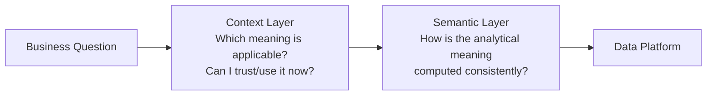

但这张图仍然过度简化。

生产架构里，两者通常不是单向串联，而是两个相互连接的 control planes。

---

# 1. 什么是 Semantic Layer？

现代 Semantic Layer 的共同目标，是把 business logic 从具体 BI 工具和 ad-hoc SQL 中抽离出来。

dbt Semantic Layer 的官方定义强调：

- 在 dbt models 之上集中定义 metrics；
- 自动处理 joins；
- 下游工具消费同一套 metric definitions；
- metric 修改后在所有调用位置保持一致。

LookML 则把：

- dimensions；
- aggregates；
- calculations；
- data relationships；

声明成 semantic data model，由 Looker 用这些模型生成 SQL。

Cube 的定义更广，通常包括：

- metrics；
- dimensions；
- joins；
- access rules；
- caching / pre-aggregation；
- SQL / REST / GraphQL / MCP 等消费接口。

因此一个成熟 Semantic Layer 可以抽象成：

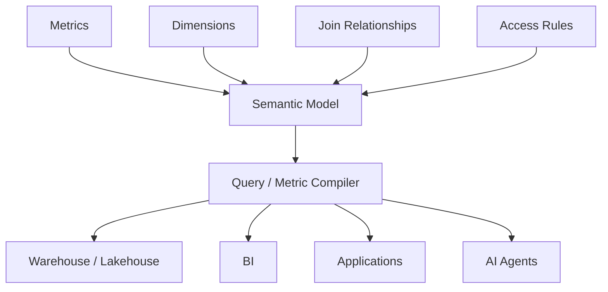

它不是简单的“数据字典”。

它通常具有一个非常重要的能力：

> **把业务语义编译成真实数据查询。**

这使它和 glossary / catalog / ontology 有明显区别。

---

# 2. Semantic Layer 的核心价值其实是 Executable Semantics

假设企业定义：

```text
Net Revenue
= SUM(order_amount - refund_amount)
WHERE order_status = 'completed'
```

如果它只存在于 Confluence：

这是 documentation。

如果它存在于 glossary：

这是 governed definition。

如果它可以被系统转换成正确 SQL，并保证 dashboard、spreadsheet、API、Agent 都使用同一逻辑：

这才是 Semantic Layer 最独特的地方。

因此可以把它定义为：

> **Executable business semantics**

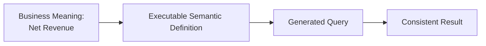

Context Layer 不应该重新实现这一套 compiler。

否则它会再次制造 semantic duplication。

---

# 3. DataHub 对 Semantic Layer 的描述有意收窄

DataHub 在《Context Layer vs Semantic Layer》中给出的对比大致是：

> Semantic Layer 定义 metrics / dimensions / business logic；  
> Context Layer 再加 lineage、freshness、governance、policy 等信息。

这个区分方向上有价值，但需要修正。

因为 2026 年的现代 Semantic Layer 产品已经明显扩展：

## dbt

dbt MCP Server 不只提供 Semantic Layer query，还提供：

- project metadata；
- models；
- metrics；
- lineage；
- freshness；
- Discovery API；
- SQL access。

## Looker

Looker 现在直接通过 managed MCP server 把：

- LookML semantic models；
- governed business data；
- user permissions；

暴露给 AI agents。

## Cube

Cube 的 semantic layer 本身就把：

- access control；
- APIs；
- caching；
- AI/MCP consumption；

作为核心能力。

所以不能用：

```text
Semantic Layer = metrics only
Context Layer = metrics + governance + agents
```

来做严格边界。

真正需要比较的是 **responsibility boundary**。

---

# 4. 一个更稳定的职责边界

我们把两个系统分别问一句话。

## Semantic Layer

> **Given a business concept, how should it be computed?**

它负责：

- calculation；
- grain；
- aggregation；
- dimension；
- join path；
- time semantics；
- analytical access control；
- query planning / execution。

## Context Layer

> **Given a task, which enterprise knowledge is applicable and trustworthy right now?**

它负责：

- meaning beyond calculation；
- ownership；
- provenance；
- lineage；
- quality；
- freshness；
- policies；
- incidents；
- decisions；
- documentation；
- authority；
- scope；
- temporal validity；
- cross-system relationships。

所以最简洁的区别是：

```text
Semantic Layer = computational semantics
Context Layer  = situational semantics
```

---

# 5. “Revenue 是什么？”其实包含两个不同问题

业务用户问：

> What is revenue?

至少可能包含：

### Semantic Question

> Revenue 的计算公式是什么？

答案可能是：

```text
SUM(completed_orders.gross_amount - refunds.amount)
```

这是 Semantic Layer 的强项。

### Contextual Question

> 我现在做 board reporting，应该使用哪个 Revenue？

这可能需要：

- Finance-certified metric；
- board reporting policy；
- current fiscal period；
- upstream freshness；
- audit status；
- metric owner；
- deprecated definitions；
- active incident。

这是 Context Layer 的问题。

因此：

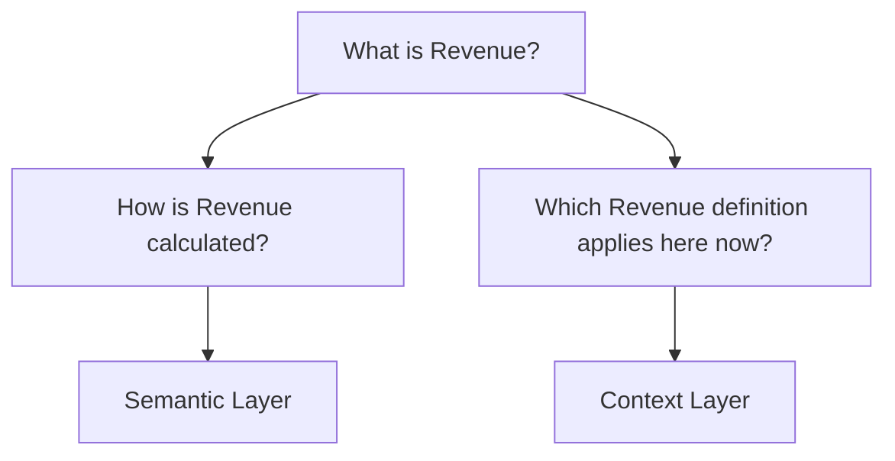

这两个答案必须连接，但不能混为一谈。

---

# 6. Semantic Layer 是 Context Layer 的子集吗？

这是这一篇最关键的问题。

## 从“知识范围”看：是

Semantic model、metrics、dimensions、join rules 都是企业 context 的一部分。

因此在 Context Graph 里，它们应该成为 first-class objects：

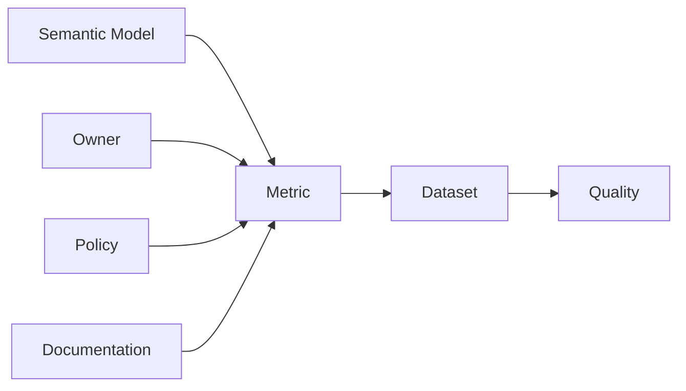

从 information model 来说：

> **Semantic Layer 产生的 semantic artifacts 属于 Context Layer 要管理的 context。**

## 从“执行职责”看：不是

Semantic Layer 通常还负责：

- metric compiler；
- SQL generation；
- query serving；
- caching；
- pre-aggregation；
- row-level policy enforcement。

这些不是 Context Layer 应该吞掉的职责。

所以我们不应该画：

```text
Context Layer
└── Semantic Layer
```

更好的架构是：

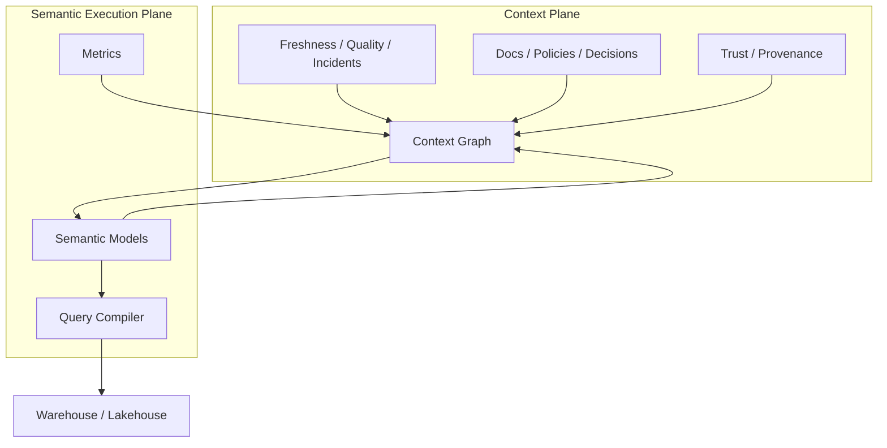

这里最重要的是：

> **Context Layer indexes and contextualizes semantic definitions; Semantic Layer executes them.**

---

# 7. 两者之间应该是双向关系

Context Layer 需要从 Semantic Layer ingest：

- semantic models；
- metrics；
- dimensions；
- joins；
- descriptions；
- owners；
- tags；
- access metadata。

Semantic Layer 则需要从 Context Layer 获得：

- authoritative business definition；
- certification；
- policy；
- upstream quality；
- ownership；
- broader lineage；
- documentation；
- domain context。

因此：

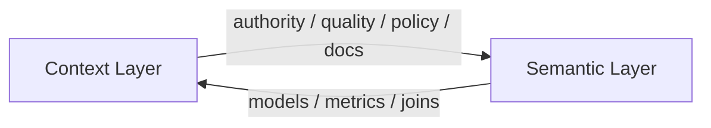

这比“谁在谁上面”更接近真实生产架构。

---

# 8. AI Agent 的正确调用路径

假设用户问：

> “过去 90 天 enterprise customers 的 net revenue 是多少？和去年同期相比怎么样？”

一个可靠 Agent 不应该直接：

```text
LLM -> raw warehouse -> SQL
```

更合理的路径：

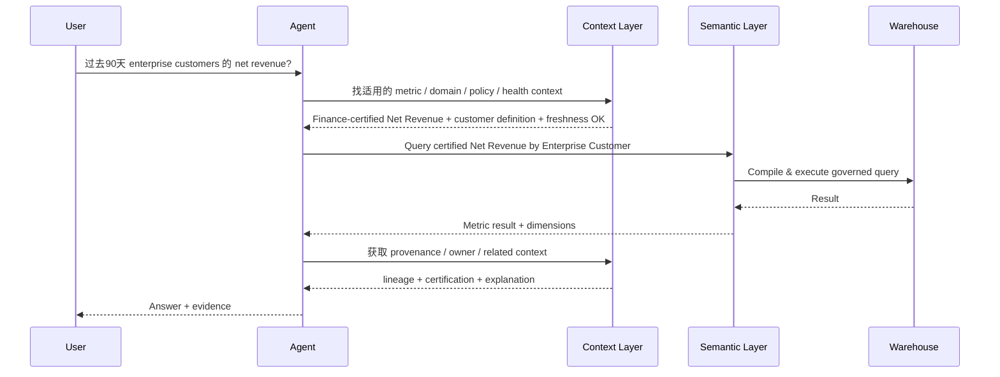

这个架构里：

- Context Layer 帮 Agent **选对东西**；
- Semantic Layer 帮 Agent **算对东西**。

一句话：

> **Context chooses. Semantics computes.**

---

# 9. 为什么只用 Semantic Layer 仍然可能出错？

假设 Semantic Layer 定义了：

```text
monthly_recurring_revenue
```

计算逻辑完全正确。

但当前：

- upstream billing pipeline 延迟 18 小时；
- Finance 正在重述某一产品线；
- metric 在 Board Reporting domain 下暂时被标记为 not approved；
- 一个 acquisition 导致 customer classification policy 改变；
- 新规则尚未写入 semantic model。

Semantic Layer 可能仍然能返回一个**计算正确**的数字。

但它可能不是一个**当前可以使用**的数字。

因此需要区分：

```text
Computational Correctness
vs
Contextual Correctness
```

这可能是 Context Layer 在 Agent 时代最重要的价值。

---

# 10. 为什么只用 Context Layer 也不够？

反过来也一样。

Context Layer 可以告诉 Agent：

- Net Revenue 是 Finance 的正式指标；
- owner 是 Finance Analytics；
- 数据健康；
- 定义已批准；
- 相关 dataset 是 orders / refunds。

但如果没有 executable semantic model，Agent 仍可能自己生成：

```sql
SUM(orders.amount) - SUM(refunds.amount)
```

并犯：

- fan-out join；
- wrong grain；
- time-zone；
- slowly changing dimension；
- filter；
- deduplication；

等错误。

所以：

> Context Layer 不能替代 Metric Compiler。

这也是为什么 Semantic Layer 在 AI 时代不会消失，反而更重要。

---

# 11. Semantic Layer 的 AI 价值不是“给 LLM 更多 context”

它真正的价值是：

> **减少 LLM 必须推理的空间。**

如果让 LLM 自己决定：

- join；
- aggregation；
- time grain；
- metric formula；
- access rule；

模型每次都要重新推导业务逻辑。

Semantic Layer 把这些选择提前固化成 governed executable model。

于是：

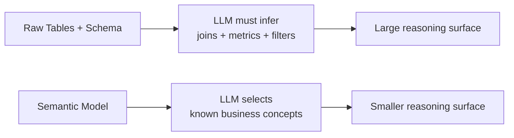

对 Agent 系统来说，一个重要原则可能是：

> **不要让概率模型重新推导可以被声明式定义的确定性业务逻辑。**

---

# 12. Context Layer 的 AI 价值也不是“塞更多 context”

同样，Context Layer 的目标不是把整家公司知识塞进 prompt。

真正目标应该是：

> **把 Agent 的搜索空间从“企业所有信息”缩小到“当前任务可相信的 context”。**

也就是：

```text
Enterprise Knowledge
      ↓ governance / relevance / authority / freshness
Applicable Context
      ↓ context engineering
Model Context Window
```

所以 Context Layer 与 Semantic Layer 都在做同一件更大的事：

> **降低 AI 的自由猜测空间。**

区别是：

- Semantic Layer 用 declarative computation 约束 analytics reasoning；
- Context Layer 用 governed enterprise context 约束 situational reasoning。

---

# 13. dbt / Looker / Cube 已经开始越过传统边界

2026 年的现实是：

> 产品类别正在收敛。

## dbt

dbt 不再只讲 transformation。

它现在：

- centrally defines metrics；
- exposes semantic queries；
- provides metadata discovery；
- exposes lineage / freshness；
- ships an MCP server；
- talks explicitly about governed context for AI。

这说明 Semantic Layer vendors 正在向 Context 方向扩张。

## Looker

Looker 的核心仍然是 LookML semantic modeling + BI execution。

但 managed MCP server 让 Agent 可以继承 Looker user roles，直接通过 semantic layer 查询 trusted data。

这说明：

> Semantic execution plane 也正在成为 Agent tool surface。

## Cube

Cube 明确把 semantic layer 描述成：

- metrics；
- dimensions；
- joins；
- access control；
- APIs；
- AI consumption。

它更加明显地把 Semantic Layer 定义成 runtime infrastructure，而不是 metadata artifact。

所以未来市场的真正问题可能不是：

> Semantic Layer 还是 Context Layer？

而是：

> **谁负责 semantic truth，谁负责 situational truth，以及它们如何互操作？**

---

# 14. DataHub 自己也正在进入 Semantic Layer

这点非常重要。

如果 DataHub 认为 Semantic Layer 与 Context Layer 完全是两个独立产品类别，它就没有必要增加 first-class semantic models / metrics。

但 DataHub 2026 年路线已经明确：

- first-class semantic models；
- metrics；
- metric-level lineage；
- import/export semantic definitions；
- 对 Snowflake / dbt / Databricks semantic models 的 ingest；
- 与开放 semantic interchange 标准兼容。

这说明 DataHub 实际采用的是：

> **Context Platform 必须理解 Semantic Layer artifacts。**

而不是：

> Context Platform 取代 Semantic Layer。

这个方向支持我们前面的双平面模型。

---

# 15. Apache Ossie（原 OSI）为什么重要？

2026 年，一个很关键的行业变化是 Open Semantic Interchange 规范进入 Apache Incubator，并更名为 **Apache Ossie (Incubating)**。

它的目标不是建立新的 query engine，而是：

> 用 vendor-neutral schema 表达和交换 semantic models。

典型内容包括：

- datasets；
- metrics；
- dimensions；
- relationships；
- semantic context。

这透露了一个重要架构趋势：

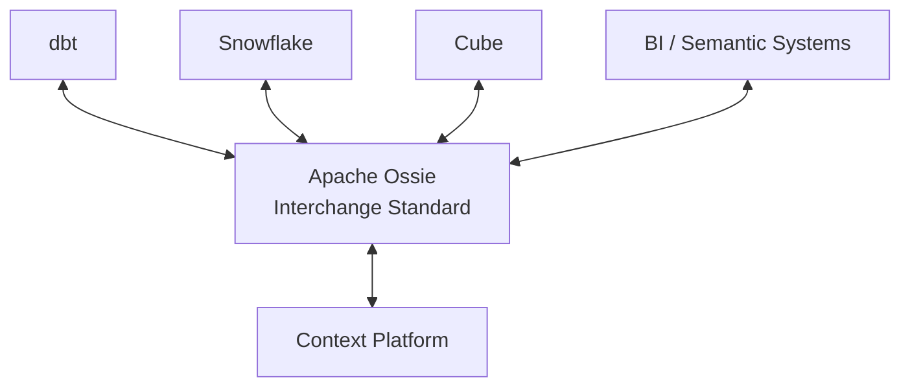

如果 semantic definitions 可以标准化交换，那么 Context Layer 更不应该重新发明 semantic model。

它应该：

- ingest；
- index；
- connect；
- govern；
- contextualize；

这些 semantic artifacts。

这是更健康的职责划分。

---

# 16. Semantic Layer 与 Context Layer 的最终对比

| Dimension | Semantic Layer | Context Layer |
|---|---|---|
| 核心问题 | How should this be calculated? | When/why/under what constraints should this be used? |
| 主要对象 | Metrics, dimensions, joins, measures | Assets, metrics, people, docs, policies, quality, incidents, decisions |
| 语义类型 | Computational semantics | Situational / organizational semantics |
| 主要动作 | Compile / query / execute | Discover / relate / validate / govern / retrieve |
| 时间敏感性 | 定义通常相对稳定 | 很多 context 高度动态 |
| Query execution | 核心职责 | 通常不是核心职责 |
| Freshness / incidents | 可集成，通常不是主模型中心 | first-class concern |
| Provenance / authority | 可以支持 | foundational concern |
| Agent role | Governed analytical tool | Enterprise grounding / routing plane |
| Human role | Consistent analytics | Shared organizational understanding |
| 最危险失败 | 算错 | 用错 / 信错 / 在错误时间使用 |

需要注意：

> 这是 architecture responsibilities，而不是 vendor feature checklist。

现实产品会跨越边界。

---

# 17. 一个更合理的 AI Data Architecture

最终我们得到的架构不是：

```text
Warehouse -> Semantic Layer -> Context Layer -> Agent
```

而更像：

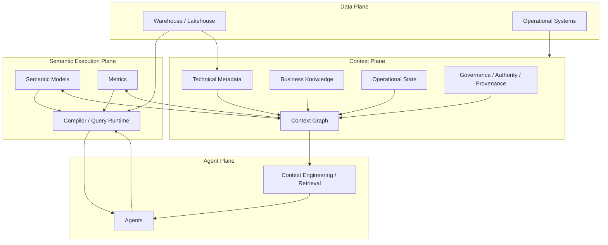

这里有三个不同职责：

### Data Plane

保存和计算真实业务数据。

### Semantic Execution Plane

把 business analytical concepts 转换成确定性查询。

### Context Plane

决定哪些企业知识与定义在当前任务中 relevant / trusted / applicable。

Agent 位于这三个 plane 之上，而不是替代任何一个。

---

# 18. 设计哲学：Deterministic Logic 应该下沉，Probabilistic Reasoning 应该收窄

这一篇最终导向一个更一般的 AI architecture 原则：

> **能声明式定义、验证和复用的逻辑，不应该每次交给 LLM 重新猜。**

因此：

- metrics → Semantic Layer；
- joins → Semantic Layer；
- access rules → deterministic policy system；
- lineage → metadata/context graph；
- freshness → observability/context；
- authority → governance/context；
- current task interpretation → Agent。

可以画成：

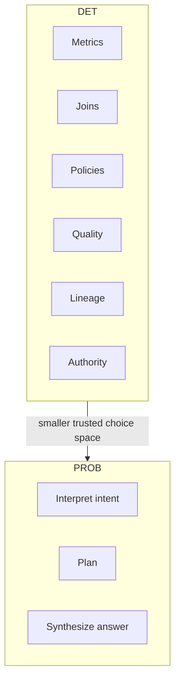

好的 enterprise AI architecture，不应该让模型更自由。

它应该让模型在**更小、更可信的决策空间**内自由。

---

# 19. 当前工作定义

## Semantic Layer

> **Semantic Layer 是将业务分析概念声明为可复用、可治理、可执行模型的基础设施，使 metrics、dimensions、joins 和访问规则能够跨工具一致地解析并转化为数据查询。**

## Context Layer

> **Context Layer 是持续维护企业当前语境的共享基础设施，把 semantic definitions 与 lineage、quality、freshness、ownership、policy、documentation、provenance 和 organizational authority 连接起来，使人和 Agent 能判断什么信息在当前任务里 relevant、trusted 和 applicable。**

二者关系：

> **Semantic Layer makes meaning executable. Context Layer makes meaning situationally trustworthy.**

---

# 20. 下一步

下一篇进入：

## Context Freshness & Provenance

要回答：

1. Context 的 freshness 到底如何定义？
2. “最后更新时间”是否足够？
3. 一个 context fact 的 provenance 应该记录什么？
4. derived / AI-generated context 如何追踪 evidence？
5. 当 upstream reality 改变时，哪些 context 应该自动 invalid？
6. Context Graph 能否形成类似 build system 的 dependency invalidation？
7. Agent 如何知道一个事实“不应该再相信”？

这将从概念层进入 Context Layer 最难的系统设计问题。

---

# Sources

## DataHub

- DataHub, **Context Layer vs Semantic Layer: What the Debate Gets Right and What It Misses**, 2026-04-27  
  https://datahub.com/blog/context-layer-vs-semantic-layer/

- DataHub, **The Context Layer for AI: What Enterprises Get Wrong**, 2026-04-27  
  https://datahub.com/blog/context-layer-for-ai/

- DataHub, **Inside the Context Platform — June 2026 Town Hall Highlights**  
  https://datahub.com/blog/inside-the-context-platform-june-2026-town-hall-highlights/

## dbt

- dbt Developer Hub, **dbt Semantic Layer**  
  https://docs.getdbt.com/docs/use-dbt-semantic-layer/dbt-sl

- dbt Developer Hub, **dbt Model Context Protocol server**  
  https://docs.getdbt.com/docs/dbt-ai/about-mcp

- dbt, **Semantic Layer vs Text-to-SQL: 2026 Benchmark Update**  
  https://docs.getdbt.com/blog/semantic-layer-vs-text-to-sql-2026

## Looker

- Google Cloud, **Introduction to LookML**  
  https://cloud.google.com/looker/docs/what-is-lookml

- Google Cloud, **Looker-managed MCP server**  
  https://cloud.google.com/looker/docs/mcp

## Cube

- Cube, **What Is a Semantic Layer?**  
  https://cube.dev/articles/what-is-a-semantic-layer

- Cube, **Semantic Layer for AI Agents (2026)**  
  https://cube.dev/articles/semantic-layer-for-ai-agents-2026

## Semantic interoperability

- Apache Ossie (Incubating)  
  https://ossie.apache.org/

- Open Semantic Interchange / Apache Ossie history  
  https://www.getdbt.com/blog/osi-is-now-apache-ossie
