# 04 — Context Freshness & Provenance

## 一个 Agent 怎么知道某条 Context 已经不应该再相信？

**Status:** 第一版  
**Focus:** Freshness / temporal validity / provenance / invalidation / evidence chains  
**Updated:** 2026-09-28

---

# 0. 当前结论

Context Layer 最困难的问题不是“如何存更多知识”，而是：

> **如何知道一条知识什么时候开始不再可信。**

这要求同时解决两个不同问题：

### Freshness / Temporal Validity

> 这个 context 现在还有效吗？

### Provenance

> 这个 context 从哪里来？经过了什么过程？为什么应该相信它？

两者不能合并成一个 `updated_at`。

一个刚刚更新的错误定义仍然不可信；  
一个一年没改但仍然有效的政策也不应该因为“旧”就自动失效。

因此：

```text
Trustworthiness
≠ Recency
```

更合理的是：

```text
Trustworthiness
= validity
+ provenance
+ authority
+ evidence health
+ dependency health
+ task applicability
```

---

# 1. Freshness 不是一个时间戳，而是一组时钟

最简单的系统只记录：

```text
updated_at = 2026-09-28 10:00
```

这对 Context Layer 不够。

至少要区分：

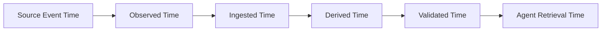

## Source Event Time

现实发生变化的时间。

例如：

- schema 在 10:00 被修改；
- owner 在 HR 系统 11:00 转组；
- incident 在 12:00 开启。

## Observed Time

Context system 第一次看到变化的时间。

如果 connector 15 分钟轮询一次：

```text
event_time = 10:00
observed_time = 10:14
```

已经产生 14 分钟 blind spot。

## Ingested Time

变化真正进入 context store / graph 的时间。

## Derived Time

基于变化重新计算出的 derived context 生成时间。

例如：

- lineage summary；
- reliability score；
- AI-generated description；
- recommended join pattern。

## Validated Time

如果 context 需要 human approval，这是最后一次确认时间。

## Retrieval Time

Agent 实际消费这条 context 的时间。

---

# 2. 所以 Freshness 应该理解成 Freshness Budget

我们可以把一个 context fact 对现实的最大滞后抽象成：

```text
Context Lag
=
Detection Lag
+ Transport Lag
+ Processing Lag
+ Derivation Lag
+ Validation Lag
+ Serving Lag
```

不同 context 类型，允许的 lag 完全不同。

例如：

| Context | 可接受 freshness |
|---|---|
| Active incident | seconds / minutes |
| Table freshness signal | minutes |
| Schema | minutes / hours |
| Ownership | hours / days |
| Business definition | months，但需要 re-validation |
| Regulation policy | 长周期，但变更时必须立即 invalidate |

这就是为什么“实时同步”不是一个统一 SLA。

> **Freshness 必须是 context-type-specific contract。**

---

# 3. Data Freshness 和 Context Freshness 不是一回事

假设：

```text
orders table
last data update = 10:00
```

这回答的是：

> 数据本身是否新鲜？

但 Context Layer 还需要回答：

- schema metadata 是什么时候观察到的？
- freshness assertion 自己是否还在正常运行？
- lineage connector 是否仍在报告？
- owner 信息是否来自活跃 source？
- description 是否与当前 schema 一致？
- metric definition 是否被重新批准？

因此：

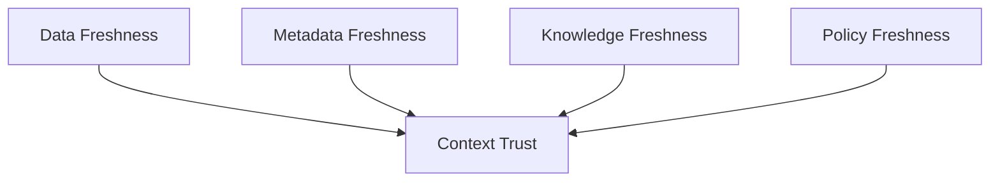

**Context freshness 是多个 source freshness 的组合问题。**

---

# 4. “没有变化”与“我们没有观察到变化”完全不同

这是生产 Context Layer 非常重要的 epistemic distinction。

假设 lineage graph 显示：

```text
A -> B -> C
```

connector 三天没有收到任何新事件。

有两个可能：

### 情况 A

真实系统没有变化。

### 情况 B

connector 已经坏了。

如果系统把两者都解释成：

> lineage unchanged

Agent 会得到错误确定性。

更合理的状态应该至少有：

```text
known current
known stale
unknown / source silent
invalid
```

而不是只有：

```text
exists / not exists
```

这点与 DataHub 近期对 lineage 的建议一致：connector silence 不应该被解释为“没有 dependency”，而应该被解释为 **unverified**。

---

# 5. Freshness ≠ Validity

这一点尤其重要。

一个 business rule：

> “Enterprise customer = annual contract value >= $100k”

可能已经 180 天没更新。

但如果业务政策没有变化，它仍然有效。

反过来，一个刚刚由 AI 自动生成的 description：

> “orders_current 是公司唯一 production orders table”

即使 30 秒前生成，也可能是错的。

所以我们需要区分：

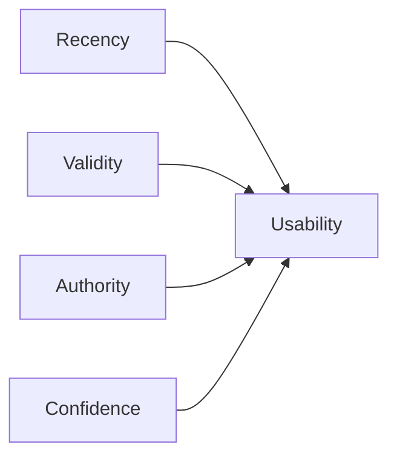

Freshness 更准确地说是：

> **context 与它描述的现实之间的 temporal alignment。**

这不是简单的 age。

---

# 6. Context Fact 应该是一个带证据的 Assertion，而不是裸属性

传统 catalog 可能存：

```json
{
  "owner": "finance-data"
}
```

Agent-era Context Layer 更合理的概念模型是：

```text
ContextAssertion
├── subject
├── predicate
├── value
├── source
├── evidence
├── observed_at
├── generated_at
├── valid_from
├── valid_until / invalidated_at
├── authority
├── confidence
├── dependencies
└── derivation_method
```

例如：

```text
subject: metric/net_revenue
predicate: authoritative_owner
value: finance-analytics

source: Workday -> ownership mapping
observed_at: 2026-09-28T08:12
authority: HR source
dependencies:
  - employee/team directory
  - domain ownership policy
```

这时 context 不再是：

> 属性值是什么？

而是：

> **谁在什么时间、基于什么证据、以什么 authority 声称这个属性值成立？**

---

# 7. Provenance 不应该只等于 Lineage

DataHub 经常把 lineage 描述成 provenance layer，这对于 data assets 很自然。

但 Context Layer 的 provenance 范围更大。

我们需要区分：

### Data Lineage

```text
dataset A -> transform -> dataset B
```

### Metadata Provenance

```text
Snowflake connector -> schema metadata
```

### Knowledge Provenance

```text
Finance policy doc -> Revenue definition
```

### Derived Context Provenance

```text
query logs + lineage + LLM summarizer
-> recommended join pattern
```

### Decision Provenance

```text
Context evidence + Agent reasoning + Human approval
-> operational action
```

所以 Context Layer 最终需要的不只是：

> Where did this data come from?

而是：

> **Where did this belief come from?**

---

# 8. W3C PROV 给了一个很好的基础模型

W3C PROV 很早就定义了三个核心对象：

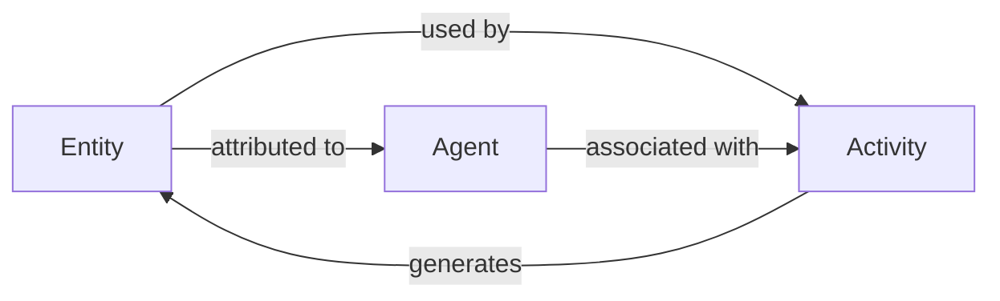

以及：

- wasGeneratedBy；
- wasDerivedFrom；
- wasAttributedTo；
- generatedAtTime；
- invalidatedAtTime；
- wasInvalidatedBy。

这里对 Context Layer 最重要的不是标准本身，而是一个思想：

> **知识的生成与失效都应该成为可建模事件。**

尤其 `invalidatedAtTime` 很重要。

很多现代 metadata/context 系统重视“什么时候创建”，却没有同等重视：

> **什么时候这条事实不应该再被使用。**

---

# 9. Context Invalidation 应该是一等事件

假设：

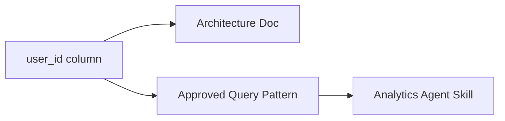

现在 `user_id` 被迁移到新的 identity model。

传统系统可能只更新 schema。

Context system 应该问：

- 哪些 docs 可能已经 stale？
- 哪些 approved query patterns 已失效？
- 哪些 semantic model 依赖旧 column？
- 哪些 Agent skill/example 仍引用旧 schema？

也就是：

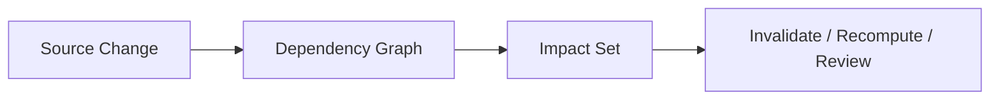

这让 Context Graph 很像：

> **incremental build system for enterprise knowledge**

---

# 10. Build System 类比非常有用

考虑 `make` / Bazel / modern incremental build system：

```text
source changes
-> dependency graph
-> identify affected targets
-> rebuild only invalid outputs
```

Context maintenance 也可以这样理解：

```text
reality changes
-> context dependency graph
-> identify affected assertions
-> re-observe / re-derive / re-validate
```

三种 context 对应不同 rebuild strategy：

## Derived Context

可以自动 rebuild。

例如：

- schema summary；
- lineage summary；
- usage pattern；
- quality state。

## Observed Context

重新从行为中推断。

例如：

- common joins；
- de facto canonical table；
- likely deprecation。

## Declared Context

通常不能自动重写。

应该进入：

```text
invalidate -> review queue -> human re-validation
```

这比“AI 自动帮你更新文档”更安全。

---

# 11. DataHub 的 Declared / Derived / Observed 分类很有价值

DataHub 最近提出三类 context：

### Declared

人明确写下来的：

- business rules；
- domain definitions；
- conventions；
- strategic intent。

特点：

> 变化慢，但不能从技术 metadata 自动推导。

### Derived

从系统技术状态自动总结：

- schema；
- lineage；
- freshness；
- quality；
- ownership；
- usage。

特点：

> 变化快，应该自动 recompute。

### Observed

从实际行为推断：

- 常见 join；
- usage correlation；
- undocumented dependency；
- emerging canonical asset。

特点：

> 来源不是声明，而是 behavior。

这个分类真正有价值的地方，不是 taxonomy。

而是：

> **不同来源的 context 必须有不同 freshness policy 和 invalidation strategy。**

---

# 12. 三类 Context 的 Lifecycle 应该不同

| 类型 | 生成 | Freshness | 失效策略 | Authority |
|---|---|---|---|---|
| Declared | Human / policy | 定期 revalidate | flag for review | SME / owner |
| Derived | Computation | source-driven | auto recompute | system evidence |
| Observed | Behavior inference | window-driven | decay / re-infer | statistical confidence |

例如：

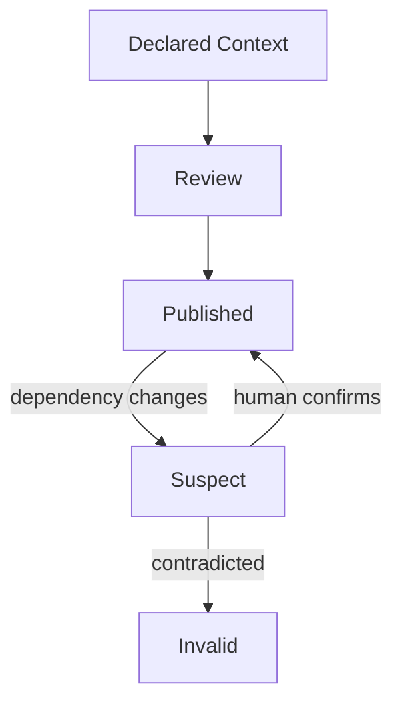

Declared context 不应该只有：

```text
draft / published
```

还应该有：

```text
published / needs-review / superseded / invalid
```

---

# 13. Provenance Graph 和 Context Graph 最终可能是同一张图的两个视角

考虑一个 AI-generated definition：

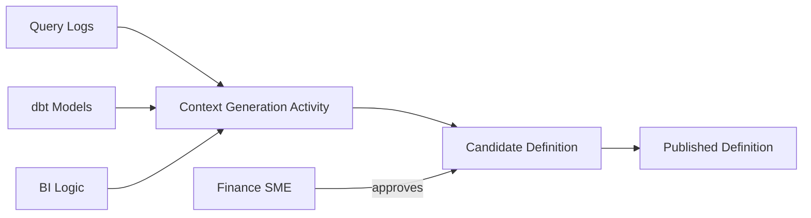

这既是：

- Context Graph；
- Provenance Graph；
- Approval Graph。

所以一个很重要的判断是：

> **Provenance 不应该作为 Context Graph 外挂的 audit log。**

它应该进入 graph semantics。

否则 Agent 看到的是结果，却看不到 evidence chain。

---

# 14. AI-generated Context 的 Provenance 要比 Human-authored Context 更严格

未来 Agent 会大量生成：

- descriptions；
- glossary proposals；
- inferred lineage；
- classification；
- ownership suggestions；
- semantic mappings；
- query patterns。

这类 context 至少应该保留：

```text
Generated Context
├── model / agent
├── prompt / task type
├── generation time
├── input evidence refs
├── algorithm / version
├── confidence
├── reviewer
├── approval time
├── supersedes
└── invalidation triggers
```

否则几年后会出现一个危险问题：

> “这个业务定义是谁写的？”

答案是：

> “不知道，可能是某个旧模型根据旧 query logs 自动生成的。”

这在 AI infrastructure 里不可接受。

---

# 15. Confidence 不能替代 Provenance

很多 AI systems 会给一个：

```text
confidence = 0.92
```

但 confidence 没有回答：

- evidence 是什么？
- evidence 是否 fresh？
- source 是否 authoritative？
- 哪个模型产生？
- 是否经过 human validation？
- 哪些 dependency 已经变化？

所以：

```text
Confidence
≠ Trust
```

更合理的 Agent context response 应该像：

```text
Net Revenue Definition

value:
  contracted revenue - refunds

authority:
  Finance

status:
  certified

last_validated:
  2026-09-10

derived_from:
  - finance-policy-v17
  - dbt metric net_revenue

dependency_health:
  healthy

freshness:
  within SLA
```

而不是：

```text
"Net revenue means ..." confidence 0.94
```

---

# 16. Freshness 的传播比 Freshness 本身更难

假设：

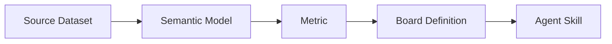

A 的 schema 变化。

问题不是只把 A 标 stale。

而是：

> 这个变化对 B/C/D/E 的可信度分别意味着什么？

不同 edge 有不同 invalidation semantics。

例如：

```text
schema change
-> semantic model: maybe invalid
-> metric: maybe invalid
-> business definition: probably still valid
-> agent query example: likely stale
```

因此 Context Layer 需要的不只是 graph traversal。

还需要：

> **typed dependency semantics**

也就是 edge 不只是：

```text
A depends_on B
```

还需要知道：

```text
A schema change invalidates which aspect of B?
```

---

# 17. 这接近 Spreadsheet / Build Graph / Reactive System 的问题

Context Graph 如果真的承担 continuous context，它实际上具备 reactive system 特征：

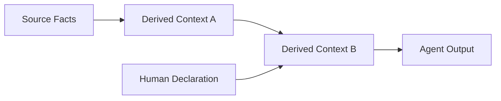

source change 后需要：

1. detect；
2. propagate；
3. mark stale；
4. recompute；
5. request review；
6. publish；
7. notify consumers。

所以未来高质量 Context Platform 的差异可能不只是：

> “连接多少 data sources？”

而是：

> **它的 context dependency/invalidation engine 有多强。**

---

# 18. Event-driven 是必要条件，但不是 Freshness 的充分条件

DataHub 强调 event-driven metadata，这是合理方向。

但要避免：

```text
event-driven = always fresh
```

现实链路仍然可能：

- source 不发 event；
- connector 断开；
- queue backlog；
- async processing lag；
- search index 延迟；
- derived context 未重算；
- human approval pending。

DataHub 自己的支持文档也明确说明：

> metadata ingestion 后存在异步处理，系统具有 eventual consistency 特征；大规模 ingestion 时 UI / search 可出现明显滞后。

因此 production Context Layer 更合理的 freshness contract 是：

```text
freshness =
source observability
+ pipeline health
+ propagation latency
+ derivation status
+ validation status
```

而不是简单宣传：

> real-time context。

---

# 19. Context Layer 应该暴露 Epistemic State

Agent 不应该只看到 value。

它还应该看到系统对这个 value 的认知状态。

例如：

```text
VALID
STALE
SUSPECT
UNVERIFIED
CONFLICTED
INVALID
PENDING_REVIEW
```

这会让 Agent 做不同决策：

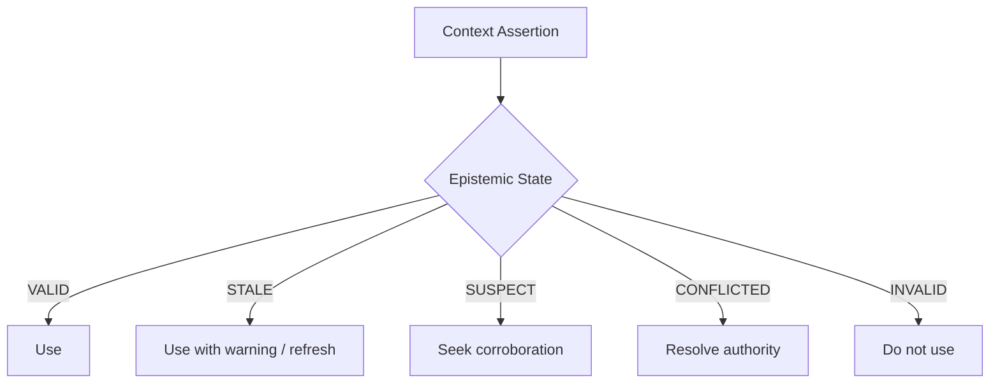

这是比 generic confidence score 更可操作的模型。

---

# 20. Provenance 最终要延伸到 Agent Decision

如果 Context Layer 真的是 AI 基础设施，provenance chain 不能停在：

```text
source -> context
```

还应该继续：

```text
source
-> context assertion
-> agent retrieval
-> agent decision
-> action
-> outcome
```

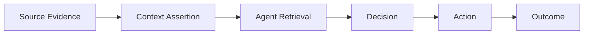

这样才能回答：

> Agent 为什么做了这个决定？

不是只保存 LLM transcript，而是保存：

- 它看到了哪些 governed context；
- 那些 context 当时是什么版本；
- freshness 状态如何；
- provenance 是什么；
- action 最终产生了什么结果。

这是真正的 AI auditability。

---

# 21. OpenLineage 给了 Context Provenance 一个现实参考

OpenLineage 的事件模型区分：

- RunEvent；
- JobEvent；
- DatasetEvent。

事件携带：

- event time；
- producer；
- run/job/dataset identity；
- state transition。

这体现一个很重要的思想：

> provenance 最好来自系统运行时的事件，而不是事后人工补写。

Context Layer 可以借鉴这个模式：

```text
ContextEvent
├── event_time
├── producer
├── subject
├── change_type
├── evidence
├── previous_version
└── new_version
```

这让 context history 成为事件流，而不只是覆盖当前状态。

---

# 22. Context 的理想时间模型：Valid Time + Observation Time

我们进一步引入一个经典 temporal data 思想。

一条 context 至少应该有两个时间：

### Valid Time

> 这条事实在现实世界中什么时候成立？

### Observation / System Time

> Context Layer 什么时候知道这件事？

例如：

```text
Finance owner changed:
valid_from = Sep 1

HR connector discovered:
observed_at = Sep 5
```

如果 Agent 在 Sep 3 使用旧 owner：

这是因为系统还没有观察到真实变化。

如果 Agent 在 Sep 7 仍使用旧 owner：

这是 context propagation failure。

这两个错误性质不同。

因此：

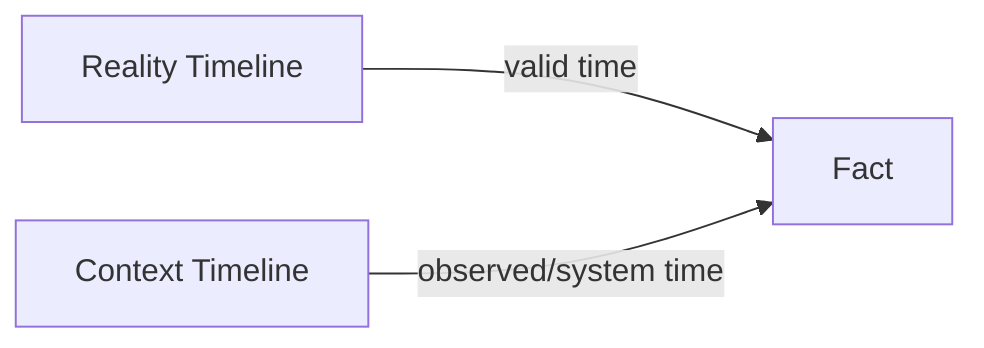

这比单一 `updated_at` 更适合 audit 和 debugging。

---

# 23. 我们给 Context Freshness 的工作定义

> **Context freshness 是一个 context assertion 与它所描述的现实、依赖证据和适用规则之间保持 temporal alignment 的程度。**

它至少取决于：

```text
Freshness
= source freshness
+ observation health
+ propagation latency
+ dependency validity
+ derivation age
+ validation status
```

这不是数学评分公式。

它是一个 architecture checklist。

---

# 24. 我们给 Context Provenance 的工作定义

> **Context provenance 是一条 context assertion 从 source evidence 到当前可消费形式的完整 derivation、responsibility、version 和 validation chain。**

它要回答：

1. 来自哪里？
2. 谁产生？
3. 什么时候产生？
4. 用了哪些 inputs？
5. 经过什么 transform / inference？
6. 谁批准？
7. 当前版本是什么？
8. 哪些 changes 会让它失效？

---

# 25. Context Trust Contract

综合前面四篇研究，一个 Agent 实际消费 context 时，我们希望得到的不是裸文本，而是一个 trust envelope：

```text
Context Payload
├── Content
├── Applicability
├── Authority
├── Provenance
├── Freshness
├── Dependency Health
├── Epistemic State
└── Access Scope
```

可以把它看成：

> **Context + Trust Metadata**

如果没有这个 envelope，Agent 得到的只是 information。

有了它，才更接近 actionable context。

---

# 26. 对 DataHub 当前方向的评价

## 值得认同的部分

DataHub 近期提出：

- declared / derived / observed context；
- context invalidation；
- freshness SLA per context type；
- dependency-aware staleness detection；
- freshness + provenance attached to agent responses。

这些概念已经明显超过传统 catalog 的 “last updated”。

尤其：

> maintenance is fundamentally a graph problem

是一个非常值得继续研究的命题。

## 仍需验证的部分

产品叙事中的：

- real-time；
- continuous；
- automatically maintained；

需要落到具体 SLO：

- source detect latency；
- ingestion latency；
- processing latency；
- search/index consistency；
- derived context recomputation latency；
- human review latency。

DataHub 自身是异步、eventually consistent 的系统，因此“continuous context”应该理解为 architecture direction，而不是字面上的 zero-latency consistency。

---

# 27. 下一步

下一篇：

## Agent Read / Write Context

前四篇都默认 Agent 是 consumer。

但 DataHub Cloud 2.x 已经开始把：

- Agents；
- Tools；
- Skills；
- Decisions；
- AI-generated context；

纳入 graph。

下一步要问：

> **如果 Agent 既读取 Context Graph，又开始写回 Context Graph，如何避免形成自我强化的错误知识循环？**

核心问题：

1. Agent-generated context 是否能直接成为 truth？
2. proposal / published context 如何区分？
3. Agent 是否应该有 authority？
4. 多 Agent 冲突怎么处理？
5. context poisoning 如何防止？
6. human validation 应该放在哪里？
7. outcome 能否反过来更新 context confidence？
8. provenance chain 如何覆盖 Agent action？

---

# Sources

## DataHub

- DataHub, **Continuous Context: Why Your AI Documentation Is Already Lying to You**, 2026-05-05  
  https://datahub.com/blog/continuous-context/

- DataHub, **How to Build a Context Layer for AI**, 2026-05-06  
  https://datahub.com/blog/how-to-build-a-context-layer/

- DataHub, **Context Layer Components for AI Agents**, 2026-06-15  
  https://datahub.com/blog/context-layer-components/

- DataHub, **The Five Common Context Problems Data Teams Face**, 2026  
  https://datahub.com/blog/common-context-problems-data-teams-face/

- DataHub, **Agents in Production: How DataHub MCP Closes the Context Gap**, 2026-03-16  
  https://datahub.com/blog/agents-in-production-datahub-mcp/

- DataHub Docs, **About DataHub Lineage**  
  https://docs.datahub.com/docs/features/feature-guides/lineage

- DataHub Support, **Large Dataset Ingestion Lag and Eventual Consistency**, 2026-03-10  
  https://support.datahub.com/hc/en-us/articles/42653624258459-Large-Dataset-Ingestion-Lag-and-Eventual-Consistency

## External standards

- W3C, **PROV-O: The PROV Ontology**  
  https://www.w3.org/TR/prov-o/

- OpenLineage, **Object Model**  
  https://openlineage.io/docs/spec/object-model/

- OpenLineage, **API Specification**  
  https://openlineage.io/apidocs/openapi/
