# 05 — Agent Read / Write Context

## 当 Agent 既读取 Context Graph，又向它写回知识，如何避免形成自我强化的错误循环？

**Status:** 第一版  
**Focus:** Agent write-back / proposal vs truth / authority / human validation / poisoning / feedback loops  
**Updated:** 2026-09-28

---

# 0. 当前结论

Agent 对 Context Graph 的关系不应该只有：

```text
read
```

未来更现实的是：

```text
read -> reason -> act -> observe -> write back
```

这也是 DataHub 当前正在走的方向。Agent 可以：

- 查询 metadata / lineage / ownership；
- 修改 description；
- 添加 tag；
- 分配 ownership；
- 生成 context documents；
- 保存 query / summaries / memories；
- 写回 incident / governance metadata。

但一旦允许 write-back，Context Graph 的性质会发生根本变化。

它从：

> 企业知识的被动存储层

变成：

> **人和 Agent 共同维护的 shared state system**

这时最危险的问题不再只是 hallucination。

而是：

> **hallucination persistence**

一个错误如果被写回 Context Graph，随后又被其他 Agent 检索，就会从一次性模型错误升级成组织级长期错误。

因此本篇最重要的结论是：

> **Agent 可以生成 Context Proposal，但不应该默认生成 Truth。**

---

# 1. Read-only Agent 和 Read-write Agent 是两类完全不同的系统

Read-only 模式：

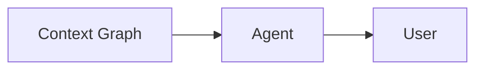

风险主要是：

- retrieval 错误；
- interpretation 错误；
- hallucination；
- stale context。

Read-write 模式：

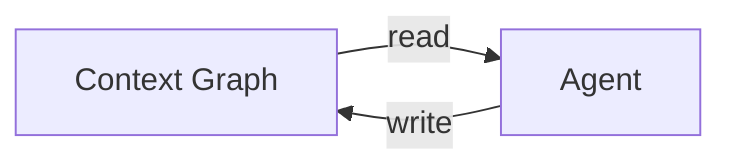

这里多出一个 feedback loop。

如果 Agent 读到错误 context：

```text
bad context
-> bad reasoning
-> bad write-back
-> future retrieval
-> stronger bad belief
```

这可以形成：

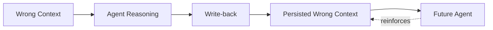

这比普通 hallucination 更危险，因为它会跨 session、跨 user、跨 Agent 持久存在。

---

# 2. DataHub 已经明确进入 Read / Write Context 模式

DataHub 当前官方材料明确表示 Agent 可以：

- read context graph；
- perform metadata mutations；
- add tags；
- update descriptions；
- assign ownership；
- persist memories / context documents；
- write incident / governance results back。

2026 Agent Hackathon 中甚至出现了多个完整模式：

```text
read lineage
-> investigate
-> act
-> verify
-> write result back
```

例如：

- incident resolution 写回 catalog；
- tags / incident banners / postmortem 写回；
- schema drift 修复后写入 lineage、column docs、tags；
- verification 之后才接受 write-back。

这说明“Agent 写 Context Graph”已经不是理论讨论，而是在成为真实设计模式。

---

# 3. 最重要的边界：Proposal != Published Truth

DataHub Context Hub 当前采用一个非常值得学习的设计：

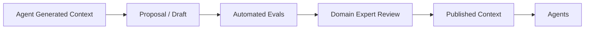

只有 **published context documents** 才暴露给 Agent。

这相当于建立：

```text
Generation Plane
!=
Truth Plane
```

我们可以进一步抽象成：

### Candidate Context

机器或人提出的候选知识。

### Validated Context

已经通过 automated checks / human review。

### Published Context

被明确允许进入共享 Context Layer。

### Deprecated / Invalid Context

曾经可信，但现在不应继续消费。

因此 Context Graph 不应该只有 value。

还应该有：

```text
publication_state
validation_state
authority_state
```

---

# 4. Human-in-the-loop 的真正作用不是“点批准按钮”

很多系统把 HITL 理解成：

> Agent 做完了，让人点 Approve。

这是过度简化。

Context approval 的本质是：

> **Authority transfer**

在 Agent 生成 proposal 时：

```text
authority = machine inference
```

当 Finance domain expert 批准：

```text
authority = Finance
```

也就是说 human review 不是简单 QA。

它完成的是：

> 从“机器猜测”到“组织认可知识”的状态转换。

因此：

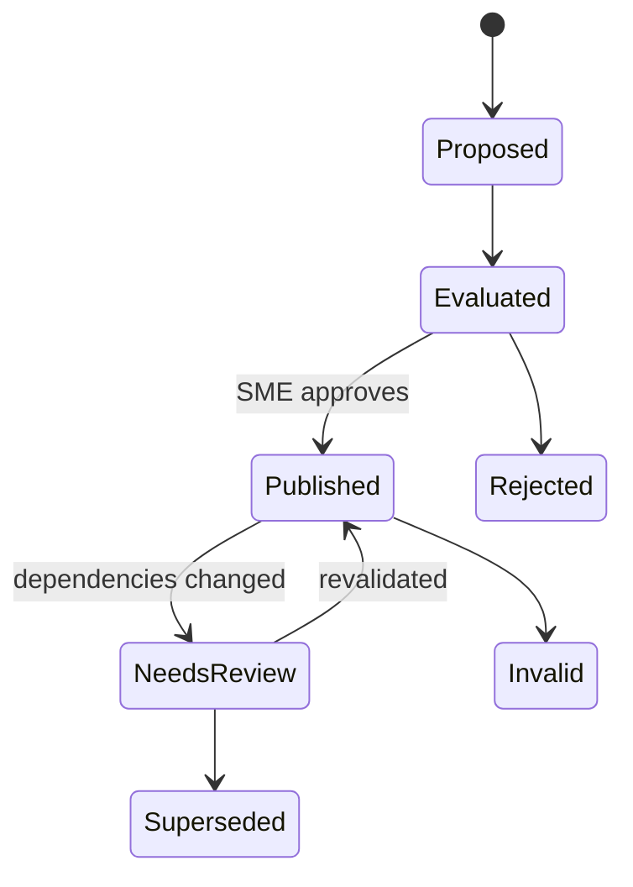

这才是 Context Governance 的核心。

---

# 5. DataHub 当前的优先级规则很重要

DataHub 的 Context Proposal 文档明确说明：

> human-edited business metadata takes precedence over agent-generated metadata.

这其实是在建立一个 authority hierarchy：

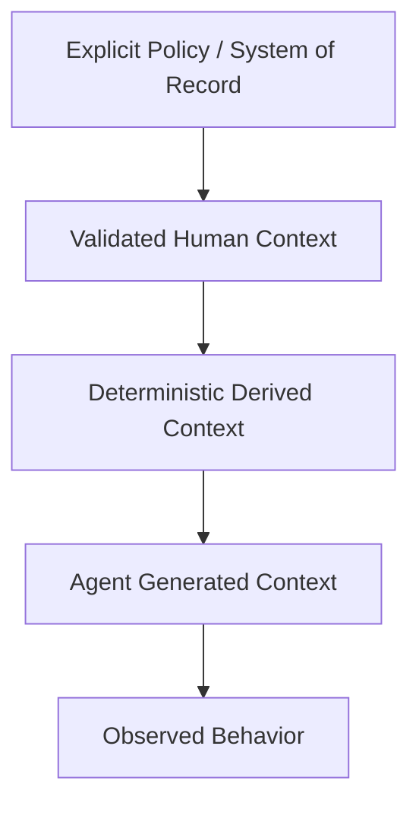

上图只是我们的分析模型，并不是 DataHub 官方固定优先级。

但它揭示了一个很重要的原则：

> **不同来源的 Context 不应该拥有相同 authority。**

如果所有内容写进 graph 后都变成同等级“事实”，系统一定会失去可信度。

---

# 6. Agent 应该有 Identity，但不应该自动拥有 Authority

DataHub v2.1 开始把 Agent 本身建模成一等 metadata entity：

- instructions；
- skills；
- tools；
- model；
- owner；
- version；
- upstream datasets；
- eval scores；
- lineage。

这是一个非常合理的方向。

因为 Agent 产生的任何写回都应该回答：

```text
Who wrote this?
```

答案不应该只是：

```text
system
```

而应该是：

```text
Agent: context-curator-v17
Model: ...
Skill: ...
Task: ...
Owner: Data Platform
Version: ...
```

但：

> identity != authority

知道是谁写的，不代表它有资格把某个业务定义变成 truth。

---

# 7. Agent Write-back 最好分成五种权限等级

我们可以把 write capabilities 分成：

## Level 0 — Read

只能消费 context。

## Level 1 — Annotate

Agent 可以写：

- comments；
- observations；
- evidence；
- suggested relationships；
- candidate metadata。

不会改变 authoritative state。

## Level 2 — Propose

Agent 可以创建正式 proposal：

- owner suggestion；
- description change；
- glossary mapping；
- semantic mapping；
- incident recommendation。

需要 review。

## Level 3 — Auto-apply bounded writes

只允许低风险、可验证、可逆的更新。

例如：

- append observed usage；
- refresh system-derived metadata；
- write verified job outcome；
- attach evidence。

## Level 4 — Authoritative write

修改：

- business definitions；
- ownership；
- policy；
- certification；
- access scope；
- governance structure。

通常需要明确 authority / approval。

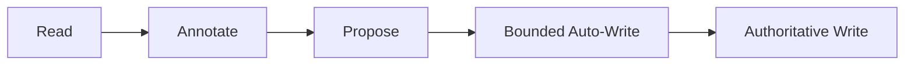

一个成熟平台不应该只有：

```text
read / write
```

而需要：

> **semantic write permissions**

---

# 8. “写 metadata”本身就有不同风险

下面这些操作不能拥有同样的 approval policy：

| Write | 风险 |
|---|---|
| 保存 query execution evidence | 低 |
| 写运行结果 / observation | 低 |
| 添加候选 description | 中 |
| 添加 tag | 中 |
| 修改 owner | 中 / 高 |
| certified 状态 | 高 |
| business definition | 高 |
| policy / access classification | 极高 |

因此权限系统不能只看 API method：

```text
PATCH /entity
```

需要理解：

> **what semantic authority is being changed?**

这是 Context Layer 和普通 CRUD system 的一个重要区别。

---

# 9. Decisions 是比 Approval 更好的 Agent Primitive

DataHub v2.2 的 Agents 引入：

- Agents；
- Tasks；
- Decisions。

其中 Decision 是：

> Agent 暂停执行，向 human 请求输入，再继续任务。

这是比“最终审批”更强的模型。

例如 Agent 发现：

```text
New table has no owner.

Possible:
- Marketing Analytics
- Growth Engineering
```

它不应该：

1. 猜一个；
2. 完成任务；
3. 最后让人审批整个 batch。

更合理的是：

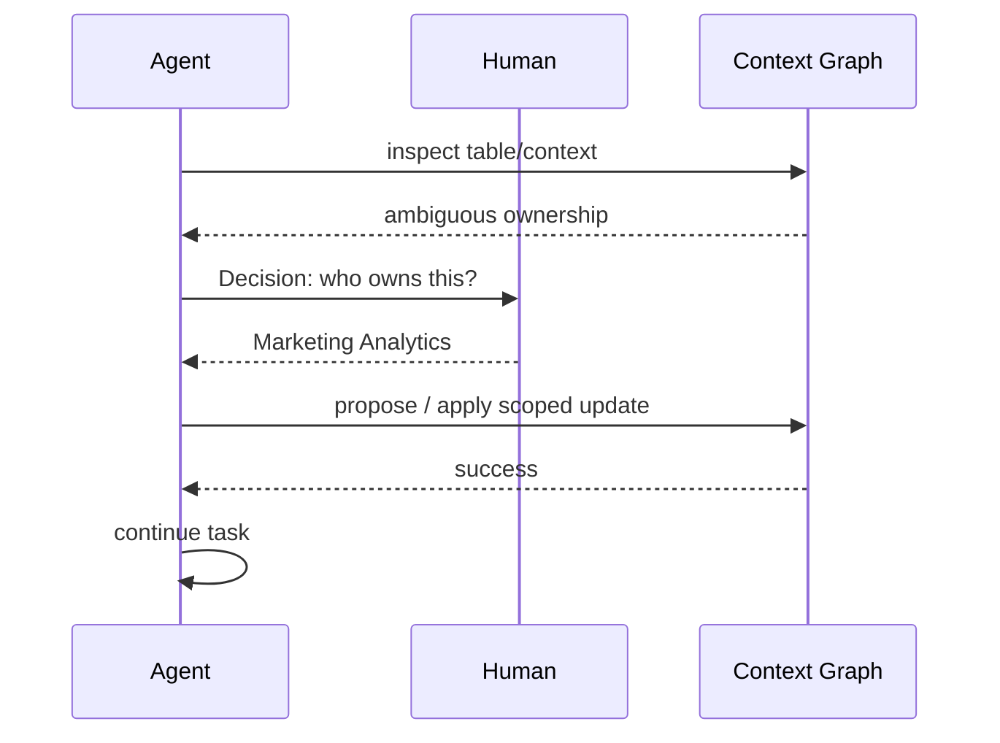

这代表：

> Human judgment 被插入 reasoning path，而不是只放在最后。

---

# 10. Auto-publish 应该建立在 Evidence Gates 上，而不是 Confidence 上

DataHub Context Intelligence 支持：

- golden questions；
- pass criteria；
- SQL equivalence；
- must-reference assets；
- must-not-reference trap assets；
- evals；
- publish decision。

这是一种正确方向。

相比：

```text
model confidence > 0.9 -> publish
```

更合理的是：

```text
evidence-based checks pass
+ domain policy allows
+ no conflict
+ bounded scope
-> auto-publish candidate
```

我们把它叫：

> **Evidence Gate**

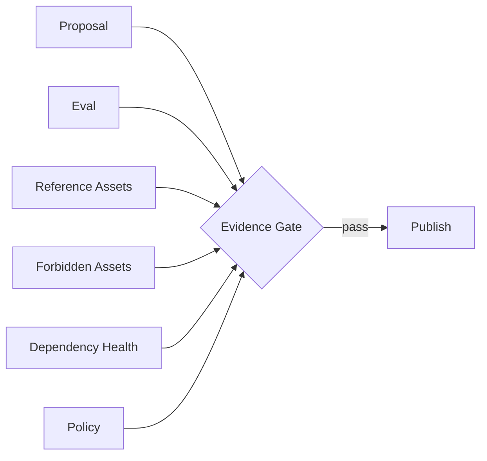

---

# 11. Read-back Verification 是一个很好的 Agent Write Pattern

DataHub 2026 Hackathon 里一个非常值得借鉴的模式是：

> write 后用另一个 API / read path 再读取确认。

也就是：

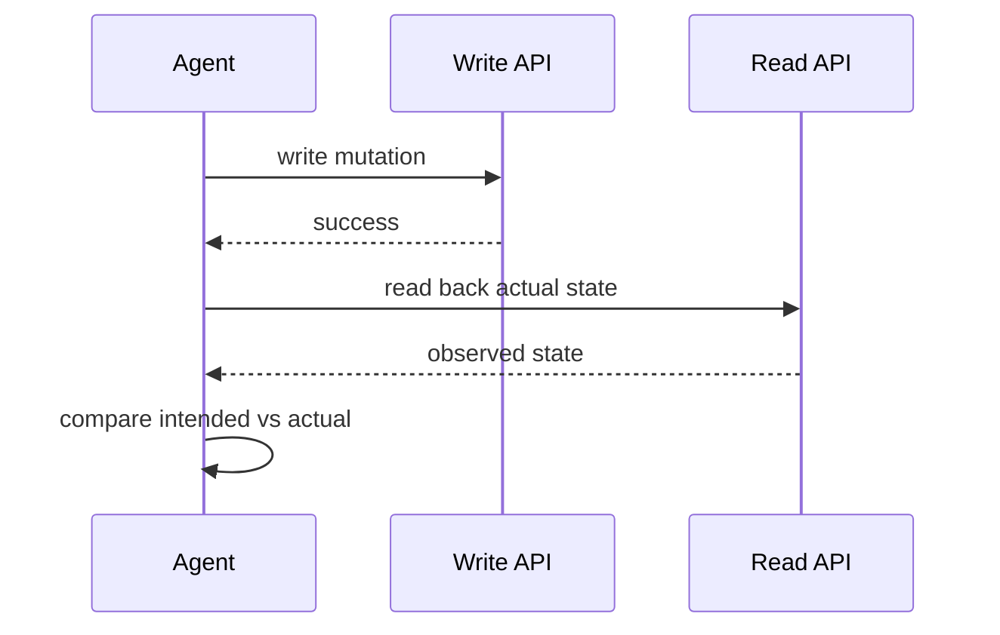

这解决一个很常见的问题：

> API 返回 200，不代表最终系统状态符合预期。

尤其在：

- async systems；
- eventual consistency；
- policy propagation；
- cross-system writes；

中非常重要。

所以：

> **agent-reported success should not be treated as proof of success.**

---

# 12. Write-back 的最大风险：Context Poisoning

MITRE ATLAS 2026 已经把：

> AI Agent Context Poisoning

列为正式攻击技术。

核心风险：

> 攻击者让恶意/错误内容进入 Agent 使用的 persistent context，使它影响后续 reasoning 和 actions。

如果 Context Graph 支持 Agent write-back，那么攻击链可以变成：

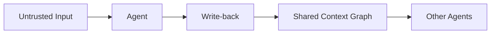

原本的一次 prompt injection：

```text
one interaction
```

变成：

```text
persistent organizational memory poisoning
```

这就是为什么 Agent write-back 必须有 trust boundary。

---

# 13. Memory 和 Context Graph 的区别必须明确

Agent memory 通常是：

> 这个 Agent 为了未来任务记住的信息。

Context Graph 是：

> 多人、多 Agent、多个应用共享的企业上下文。

因此：

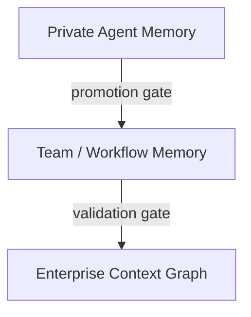

不应该允许：

```text
Agent memory
-> automatically becomes enterprise truth
```

这是很危险的跨 trust-domain promotion。

---

# 14. Context Promotion 比 Context Write 更准确

我们可以把 Agent write-back 重新理解成：

> **Context Promotion Pipeline**

Agent 不是直接“写 truth”。

它产生：

```text
Observation
-> Candidate
-> Proposal
-> Validated Assertion
-> Published Context
```

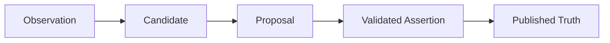

不同 Agent 可以停在不同阶段。

例如：

### Monitoring Agent

可以直接写 Observation。

### Context Curator Agent

可以写 Candidate / Proposal。

### Governance Agent

可以提出 change proposal。

### Domain Expert

负责把 Proposal promotion 到 Published Truth。

这是比简单 RBAC 更清晰的 trust model。

---

# 15. Agent-generated Context 必须带 Provenance

结合上一篇，Agent write-back 至少应该带：

```text
AgentGeneratedAssertion
├── content
├── author_agent_id
├── agent_version
├── model
├── task_id
├── tool_calls
├── input_context_refs
├── evidence
├── generated_at
├── confidence
├── eval_results
├── reviewer
├── approval_time
└── publication_state
```

这样未来另一个 Agent 读取时可以判断：

> 这是 Finance 明确批准的定义，还是某个旧 Agent 自动生成但没人看过的建议？

---

# 16. Self-referential Evidence 必须被限制

一个非常危险的循环：

```text
Agent A generates statement X
-> X written to graph
-> Agent B retrieves X
-> B uses X as evidence
-> B writes stronger statement Y
-> Y cites X
```

最终 graph 可能形成“看起来很多证据”的闭环：

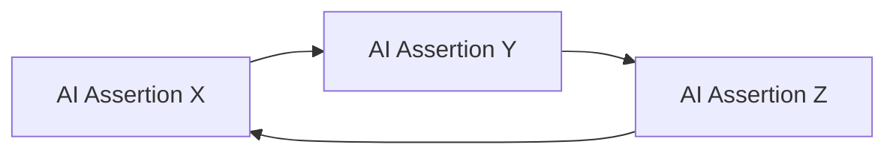

但实际上没有任何 external evidence。

因此 provenance graph 应该能区分：

- source-of-record evidence；
- human declaration；
- deterministic system signal；
- agent-derived assertion；
- agent-on-agent derivation。

Agent-derived evidence 不能无限提升自己的 authority。

---

# 17. Evidence DAG 应该尽量保持 Rooted

理想情况下，一条重要 assertion 应该最终能回溯到：

```text
System of Record
Human Authority
Runtime Observation
Policy Document
Verified Execution Result
```

而不是只回溯到另一个 LLM output。

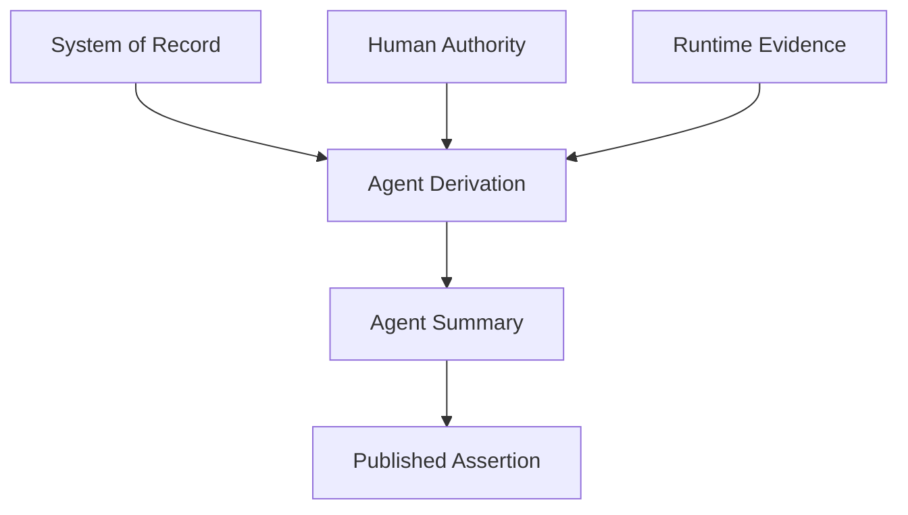

这可以称为：

> **rooted provenance**

---

# 18. Multi-Agent Conflict 需要 Authority Resolution

未来多个 Agent 会对同一个对象写建议。

例如：

```text
Agent A:
owner = Growth

Agent B:
owner = Marketing Analytics
```

这不是普通 merge conflict。

它是：

> epistemic conflict

解决方式不应该是：

- last write wins；
- higher confidence wins；
- more agents agree wins。

而应该根据：

- source authority；
- domain ownership；
- evidence；
- human role；
- policy scope；
- temporal validity。

因此 Context Graph 需要：

```text
Conflict
-> Authority Resolution
-> Decision
-> Provenance
```

---

# 19. Consensus 不等于 Truth

如果 10 个 Agent 都读取同一个错误 source，然后都得到同一个结论：

```text
10 votes
```

并没有增加 evidence diversity。

所以 Context Layer 不应该只记录：

> 多少 Agent 支持这个结论。

还需要：

> 它们是否来自独立 evidence roots？

这是典型的 correlated evidence 问题。

---

# 20. DataHub Agent Registry 的真正意义

Agent Registry 不只是 inventory。

如果 Agent 也会产生 context，那么它应该成为 provenance graph 的一部分：

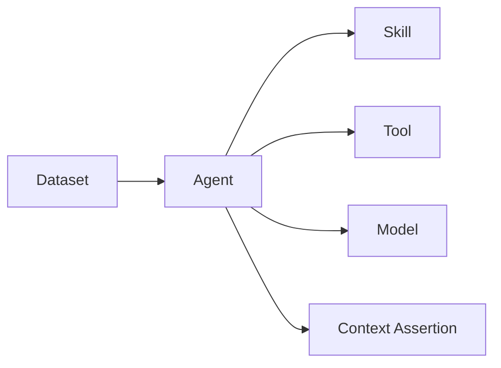

这意味着未来可以回答：

> 哪个 Agent 产生了这个错误 definition？

以及：

> 哪个 Agent version 使用了被污染的数据？

Agent 本身也成为 governed data asset。

---

# 21. Context Graph 也可以治理 Agent

DataHub v2.1 的一个有趣方向：

> classification 可以沿 lineage 传播到 consuming agents。

这代表 governance graph 开始双向工作：

```text
data -> agent
agent -> context
```

例如：

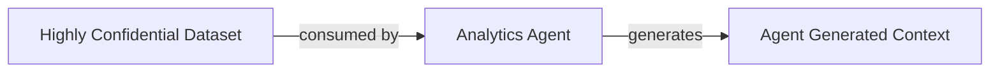

如果 Agent 的 output 是从 sensitive context 派生：

> output 自己可能也需要继承 sensitivity。

因此 write-back 不能只问：

> “Agent 有没有写权限？”

还要问：

> “写出来的 context 应该继承哪些 governance properties？”

---

# 22. Human Approval 也不是绝对安全

OWASP 已经指出 Human-in-the-loop 自身也可能被操纵。

例如 Agent 把危险操作包装成：

> harmless-looking approval request

于是：

> approve button 变成 social engineering surface。

因此 HITL 需要：

- 显示真实 diff；
- 显示 evidence；
- 显示影响范围；
- 显示权限变化；
- 显示 source trust；
- 不允许 Agent 自己决定 approval UI 内容的全部语义。

所以真正的原则是：

> **Human review 必须基于 independently rendered evidence。**

不是：

> “Agent 说这个改动没问题，你批准吗？”

---

# 23. Write-back 应该优先满足四个属性

## 1. Bounded

Agent 能改什么必须明确。

## 2. Reversible

应该有：

- history；
- previous version；
- rollback；
- supersede。

## 3. Verifiable

写完后有独立 read-back / eval。

## 4. Attributable

所有 writes 都能追到：

- agent；
- task；
- user；
- model；
- evidence；
- approval。

```text
Safe Write
=
Bounded
+ Reversible
+ Verifiable
+ Attributable
```

---

# 24. Metadata-as-Code 是高风险 Context 的一个好模式

DataHub 自己对 metadata-at-scale 的建议之一是：

```text
metadata definitions
-> Git repository
-> pull request
-> review
-> merge
-> ingestion
```

对于：

- glossary；
- domains；
- policies；
- important ownership；
- semantic definitions；

这种模式很有价值。

Agent 可以：

```text
create PR
```

而不是：

```text
directly mutate production truth
```

于是整个 existing software governance system：

- diff；
- CODEOWNERS；
- review；
- CI；
- history；
- rollback；

都可以被复用。

这比重新设计一套 AI approval system 更成熟。

---

# 25. Write Path 和 Read Path 不应该完全对称

很多 API 设计天然是：

```text
GET entity
PATCH entity
```

但 Context Layer 里更合理的是：

```text
Read Trusted Context
Write Proposal
Publish Validated Context
```

也就是：

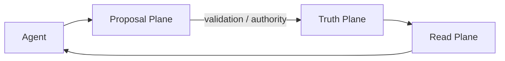

这是一种 **asymmetric architecture**。

Agent read 可以很宽。

Agent authoritative write 应该很窄。

---

# 26. DataHub 当前设计可以抽象成三平面

结合 Context Hub、Agents 和 MCP，目前可以抽象成：

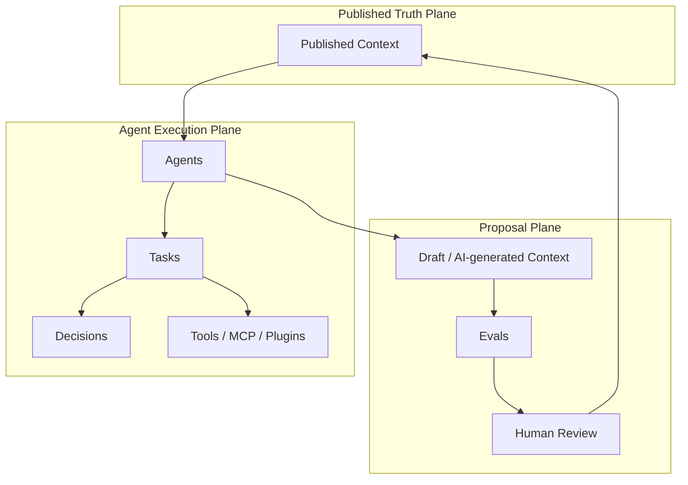

这个模型比单一 Context Graph 更准确。

因为“Graph”是数据结构。

而可靠 Agent 系统还需要：

> **promotion workflow**

---

# 27. 一个完整的 Context Write Contract

我们可以给未来的 Agent write-back 定义一个最低 contract：

```text
WriteRequest
├── agent_identity
├── user / principal
├── task
├── intended_change
├── target
├── semantic_risk_class
├── evidence
├── source_context_versions
├── expected_effect
├── rollback_plan
├── verification_method
└── required_authority
```

写入后：

```text
WriteResult
├── actual_change
├── read_back_state
├── verification_result
├── resulting_context_version
├── provenance_event
└── approval_record
```

这已经不像简单 API mutation。

更像：

> transaction + evidence + governance.

---

# 28. 对 DataHub 当前方向的评价

## 值得认可

DataHub 当前已经体现几个正确原则：

### Proposal before publication

AI-generated context 默认可以进入 proposal / draft，而不是直接进入 Agent-visible truth。

### Human precedence

人类修改的 business metadata 优先于 agent-generated metadata。

### Only published context is activated

未发布 context 不提供给 Agent。

### Decisions

Agent 遇到需要 judgment 的地方可以暂停请求 human input。

### Agent identity / lineage

Agent 本身进入 governed graph。

### Evals before publish

可以用 golden questions / expected SQL / forbidden assets 等验证 context 对 Agent behavior 的实际影响。

这些已经接近一个真正的 shared context governance model。

## 仍然值得继续研究

1. 哪些 metadata mutations 可以 safe auto-write？
2. proposal state 是否覆盖所有 entity / aspect？
3. agent-generated evidence 的 trust weight 如何表达？
4. multi-agent conflicting writes 如何 resolve？
5. write-back context 如何继承 source sensitivity？
6. prompt injection 如何防止污染 shared Context Graph？
7. approval UI 如何防止 HITL deception？
8. context write 是否有 transaction / rollback semantics？
9. derived context 的循环 dependency 怎么检测？
10. eval 通过是否足够支持 auto-publish？

---

# 29. 我们的工作定义：Agent 是 Context Contributor，不是默认 Authority

最终我们采用：

> **Agent 可以观察、推断、建议、生成和写回 context，但 machine-generated context 应当保留其来源身份和 epistemic status；只有经过适当 evidence gate、policy 或 human authority promotion 后，才进入 shared authoritative context。**

一句更短的：

> **Agents propose. Evidence verifies. Authorities publish.**

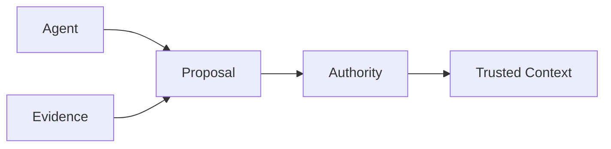

---

# 30. 下一步

下一篇：

## Human + Agent Shared Truth Plane

问题会从 write-back 扩大到组织架构：

1. 人与 Agent 是否应该真正消费同一份 context？
2. 如果是，同一份 context 是否需要不同 presentation / privilege？
3. human knowledge 和 machine-derived knowledge 怎么共存？
4. enterprise context 是否应该成为新的 organizational control plane？
5. 当 Agent 数量超过 human users 时，Context Layer 的治理模型如何变化？
6. Context Platform 会不会成为未来企业 AI 的“control plane”？

---

# Sources

## DataHub

- DataHub, **Introducing DataHub Cloud v2.2**, 2026-09-09  
  https://datahub.com/blog/datahub-cloud-v2-2/

- DataHub Docs, **Agents**  
  https://docs.datahub.com/docs/features/feature-guides/agents

- DataHub Docs, **Validate Context Proposals**  
  https://docs.datahub.com/docs/managed-datahub/context/review-context-proposals

- DataHub Docs, **Activate Context**  
  https://docs.datahub.com/docs/managed-datahub/context/activate-context

- DataHub, **Introducing DataHub Cloud v2.1**, 2026-08-03  
  https://datahub.com/blog/datahub-cloud-2-1/

- DataHub, **Context Platform for AI Agents**  
  https://datahub.com/products/context-platform/

- DataHub, **Meet the Winners of Build with DataHub: The Agent Hackathon**, 2026-09-10  
  https://datahub.com/blog/meet-the-winners-of-build-with-datahub-the-agent-hackathon/

- DataHub, **Building Trustworthy AI Agents**, 2026  
  https://datahub.com/blog/datahub-town-hall-building-ai-agents/

- DataHub Support, **Managing Metadata from GitHub Using Ingestion Pipelines and CI/CD**, 2026-07-14  
  https://support.datahub.com/hc/en-us/articles/52985667314971-Managing-Metadata-from-GitHub-Using-Ingestion-Pipelines-and-CI-CD

## Security references

- MITRE ATLAS, **AI Agent Context Poisoning — AML.T0080**  
  https://atlas.mitre.org/techniques/AML.T0080/

- MITRE, **ATLAS OpenClaw Investigation**, 2026  
  https://www.mitre.org/sites/default/files/2026-02/PR-26-00176-1-MITRE-ATLAS-OpenClaw-Investigation.pdf

- OWASP GenAI Security Project, **Memory Is a Feature. It Is Also an Attack Surface**, 2026-05-13  
  https://genai.owasp.org/2026/05/13/memory-is-a-feature-it-is-also-an-attack-surface/

- OWASP, **AI Agent Security Cheat Sheet**  
  https://cheatsheetseries.owasp.org/cheatsheets/AI_Agent_Security_Cheat_Sheet.html
